.. -*- encoding: utf-8 -*-

.. meta::
    :PG.Title: The Second Boy's Book of Model Aeroplanes
    :PG.Id: 62549
    :PG.Released: 2020-07-03
    :PG.Rights: Public Domain
    :PG.Producer: James Simmons
    :PG.Credits: This file was produced from page images at Google Books.
    :DC.Creator: Francis Arnold Collins
    :DC.Title: The Second Boy's Book of Model Aeroplanes 
    :DC.Language: en
    :DC.Created: 1911
    :coverpage: images/CoverImage.jpg

==========================================
The Second Boy's Book of Model Aeroplanes
==========================================

.. clearpage::

.. pgheader::

.. clearpage::

.. topic:: Transcriber's Note

    This book was transcribed from a scan of the original found at Google Books. 
    I have rotated some images and have corrected the misspelling of "aileron"
    that appeared many times in the original text.

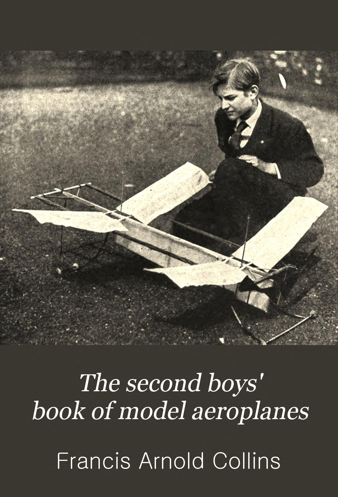

.. clearpage::

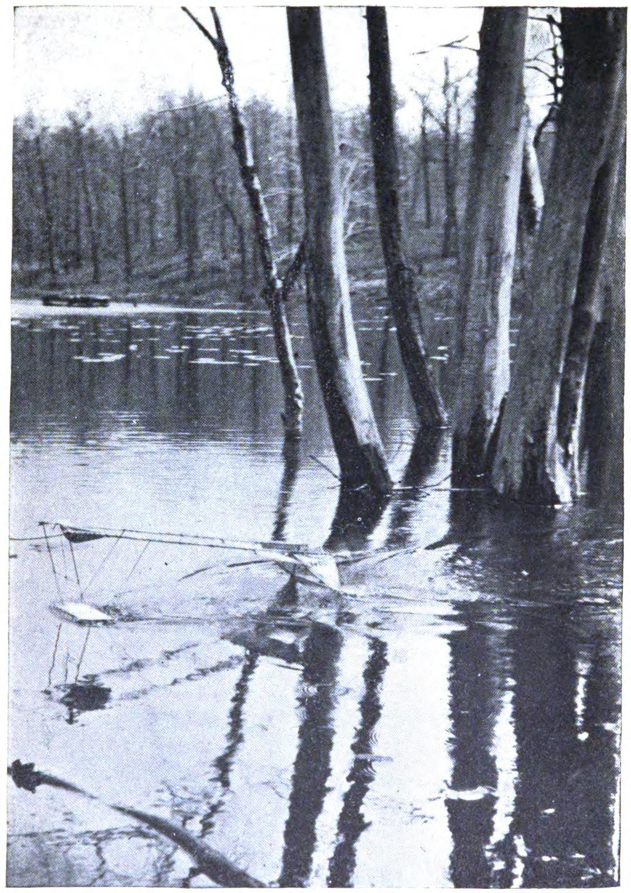

   A model aeroplane rising from the water.

.. clearpage::

.. container:: titlepage 

    .. container:: center x-large

	THE SECOND BOY'S BOOK

	OF MODEL AEROPLANES

	BY

	FRANCIS A. COLLINS 

	AUTHOR OF "THE BOYS' BOOK OF MODEL AEROPLANES" 

    	.. vspace:: 2

    .. container:: center large

    	.. vspace:: 2

    	ILLUSTRATED WITH MANY

	PHOTOGRAPHS AND DIAGRAMS

	BY THE AUTHOR

.. container:: center medium

    	.. vfill::

    	NEW YORK
    	
    	THE CENTURY CO.
    	
    	1911

.. clearpage::

.. container:: center medium

	Copyright 1911, by 

	The Century Co. 

	Published October, 1911

.. cleardoublepage::

THE SECOND BOY'S BOOK OF MODEL AEROPLANES
-----------------------------------------

FOREWORD
````````

It is assumed that the reader is familiar with "The Boys' Book of Model Aeroplanes." Some knowledge of the history of aviation and the early models, big and little, will be found helpful, but not essential, as a preparation for the present volume.

Within the year so much has been learned of the science of model aeroplane construction that an entirely new and more detailed treatment of the subject seems to be justified. Since the length of model aeroplane flights has been increased ten times, their improvement is comparable to that of the large man-carrying machines. The science has become more exact, and the chance of failure reduced, until to-day successful flights are within the reach of all.

In the preparation of this volume thanks are due to the New York Model Aero Club, to Mr. Edward Durrant, Percy Pierce, Cecil Peoli, W. S. Howells, Jr., and to the young gentlemen whose models are illustrated herewith, who, singly and collectively, are doing much for the development of the science in America.

.. contents::
 :depth: 2
 :page-numbers:
 :backlinks: none

.. clearpage::

LIST OF ILLUSTRATIONS
`````````````````````

.. lof::
 :page-numbers:
 :backlinks: none

.. cleardoublepage::
   
.. mainmatter::

CHAPTER I MODEL AEROPLANES OF 1911
``````````````````````````````````

For the average boy there is no more stirring music than the brisk, whirring note of his model aeroplane. Let the propellers spin steadily for ten glorious seconds, and the journey spans a couple hundred feet or more. Double the time and the flight becomes a triumph. Out of the ingenuity of thousands of boy aviators, the world over, has come a surprising development of the model aeroplane. The experimental stage is passed. Any bright boy may now build a model aeroplane which is certain to give results. The distance qualities of your model may even rival your endurance as a runner in keeping pace with it.

Working along different lines, the builders of model aeroplanes, widely scattered, seem to be gradually developing much the same type of air craft. The tendency is toward the construction of much lighter and more logical models than last year. In place of the complicated models supported by several broad planes, we find the most successful amateur aviators expending all their ingenuity upon simple monoplane forms. The biplane forms are being abandoned by model builders, as well as the biplane form of elevating planes. In place of the models made from fifty or more members, we now find excellent models, capable of much longer flights, formed of but a dozen pieces. The builders of model aeroplanes are keeping pace with the development of the man-carrying machines, if they are not passing them, in developing the flying machine of the future.

Improvement in the distance qualities of the model aeroplanes, in the past few months, has been remarkable. At one of the first model aeroplane tournaments, held in New York, less than two years since, the longest flight was under sixty feet. In less than one year, flights of more than 200 feet had become common. To-day the improved racing model aeroplanes have flown more than 2,500 feet. As a result of the labors of the boy aviators, it is much easier to build a successful model flying machine to-day than it was a year ago.

What may be called the 1911 type of model aeroplane looks every inch a racer. Every unnecessary stick and string has been cut away. When skids are used they are of the lightest possible material and the simplest construction. The miniature rubber-tired wheels, with ball bearings, which made many of last year's models so attractive, are rarely used. The plane surface has been reduced fully one half. One great secret of success is in the cutting down of weight. When your propeller has but half the work to do, the length of the flight is, of course, greatly increased.

Our amateur aviators are attacking one great problem of aviation which the pilots of man-carrying crafts are perhaps neglecting. Model aeroplanes are built to maintain their equilibrium in the air automatically. They must not only rise from the ground, prepared for a long flight, but must be contrived to resist all manner of baffling air currents aloft. Watch the successful model as it gains its altitude, settles down to a horizontal flight, is perhaps knocked off its course by a cross current, and steadies itself with a graceful curve and proceeds on its way.

All these problems must be anticipated. The young aviator must ingeniously arrange his planes and ballast in advance. The regular sky pilot, on the other hand, meets the problems of the air as he encounters them, by flexing his wings against disturbing currents or by banking to maintain an even keel at a turn. If the man-carrying airship had to be prepared to meet all these problems before it left the ground, the problem would be, of course, much more complicated.

In other words, if the motor of a large machine were started and the aeroplane launched without a pilot, would its chances of flight be as good, in proportion to its size, as those of our best model aeroplanes? A model aeroplane which flies 300 feet performs as remarkable a feat as would a large machine flying, unguided, a mile or more. The progress in the construction of model aeroplanes, in brief, already deserves serious scientific consideration.

The last twelve months have brought out a surprising number of new aeroplanes, while notable progress has been made in the standard types. To realize the immense strides or flights forward in the construction of heavier-than-air machines, one need only set the 1911 models beside the aeroplanes of a year or two years since. Even to the eye of the layman in such matters, the older machines are beginning to appear obsolete. In a previous volume, it was suggested that within a few years the aeroplane of to-day would appear like cumbersome stage coaches to one familiar with racing automobiles, and certainly the prophecy is being quickly realized.

The general tendency is in the direction of greater simplicity in design in passenger-carrying craft, as in model aeroplanes. Both the monoplane and biplane types are being developed side by side, and each continues to have its enthusiastic advocates. The increase in the passenger-carrying qualities is realizing the most sanguine hopes. Aeroplanes have carried fifteen passengers for several miles. The speed qualities of machines have developed correspondingly.

If the development of model aeroplanes leads the way in perfecting heavier-than-air machines, as many believe, the monoplane form seems destined to replace all multiplane types. During the past year practically all of the biplane forms have been abandoned by model builders. As a result of wide experiments, it has been found that the monoplane exerts more sustension per unit of surface than any two or three-plane machines. In theory, it is, of course, possible to increase the sustained force by setting one plane above another, but in practice it has been found that the planes must be set so far apart that the arrangement is impracticable. When planes are separated, they must, of course, be stayed and trussed to keep them rigid, and all this adds to the weight and complexity of the machine.

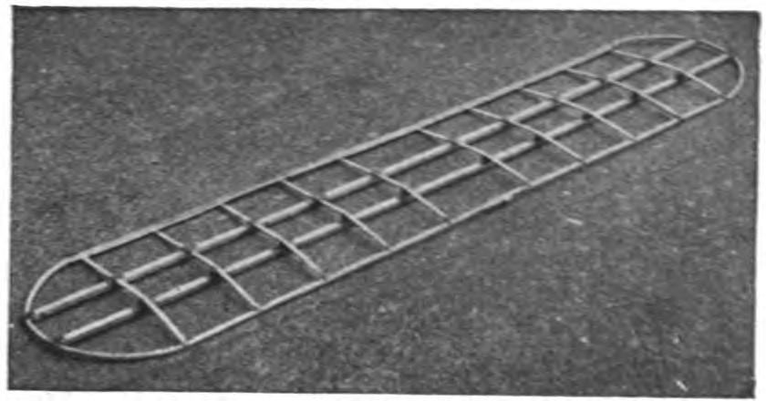

   A good specimen of plane building.

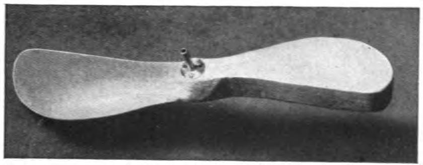

   "Finish one end of the blade before cutting away the opposite end."

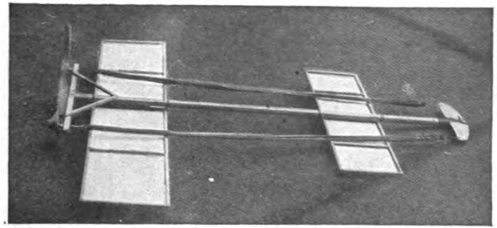

   Model aeroplane. Designed by Cecil Peoli.

The builder of model aeroplanes has a great advantage over the designer of man-carrying crafts. The spread of the wings of his model is comparatively small, and the problem of staying and trussing is greatly simplified. The monoplane, especially in a model, requires practically no staying at all. Then again the skin friction is greatly reduced in the monoplane form. Simple as it is, there are great possibilities in the arrangement of these surfaces. The effect of outline upon resistance again may be more closely observed in the monoplane than in the multiplane forms. In other words, if your model goes wrong, it is far easier to locate the fault and rectify it than in the more complicated arrangement of planes.

The flights of the English models this year are longer than those made in America, but, on the other hand, we are solving many practical problems of aviation, in our model building, which the English have not attempted. Even in the case of our single-stick frames built in America, the tendency is toward more stable construction than abroad. The best English models would not qualify for an American model tournament, since they could not rise from the ground.

The best American models, on the other hand, would be outdistanced in an English meet, but their flights would show them to have far greater automatic stability than their English rivals. It is extremely interesting to speculate whether the American or English types of model aeroplanes will survive, and which is contributing more to the solving of the great mysteries of aviation, but, after all, it is a question which only time can answer.

Compare typical flights of the American and English models, and the contrast becomes obvious. The English model is usually held and thrown forward. The starter thus gives it its altitude and direction. Being extremely light, they gain a great deal from the wind. Their flights are usually in straight lines, or in slightly undulating curves. Under favorable conditions, their distance qualities are remarkable. Flights of six or eight hundred feet are common, while the present record is over 2,500 feet or nearly half a mile.

In an American model tournament, the models are set upon the ground and left to themselves. As a rule, it is not even permitted to give them a slight push. The motor must be powerful enough to carry them onward and upward unassisted. In many cases they must be clear of the ground within twenty feet or the flight is disqualified. It is, of course, obvious that the motors must be far stronger than in the case of the English models, and that their frames must therefore be correspondingly heavier to support the weight. The plane surface, in turn, must be increased to support this weight. The average English models, even with American skids, would not leave the ground at all.

Once in the air, the behavior of the American model, again, is entirely different from its English rival. Our aeroplanes are off with a rush. The first part of the flight is at a more or less sharply drawn angle of elevation. It usually rises to an altitude of from ten to twenty feet in a straight line. To secure a good rise requires a much more scientific adjustment of the planes and weighting than in the case of the English models. As it reaches its altitude, it adjusts itself, and here the problem of stability comes in. The marvelous little craft balances itself with the least possible loss of time and power, comes to a horizontal position, and is off on its flight. If its adjustment is not all it should be, it will, of course, fail to right itself and fall backward, or, as the phrase goes "sit on its tail." It is estimated that one-third of the power of the motors is used up in leaving the ground and rising to its maximum altitude.

Our American model builders believe that their flights are far more scientific than in the case of a hand-launched model, and that they are doing more for the actual development of the art of aviation than their English cousins. Whether one prefers to watch an American or English tournament is, of course, largely a matter of taste; certainly both are fascinating.

Much has been learned about motors. It has been found that the rubber motor is capable of great development. Since a flight of one-half a mile may be made by twisted bands of rubber, the average model builder may be content to let clock work and miniature gasoline engines take care of themselves. By building and flying thousands of models, we have found what form of rubber strand is best, just how heavy the strands should be, and the most efficient point of winding. Instead of short heavy bands, we now use much longer and more slender motors. The efficiency of rubber motors has been greatly increased by arranging them in series and connecting them up by gear wheels. It is even possible to buy miniature gasoline motors suitable for model aeroplanes. Flights of more than one mile have been made in this way.

All the best models this year are equipped with twin propellers. It is very little more trouble to build two motors than one, and the model thus equipped will not only travel much further, but will insure much more stable flights. A common trouble in model building has been the lack of stability. Your model has been likely to capsize, even under favorable conditions, spoiling the flight, while a chance gust of wind would knock it out of its course in spite of everything you could do. To overcome this tendency, the surface of the planes might be increased, but this added to the weight of the model, thus cutting down the length of the flights. The twin propellers cut at the root of the problem. They balance the thrust, thus making the flight even and stable. The planes may also be made much smaller with a gain in weight which, in turn, lengthens the flight.

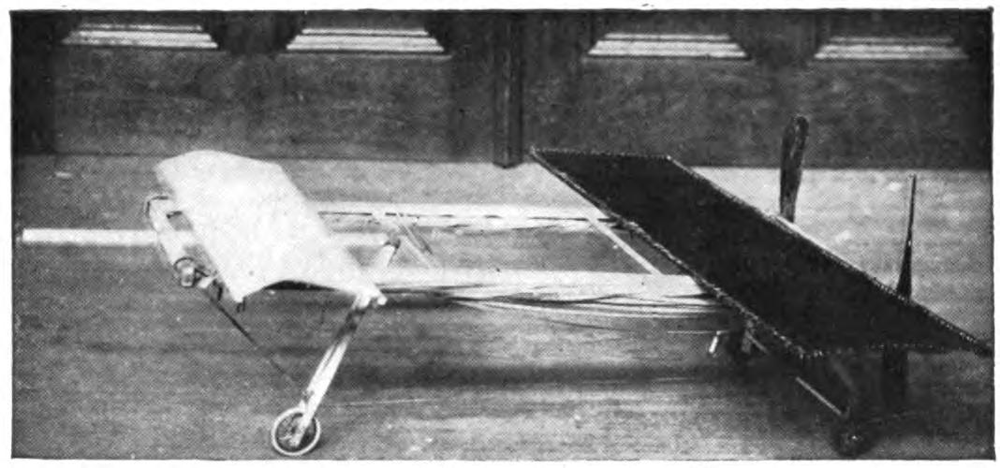

   A variation on a familiar form.

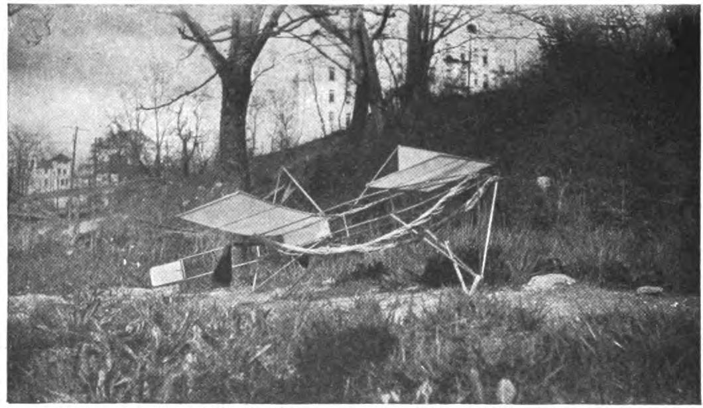

   An excellent model designed and built by H. Wakkins.

CHAPTER II MODEL AEROPLANE TOURNAMENTS
``````````````````````````````````````

Within the year, exhibitions and contests of model aeroplane flights have become an established form of entertainment. The attractions of the flights of man-carrying machines are borrowed in a large measure by the model aeroplanes. The building of models has progressed so rapidly, bringing the little air-craft under such control, that a definite program of flights may now be carried out. The programs may be considerably varied to include distance flights, weight-lifting contests, and spectacular flights in which the models loop the loop and perform other amazing feats.

The first formal exhibition or professional appearance of the model aeroplane in public as an entertainment was made in connection with the first aviation meet held at Asbury Park, New Jersey. Two of the most successful model builders, Percy Pierce and Frank Schoeber, of the New York Model Aero Club, were engaged to give exhibition flights for one hour a day in the intervals between the flights of Arch Hoxey, Johnston and other aviators of the Wright Brothers staff.

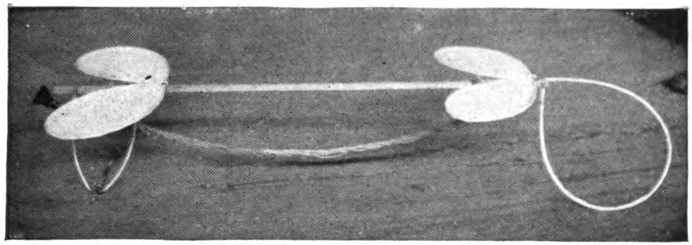

   An original design by Harry McAllister

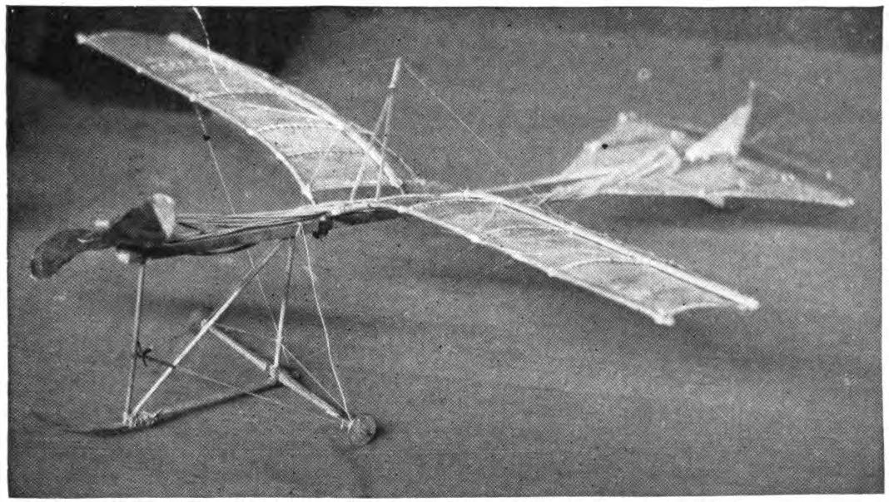

   An interesting experiment in stability

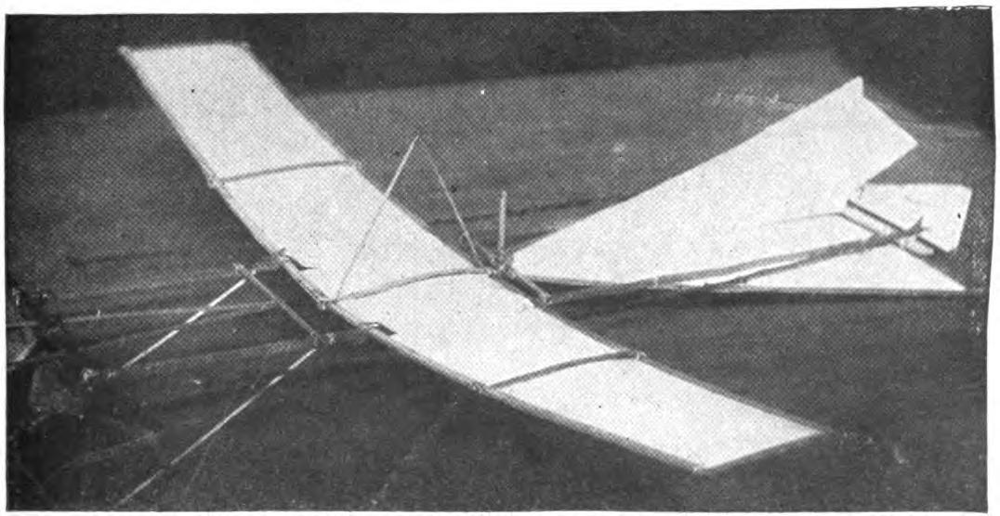

   An early model built by E.G. Halpine

The models were flown for more than 200 feet and were enthusiastically applauded. The aeroplanes in miniature imitated the flights of the man-carrying craft with wonderful fidelity, rising from the ground and soaring aloft in long, graceful curves. They came as a very welcome variety, and could be watched without breaking one's neck gazing aloft, or the unpleasant possibility of a serious accident. The applause of the thousands gathered for the meet may be said to have definitely established the model aeroplane as a feature of these tournaments.

The model aeroplane has one great advantage over the man-carrying machines. It makes possible indoor aviation, and may be enjoyed the year round, and is especially effective for evening entertainment. The fortnightly meets in one of the great New York armories, some time since, attracted the attention of the officers, and the boys were invited to give exhibition flights in connection with athletic games. The first of these meets was held under the auspices of the New York Model Aero Club, in connection with the Greek athletic games, in the interval between the games and the ball which followed.

An audience of fully 3,000 people, crowding the armory, witnessed the flights. Some twenty members of the club entered the contest. In a public contest of this kind, much depends upon the system of flying. The floor must be kept clear and the flights follow one another so quickly that the interest will not lag for a moment, and the audience have no opportunity to tire. The flights on this occasion went with a rush and proved in every way so successful that the rules which made this program are given in full on another page.

Few in the audience had ever seen a model flight, and the contest held the great crowd's attention more closely than had any of the evening's athletic events, which had come before. There was a breathless moment of suspense when the whistle had sounded for the first flight. A beautiful white monoplane led off, but in the excitement of the moment, it had not been properly adjusted, and failing to get its altitude, spun daintily across the floor. The second model yawed sharply and flew into the crowd at the side.

The third model found itself, however, rose perhaps twenty feet and, settling down to a steady horizontal, darted across the arena. Every eye followed it. A burst of handclapping greeted its graceful rise, which increased in volume, and as it reached the farthest corner of the great armory, more than 200 feet distant, there was a perfectly spontaneous cheer.

The program was so well organized and carried on that the flights followed rapidly without a break. There was scarcely a moment when an aeroplane was not aloft, and the interest never faltered. There were Scores of excellent straight-away flights of 200 feet or more, at various altitudes. Occasionally a model would fly wild, even refuse to rise, but the flights followed one another so continuously that a failure was quickly forgotten in the delight of watching the next flight.

The rapid development of the model aeroplane was shown particularly in the spectacular flights. The thrilling volplanes and daring aerial feats of the famous air pilots were imitated by the model aeroplanes. The models were made to dart about at unexpected angles, and, while keeping clear of the ground, perform many astonishing feats. The prize for these spectacular flights was won by Henry Ragot whose aeroplane actually looped the loop repeatedly, in obedience to skilful adjustment of the planes and weights.

In launching the model for this flight, the model was held well above the ground and launched at a sharp upward angle. It rose with astonishing speed, in a vertical line, fully twenty feet, when it turned and descended with accelerated speed. The crowd naturally expected a bad smash, but with a good clearance of the ground the model suddenly swept around in a narrow semicircle, rose and repeated the performance. It seemed to many spectators that the model was enjoying a miracle of good luck, but they were mistaken. The flight was repeated several times. Indoor aviation was an instantaneous success.

Unless well-thought-out rules are carefully observed, a public exhibition may fall into confusion, and be seriously marred. A large audience grows quickly impatient of delays between flights. There is, of course, the danger that the models will follow each other too quickly, perhaps collide in the air. The distance and spectacular flights again must be kept separate.

The rules followed by the New York Model Aero Club in these exhibitions worked well in practice. First of all, the floor was kept absolutely clear except for the director of the flights, who took up a position at the center. The distance flights started from one corner only, and the spectacular nights from the center of one side, the weight-lifting contest from another corner.

An official starter, a measurer, and an entry clerk are stationed at each point from which the flights are started. When a model was wound up ready for a flight, a starter waved a small flag to attract the attention of the director out on the floor. From his vantage point, the director could see if the floor was clear and signaled to the starter to go ahead. He blew a whistle by way of signal, one blast for the start of a weight-lifting contest, two for a distance flight, and three for a spectacular flight.

Instantly the whistle sounded, the model signaled was released without a moment's delay. In this way no two models were ever started at the same time, and all confusion was avoided. The whistle was clearly heard in all parts of the hall, and the audience quickly learned to recognize the signals and look to the point from which the start took place. In the distance flights the one flying the model and the measurer alone were allowed to go after the machine. This was done on the run. It is important that any delay be avoided in measuring, since this does not interest the public in the least, and may make the exhibition drag.

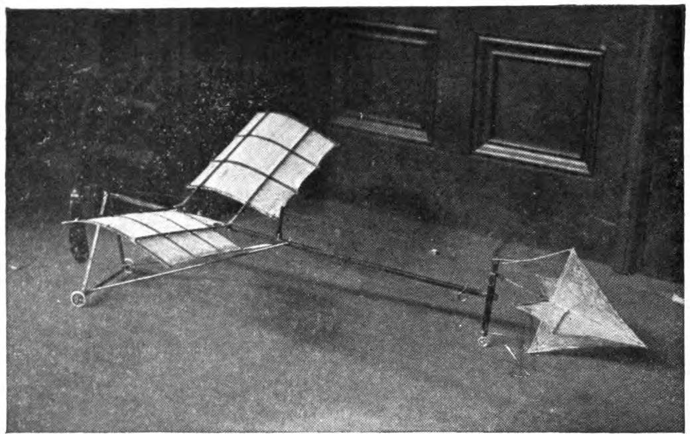

   An interesting experiment in stability

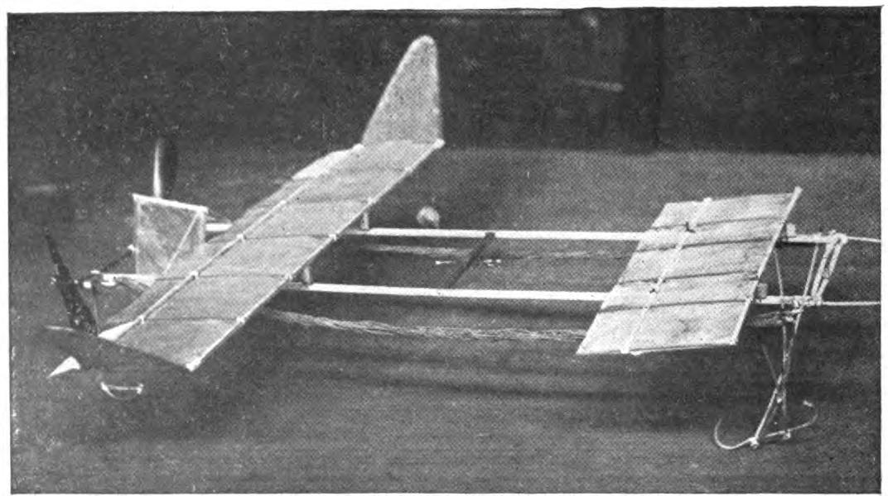

   An early model built by Monroe Jacobs. Note the Ailerons.

The only other person allowed on the floor while the flights were in progress was the owner of the model, who must follow it and bring it back. He was allowed to cross the floor, but once he had secured his model, he must carry it quickly to the nearest point at the side, and find his way back to the starting point along the outer lines. It is confusing both to the flyer and the spectators to have a single unnecessary figure on the floor during the flights. The crowd is kept back by members of the club, wearing the club colors.

The regular fortnightly model aeroplane meets held in New York are doubtless the most largely-attended and best-organized meets of the kind in the world. The 22nd Regiment armory, a spacious structure admirably suited for indoor aviation, has very courteously been thrown open for the purpose on every other Saturday afternoon.

Throughout the season, each of these meets brings together several hundred boys and spectators, and on the average about 100 model aeroplanes. The meet is conducted with intelligence and sympathy by the Y. M. C. A., and is open to all. Of late these exhibitions have become so popular that the crowds actually threaten the convenience of the flyers, and the boys have been required to present credentials on entering, consisting simply of a model aeroplane.

There are few more animated spectacles than the model aeroplane tournament. There is a great sunlit floor, measuring 250 by 150 feet, roofed with glass. The aviation fields are reproduced here in miniature, without loss of animation. Along the sides are continuous lines of "camps," corresponding to the hangars where scores of boys are busy tuning up their machines. They have brought tools and a variety of extra materials, planes, propellers, motors, and strips, which are spread about them.

In each camp the machines,—and there are no two alike,—are being assembled or repaired. Groups of the boys' friends and admirers are gathered about each camp, earnestly discussing the merits of a particular model and its chances in the approaching contest. To stroll down the line of camps is in itself a liberal education in aeronautics.

The records of all flights are carefully preserved, to be counted against the several important trophies which will be awarded at the end of the season. Any one of the scores of contestants can tell you at any moment how the score stands. During this tuning up process, the galleries have filled and an enthusiastic audience is assured.

One of the great beauties of indoor aviation is that it is entirely independent of the weather. The air of the great armory is practically at rest, and the aeroplanes escape the baffling side currents and air gusts. In England, for instance, indoor aviation is practically unknown.

A whistle sounds above the hum of many voices, and at the signal everyone scurries to the sides, leaving the broad floor clear. The judge, starter, and measurer take their positions, and the aviators, with their models tuned up to concert pitch, stand ready at the starting line. The starter announces whether the flight is "official" and if it is to be counted in the competition for the trophies, or is merely a practice or exhibition flight.

The start is made from the extreme corner diagonally across the armory. Only last year the start was made from a point well out in the middle of the floor, but that was when the flights were much shorter. To-day the boys have actually outgrown the armory, and even by flying from corner to corner there is not enough room. The aeroplanes are no longer launched from the hand or even pushed along the ground. They are required to start without assistance and rise in the air without being touched.

"Official flight."

Everyone's attention is attracted by the announcement. Hundreds of boys crowd to the lines. The starter is doubtless known to all, as well as his record and standing in the various competitions. Hundreds of critical eyes are upon the model. It is a thrilling moment. The propellers are released, and the aeroplane starts forward under its own power.

Some leap into the air, others take the full twenty feet permitted them in getting off the ground. There are surprisingly few failures. The length of the take-off, the angle at which it rises, the altitude in the first rise, are critically observed by the young experts.

To the whir of the propellers, which form two blurred circles in the air, the model quickly climbs upward, rights itself and speeds away on its long flight. The young aviator's skill is revealed to every eye by the angle of the ascent, the altitude and the ability to gain equilibrium aloft. The more you know about aviation, the more absorbing is your interest in a flight.

A good rise is usually observed in silence. By the time the model has reached the middle of the armory, more than one hundred feet from the starting line, enthusiasm is aroused. When two-thirds the distance has been covered, the applause begins. Let the model continue without swerving to the farthest corner, and a perfectly spontaneous cheer sweeps the crowd. It is a well-deserved reward of hours of patient effort.

The official measurers take the floor on the run, dragging their tape after them. The crowd overruns the floor to gain a closer view of the model, and the young aviator receives congratulations. The distance is announced at once, and there are more cheers. There is never a dull moment at the meets. One or more machines are almost always aloft. It is as thrilling as a three-ringed circus.

CHAPTER III PARLOR AVIATION
```````````````````````````

A model glider, or aeroplane without a motor, will be found perhaps as entertaining a toy as the power-driven machine. It is much simpler, of course, to build and adjust a successful glider even than the most elementary model aeroplane. With the problem of the motor and propeller removed, the cost of construction besides is reduced to practically nothing. Here is excellent entertainment for those who have not the time or patience for model building. A graceful glide of successive waving lines makes a beautiful spectacle. Incidentally it is a good plan to work out the designs of large models in this way.

Fascinating little paper models, reproducing the famous man-carrying machines, the Wright, Bleriot, and others, may be put together in a few minutes. With a little adjustment, they may be made to fly from fifty to one hundred times their length. A paper Bleriot biplane six inches in length, for instance, may be made to sail for from twenty-five to fifty feet, and so on. This will be the actual horizontal distance traversed; the actual distance measured in long, undulating curves may be considerably more. Such flights do not consist merely of a long diagonal to earth, but of several surprising upward sweeps, well worth the trouble of construction. It is interesting to note the remarkable stability of their gliders.

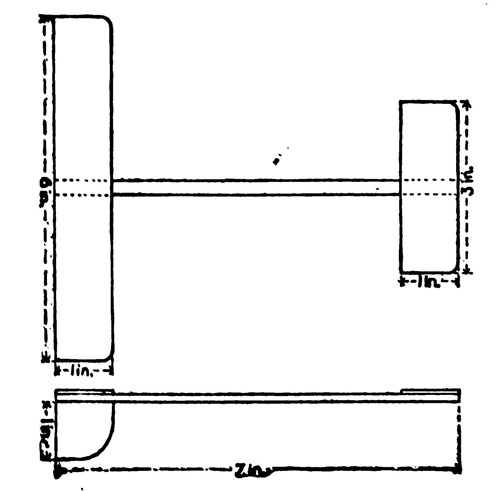

   A Simple Model Glider

An hour's entertainment, no less interesting than instructive, may be enjoyed with a series of these paper gliders. A different model might be prepared for each guest, and a prize or favor offered for the longest or best spectacular flight. The little gliders will cross a large room before coming down. The various aeroplanes nowadays are so familiar that in any gathering will be found several who favor, for instance, a Wright over a Curtiss take a lively interest in the rivalry of the various models.

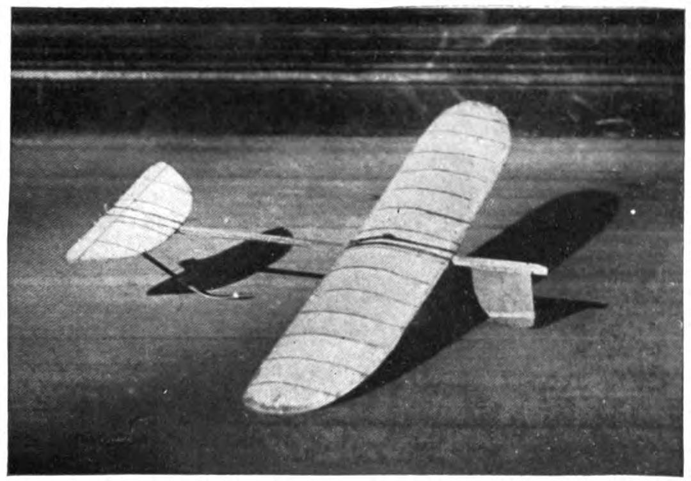

   An effective glider built by R.S. Barnaby

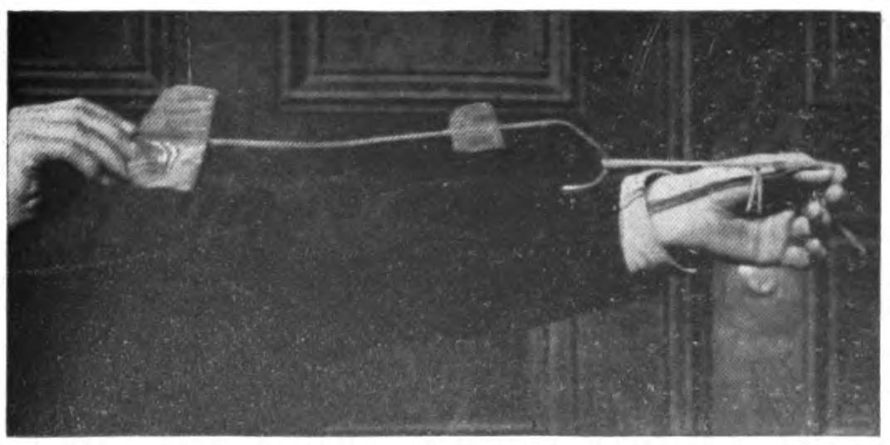

   An efficient sling-shot glider built by John Roche

Begin with a very simple model. You will soon learn the trick of judging the size of the supporting surfaces and the spacing. The Antoinette aeroplane is probably the easiest one to imitate. From a sheet of ordinary writing paper, cardboard or fine wood, cut the form indicated. If the paper be rather heavy, it may be made six inches in length. By folding the paper and making one cutting, it will be found much easier to make the wings even and symmetrical.

The two sides should be fixed at a broad dihedral angle. To keep the little glider on an even keel you will need to add a weight to the front. A large pin or paper clip will answer. Launch the glider by holding it horizontally and throwing slightly forward. If it darts downward, lighten the ballast. If it falls backward, "sitting on its tail," add more weight at the front or bend the tail up.

Your glider will, of course, travel to the ground along the line of least resistance, and the trick is to adjust the center of gravity and center of pressure that this descent may be as gradual as possible. The center of gravity should come a little in front of the center of pressure. The gliding angle, as it is called, or the angle between the course of the model in flight with the ground should be about one in twelve. In other words, the glider descends one foot for every twelve feet it travels forward. Practically all the famous monoplanes may be reproduced in this way.

A variety of gliders may be made in a general arrow form. These arrows, or darts, as they are called, may be made about a foot in length and three or four inches in width. The horizontal surface, it should be borne in mind, is the supporting surface, while the vertical surface gives the flight direction. These gliders will also require weighting at the forward end. They should be thrown forward with rather more force than in the case of the Antoinette.

The biplanes such as the Wright and Curtiss aeroplanes may be reproduced very easily in paper. They fly best when made about six inches in length. Cut the two sheets of paper for the main planes one inch by six inches and round off the corners on one side. Two similar sheets, one by three inches, will be required for the smaller plane in the rear.

The planes are held in position by a series of paper struts, or toothpicks, and should be separated by a distance equal to their width, in this case one inch. Cut the slips of paper to form the struts one and one-half inches in length and bend over the corners at right angles, one-quarter of an inch from either end. These should be pasted in position, always keeping the edge of the struts lengthwise so that they will offer the least resistance in flight.

Connect the two biplanes by strips of paper six inches in length pasted on the lower planes or main deck of the little aeroplane. The forward planes should be fixed at a slightly elevated angle by running struts from the connecting strips to the upper plane. The accompanying picture will show how simple this all is.

The biplanes as a rule require no weighing. To launch them, hold them high in the air and merely let go. They fly best with their smaller planes forward. By varying the angle of the front plane, you can soon bring it to an even keel. A vertical rudder placed three inches behind the main plane will increase the model's directional stability.

An amazingly clever little glider may be made of a piece of reed or cane, say five inches in length, and a sheet of writing paper. With a pair of scissors cut two planes, one three by one inch and the second two by half an inch. You will also need a vertical rudder one inch square. Round off the corners slightly and glue the planes at either end of the stick and exactly on a level. Now fasten the rudder at right angles to the planes beneath the larger plane. If it dips, the front plane is too far back, while if it rises too quickly and settles back, the front plane must be brought back.

The paper gliders form an excellent kindergarten preparation to the study of aviation, leading up to the construction of large model gliders. You will thus gain a skill in adjusting the planes and fixing the centers of gravity and of pressure, which will prove valuable later on. The possibilities of glider building come as a surprise to the laymen in such matters.

THE SLING-SHOT GLIDER.
######################

A fascinating field of experiment is opened by combining the sling-shot principle with the ordinary glider. The speed with which one can launch a glider from the hand is, of course, limited. Now use a small strand of rubber to launch the planes, and the increased speed will not only lengthen the flight surprisingly but make possible a really remarkable spectacular flight. A small glider may be made to return to the starting point or even loop the loop two or three times before touching the ground. By a simple adjustment of the planes, these curves may be varied indefinitely.

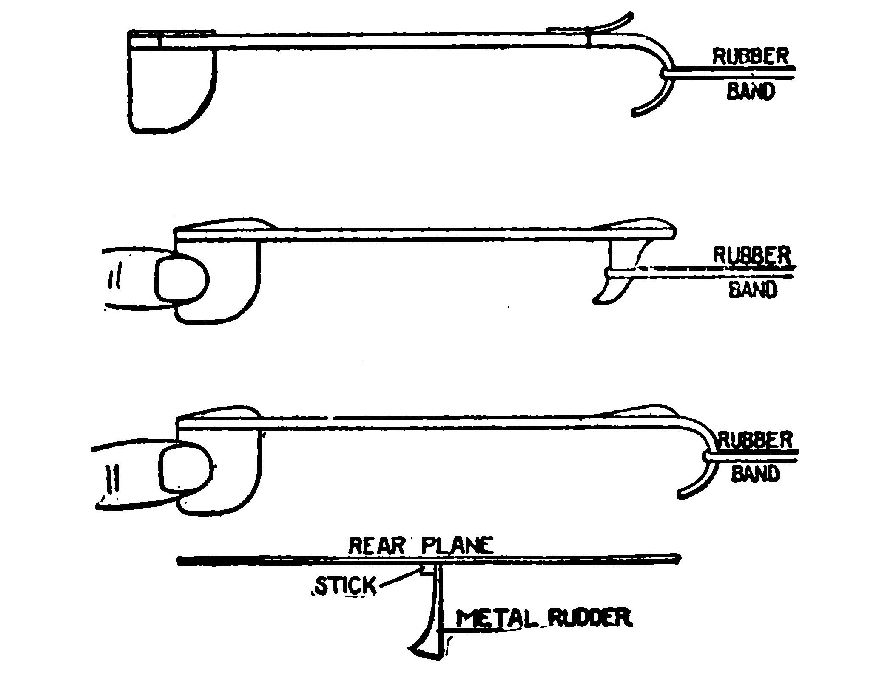

   Designs for Sling-Shot Gliders.

When you have adjusted your glider to fly well, try the same arrangement of planes on a piece of reed, say eight inches in length, and bend the end over in the form of a hook. By heating the cane over a flame, you can make it turn without breaking and hold its position. Now loop a single rubber band over your thumb and forefinger, and passing the hook over the rubber, pull back exactly as you would use a sling shot. As you release the glider, pull your other hand quickly out of range. By using a heavier paper, one which will hold its shape, and turning the forward edges up slightly, the glider may be made to travel upward in a variety of graceful curves.

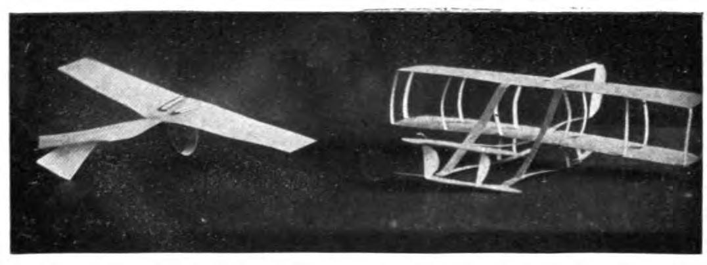

   Paper Gliders. Antoinette Monoplane and Wright Biplane

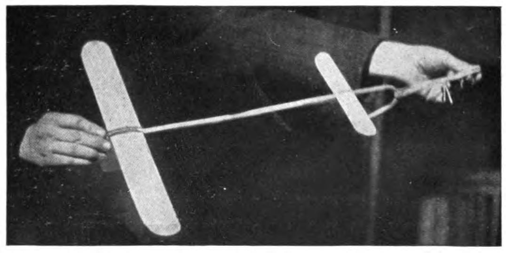

   An excellent glider with wooden planes

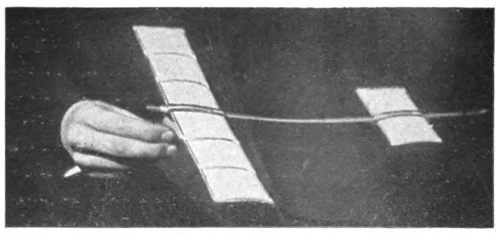

   A covered-frame sling-shot glider

The best glider for launching on the sling-shot principle is made from planes cut from thin metal sheets. Aluminum is the best material, but a very thin wood will answer. A one-foot model glider will be found the easiest size to manage. Cut one plane eight inches in length by three in width, and the second five inches by two inches. Round off the corners on one side of each plane, leaving a straight line for the front or entering edge.

Mount the planes on a strip of reed, cane or bamboo about eighteen inches in length. In all these gliders the forward plane is made the smaller, thereby reducing the head resistance as far as possible. The metal planes should be slightly flexed by bending them to a slight concave above the horizontal and just back of the front edge. The forward end of the stick should be bent into a large hook by heating or first soaking in water. If your glider falls quickly to the ground bend the frame a trifle upward.

Since your glider is intended to travel at a comparatively high speed, the planes may be mounted much further apart than in the case of a glider launched from the hand. Try them first ten inches apart and afterwards adjust them to suit. The rubber used for launching the glider should be fairly heavy, say three strands of one-eighth inch rubber or its equivalent. The end of the hook may need adjusting so that it will escape from the rubber on being released.

It will be found an easy matter to obtain long, graceful glides from this model from the first. By launching it upward, it may rise to a considerable height. When you have caught the trick of launching your glider with sufficient force, try a spectacular flight. Set your forward plane at an angle by inserting a block of wood between the stick. In the case of metal planes, bend up the front edge.

A very slight upward elevation will answer. Gradually increase this angle until the model sweeps upward and turns on itself. You will soon be able to make the glider describe a complete circle or loop the loop twice before landing. When traveling at such a high rate of speed, your glider is likely to be dangerous and might inflict a bad cut, and the flight should only be attempted where one has plenty of room.

These flights may be still further varied by adjusting the rear edge of the vertical plane or rudder. By turning the rudder to the right, for instance, the glider may be made to travel to the right or the direction may be reversed. In this way the glider may be made to describe a complete horizontal circle or several circles. By launching the glider upward with this adjustment, it may be made to fly in a graceful spiral.

The success of a glider depends more upon its modeling and finish of its planes than in the case of the model aeroplane. It must gain as much support as possible from the air, since it has no motive power to keep it aloft. Its head resistance must also be cut down. The ordinary cloth-covered planes, which serve well enough for an ordinary model aeroplane, will not carry a glider far. The planes must, therefore, be of metal or wood, or when built-up planes are used they must be of the most careful workmanship.

The simplest form of glider, excepting, of course, the paper model, is made entirely of wood. A glider two feet in length will be found a good size to experiment with. The model should be much heavier than an aeroplane so that one need not take the care in its construction to reduce weight which may make the construction of a model tedious. A glider of this size may weigh upward of one pound. Under favorable conditions, it will glide for two hundred feet, when launched from the hand, while if it is thrown from an elevation, an upper window or a hill top, it may travel considerably further.

Select a stout stick for your base, one inch square and two feet in length. The main plane should measure fifteen inches in width by six in depth, and the smaller plane ten inches by four inches. A thin board about three-sixteenths of an inch thick may be used for the planes.

The front corners should be slightly rounded, and the rear edges cut sharply away. These planes may be flexed by steaming. Hold the section to be bent over the spout of a tea kettle until the wood is soft and pliable enough to bend. If it does not soften sufficiently, immerse the wood in boiling water. The plane should be flexed slightly upward just back of the forward edge. A good curve may be obtained by heating the under surface over a flame.

To hold it in position until it has dried and assumed shape, bend it over a stick laid on a board and fasten the plane down by driving brads around the edges and bending them over to keep it down. Leave it in this position until it is dry and hard.

Your glider will fly better with a vertical rudder, as in the case of the paper models. The rudder should be cut from a thin board of the same material about six inches square. Round off one corner and plane or sandpaper this front edge, which will be the entering edge. The entering edges of the front plane should be prepared in the same way to reduce the head resistance as much as possible. Nail this rudder to the side of the stick directly beneath the rear or larger plane. It will be still better if you mortise it neatly into the center of the stick.

The glider is thrown with the smaller end forward. For the trial flight, mount the smaller plane at the extreme forward end and then move it backward as you test it out, until the glider moves on an even keel. To launch the glider, grasp the central stick from beneath at the point where it balances, and throw it forward with all your might. Since it travels at a much higher speed than a power-driven model aeroplane, it requires much less supporting surface, while the planes may be spaced much further apart.

When you have adjusted the planes, try throwing your glider at an upward angle of say forty-five degrees. It should rise swiftly to a height of upwards of fifty feet, turn backward on itself, and even describe a graceful upward curve before coming down. Now try throwing it into the wind or against a moderately strong breeze. Its course is likely to be very irregular. It will dip and rise at many unexpected angles, and probably travel several hundred feet in all before landing. During the past year, a model glider has been built by Mr. W. H. Howell, Jr., to glide a horizontal distance of 650 feet, while the actual length of the flights has been upwards of 2,000 feet. 

CHAPTER IV TOOLS AND MATERIALS
``````````````````````````````

A well-stocked tool chest will be of great assistance to the builder of model aeroplanes, but it is by no means essential. A few simple tools, easily obtained, will be found to answer. First of these comes a serviceable pair of nippers. You will need them to bend the axles of your propellers, in adjusting the motors, and for a score of uses. A pair of nippers with a cutting edge is best. Always be sure to slip these in your pocket before flying your model, for you are sure to need them.

A fine gimlet, or a needle drill, will be found useful in a score of ways. They cost but a few cents. A handle which may be adjusted to drills of different size is best. A drill one thirty-second of an inch in diameter will be found especially useful. The parts of your model are likely to be delicate and easily split, even while driving a small brad. You can avoid the danger of splitting by first using the needle drill, even for small brads, and then enlarging the hole, if necessary, with a larger drill or a gimlet.

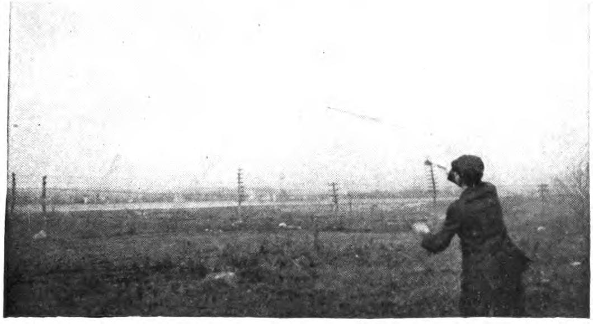

   Percy Pierce launching a model

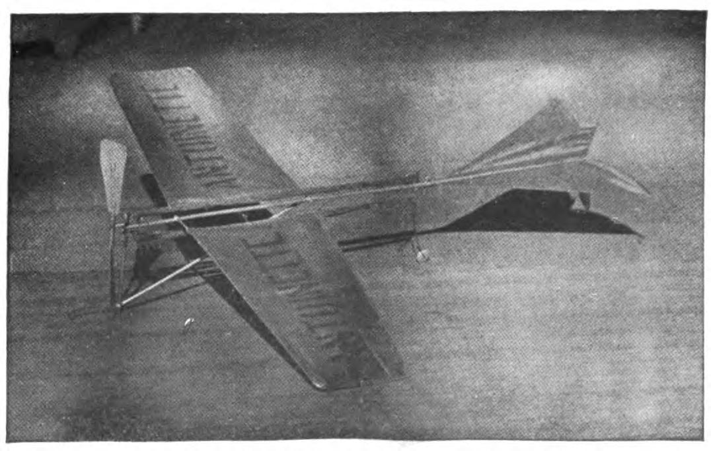

   A French model built of aluminium

A fine saw will be found very useful,—the finer the better. The timber used for the frame is so light and soft that it is likely to split. A gig saw will be found just the thing for cutting out propeller blanks and other parts, but it is not essential. If your model be made of metal, a small soldering iron will, of course, be found indispensable,—the smaller the better. The metal parts are very delicate, and the iron should have as fine a point as possible. Such an iron can be obtained at a hardware store for a few cents. If you do not know how to solder neatly consult some tinsmith.

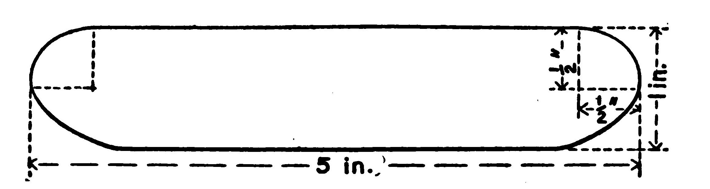

   Diagram for making the planes

In addition to good cutting tools, a good half-inch chisel is most important. A concave chisel will be found handy in carving propellers. Some of the best propellers have been whittled out with an ordinary penknife, and sometimes a dull one at that, so that after all a good penknife is the most essential tool of all. With this little handful of tools, you will find you can build up the most delicate models.

The world has been ransacked for material which will give the greatest possible strength for its weight. The use of aluminum is, of course, familiar. The search has also brought out the comparatively unknown metal, "magnalium," which, although a trifle heavier, is believed to be much more desirable on account of its greater strength. In a search for strong, light wood the builders of aeroplanes have searched the tropics.

One of their discoveries has been balsic wood, which is of a feather weight. It is exceedingly soft and easily worked, but has the drawback of being rather pithy and easily split. A severe jar is likely to discover some weak point. It will be found valuable, however, for the shorter members of the model. Some model builders use balsic wood as a filling for hollow sticks. The wood may be strengthened by covering with cloth glued firmly about it. It is also used as a filling for thin aluminum tubing.

In all the search for materials nothing has been found to compare with bamboo for lightness and strength. A number of successful model aeroplanes have been built this year in which the central sticks and frames are built entirely of bamboo. Bamboo is especially valuable in constructing the smaller members. It can be bent either by the dry-heat process, described elsewhere, or by steaming. Bear in mind that the strongest part of the stick lies just beneath the hard glazed outer surface. The only drawback of bamboo is a tendency to split at the ends. The extreme lightness of the material on the other hand makes it possible to make rigid joints by glueing and winding with fine thread touched with glue.

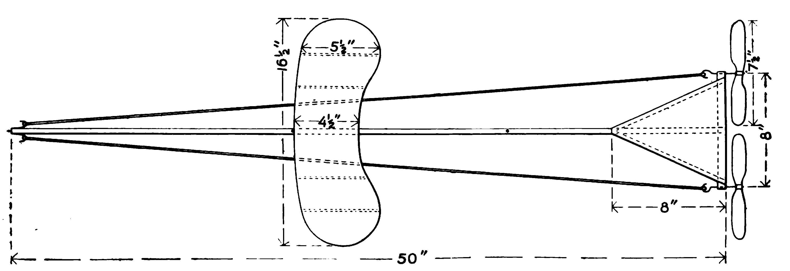

   Working drawing of the Flemming Williams model

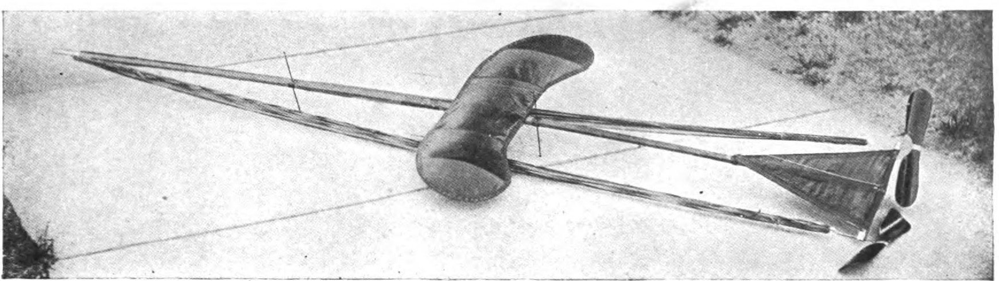

   An imported Flemming Williams model. English record 2600 feet.

The lighter woods, whitewood and poplar, are much used by model builders. They are easy to work, especially whitewood, because of its freedom from knots and cross grains. Some builders prefer ash on account of its strength. Beech has rather less strength, some fifteen per cent, while spruce is little more than half as strong as ash. The quality of the wood varies considerably according to its nearness to the bark of the tree. The wood used for model aeroplanes should be well seasoned; a year is not too long.

Motor bases are of two general divisions. The "single stickers," or bases consisting of one member, are commonly called "spars," while the more complicated frameworks are designated as "built-up" frames. The spar type is, of course, the simplest to construct, and, as many believe, the most efficient of all forms. The simpler the design, as a rule, the less chance will there be of breakage. For the beginner the use of plain, honest sticks is, of course, to be recommended.

The built-up motor bases, on the other hand, make a more attractive model to the eye. There is besides an opportunity to reduce the weight of the frame while retaining the same strength. An examination of the models illustrated elsewhere will show to what an art such construction has been brought. By ingenious bracing it is possible to construct motor bases of strips one-sixteenth of an inch, or even less, in width, and yet render the whole sufficiently rigid to withstand the pull of powerful twin motors.

Your frame may be considerably lightened by using hollow sticks or shafts in place of solid members. A stick three-fourths of an inch wide formed of light lath one-eighth of an inch thick will weigh no more than a solid piece one quarter of an inch square. Such a member is stronger than the small, solid stick; it bends less readily under the pull of your motors, and renders the entire frame far more rigid. It will also be found much more satisfactory to mount the planes upon such a frame.

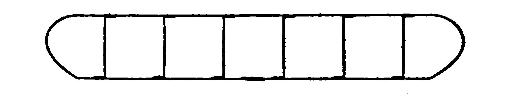

A little practice will enable you to make a very satisfactory stick of this pattern. Secure a light strip one-eighth of an inch thick and of a width one-eighth of an inch less than that of the stick you intend to build. A one-inch stick is probably larger than you will need. The following directions are intended for a stick three-fourths of an inch square.

First cut three square plugs one-half an inch square and one-fourth of an inch thick, and placing one at either end and one in the middle to form a core, build your frame about them. The edges should overlap and be glued continuously together, and the plugs fastened in position with brads driven from the middle of the four sides. When dry, cut away the glue, sandpaper and varnish.

Some model builders prefer a T-section-shaped spar, which is almost as light as the hollow stick, besides being easier to construct. We assume that you are working with eight-inch strips, which will prove heavy enough for ordinary purposes. Prepare one strip one-half an inch wide, the desired length of your base, and the second strip three-eighths of an inch wide, the thickness and length being the same.

Now fasten the smaller strip at the center of the long strip, glueing it first in position. When dry, drive a series of fine brads along the center of the back of the larger strip. Cut away the glue and sandpaper. The T-shaped stick will be found strong enough for all ordinary demands. The rubber strands of your motor may be carried either above or below it.

The H-shaped-section stick is rather more difficult to build, but it will be found somewhat stronger, weight for weight. If you are using one-eighth strips, cut two lengths one-half an inch wide, and a third length three-eighths of an inch wide. Fasten the smaller pieces to the middle of one of these strips, as in the case of the T stick, with glue and brads. When dry, attach the remaining strip opposite, glueing and nailing as before. Some builders prepare these strips by cutting out the grooves with a chisel, thus making a one-piece strip. This requires very careful workmanship, however, and is scarcely worth the trouble.

The motor frame may be still further lightened by using a trussed frame. The weight of this member may be cut in two in this way without sacrificing its strength. To build such a part secure two strips of wood one-eighth of an inch thick, one inch in width, and cut to the desired length. Now from the same material cut six blocks, one-half an inch in length, and set these at regular intervals along one side of the strip. They may be glued or nailed in position, or both. A small brad will hold them in place. In working with such delicate material it will be well to first drill the holes with a fine drill. Next fasten the second strip above them, nailing and glueing as before.

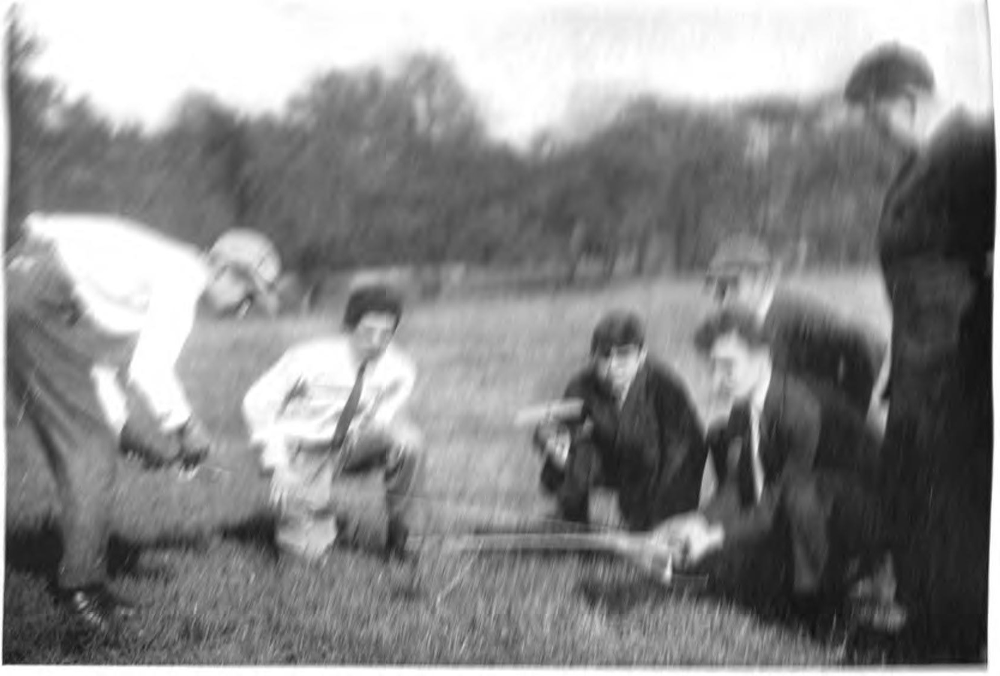

   Storing energy for a long distance flight

CHAPTER V THEORY AND PRACTICE OF PLANE CONSTRUCTION
```````````````````````````````````````````````````

THE planes of your model aeroplane need no longer be a blind experiment whose merits or defects may only be learned by actual test. The science of wing-building is much better understood to-day than a year ago. Without going into the complicated equations dealing with aspect ratio, pressure, and gravity, it is important that one bear in mind a few definite rules in designing even the simplest planes. A great many useless experiments may be avoided.

In a previous volume, it was pointed out that a narrow plane, or one with a high aspect ratio, driven with its broader side forward, would yield greater support than a square surface of the same area. (The aspect ratio, it may be well to repeat, is the relation between the width and depth of the plane. A wing, for instance, whose width is five times its depth, is said to have an aspect ratio of five.)

It has been found that on small planes the center of pressure is situated about one-third the distance back from its front or entering edge. The center of pressure in flexed planes occupies about the same position.

As long as a plane remains horizontal, or nearly so, a very narrow surface,—one, that is, with a high aspect ratio,—will exert greater lifting power than a deeper plane of the same area. An examination of the successful model aeroplanes of 1911 will show that the depth of the planes has been cut away. Planes are used with an aspect ratio as high as ten. The speed at which such a plane travels is a very important factor. As the speed increases, the efficiency of the plane surface increases, so that a model aeroplane driven rapidly may be sustained by less wing area than in the case of one which flies slowly.

As the front edge of a plane is raised, the center of pressure travels backward. By the time the plane has reached an angle of about fifteen degrees, its lifting power has diminished about one-half. A very narrow plane, or one with a high aspect ratio, should, therefore, be set near the horizontal. The model should, moreover, rest upon skids at as low an angle as possible.

In starting off, the planes will thus exert their maximum lift, or nearly so. If the narrow planes be elevated too much, the center of pressure will come nearer the rear than the front edge, and tend to force the aeroplane downward, or, as the phrase is, make it "sit on its tail." As long as a plane is traveling horizontally, or at low angles, its rear portion exerts very little sustaining power and may be cut away.

A plane with a high aspect ratio is much more stable in flight than a surface of greater depth. The center of gravity of a flat plane would, of course, coincide with the center of the surface when the plane is in motion. When the plane tilts, the center of pressure, as we have seen, moves backward or forward. If the plane has little depth or a high aspect ratio, this center of pressure cannot move far.

It must oscillate back and forth within very narrow limits. A very little tilt up or down will restore it to its normal position, so that a plane with high aspect ratio is more stable than one with a deeper surface.

The efficiency of a curved surface over a flat plane was analyzed in a former volume. Such a curve, when well drawn, adds to the lifting power as well as the stability. Since a curved plane does more work than a flat surface, its size may be reduced and its aspect ratio increased. In other words, the curved plane may be narrower than a flat surface, and may be made thinner in proportion to its width.

The height of the curve, or camber as it is called, has been worked out by elaborate mathematical equations, but we may take the general results without following the calculations. For a plane six inches in depth, the camber should be about one-half an inch, or one in twelve, or in this proportion. The curve should be a parabolic with the highest point well forward, one-third the way from the front edge. The front, or entering edge, of the plane should be the thickest point. It should be tapered off to a thin edge in the rear.

In theory, it is possible to model a plane so delicately that it will fly against the wind by the pressure of the wind itself. It is extremely important that both sides of the plane be brought to this curve as accurately as possible. An efficient plane must, therefore, be covered smoothly on both sides. Such a plane again offers very little skin friction to the wind.

It is difficult to lay down any hard and fast rules for the relation of weight to wing surface, since the types of aeroplanes differ so widely. It has been found, however, that in large models one square foot of surface will support about one-half a pound of weight, when traveling at a high rate of speed.

You will find that your model, if its wings have a spread of thirty inches os thereabouts, will approach one pound in weight. The figuring will show you that two wings, whose combined area is less than 150 square inches, will be comparatively small and certainly well under those generally employed a year ago.

The planes used on this season's models are marvels of lightness and strength. Much has been learned by studying the methods employed by the builders of man-carrying aeroplanes. It is a simple matter to build a three-foot plane which weighs complete less than one ounce, and is strong enough to withstand many a violent shock.

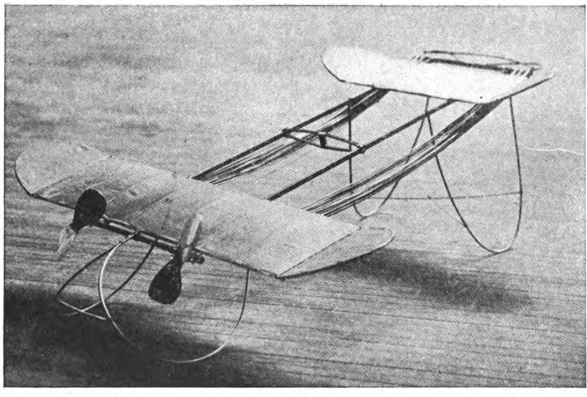

   A geared model built by Leslie V. Robinson

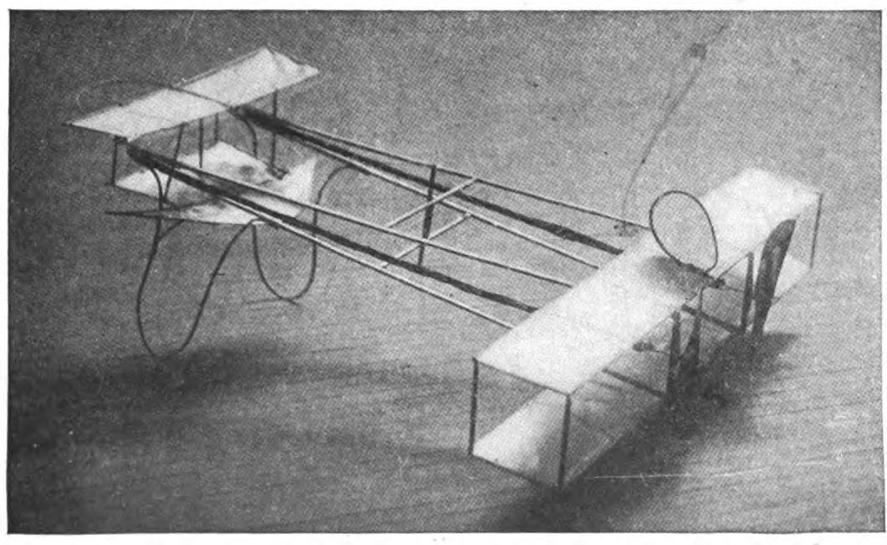

   An ingenious biplane

It will be found a good plan first to lay out the exact form of your plane on a smooth board. Make the depth of the plane one-fifth of its length. It will be noticed that this plane is much more slender than those used last year. Next draw a line at the center the entire length of the board, and mark off one-tenth of the length of the plane from either end. From this center describe a quarter circle at either end, on the same side of the line. This will form your main or entering wedge. The rear corners should be cut sharply away and only slightly rounded.

There is no better material for the main frame than a thin reed, cane or bamboo. The longer ribs may be made of any light lath and the cross ribs of a thin flat strip of the same material. Soak the reed overnight to make it as pliable as possible, or heat it over a flame. Now lay the reed over the outline of the plane, and hold it in this position by driving thin brads on both sides and bending them over the cane. When the outer edge is complete, mortise the ends slightly and tie and glue firmly together.

With the outer frame held rigidly in position, it will be found a much easier matter to introduce the ribs. If you are building a flexed plane first, insert a stick of wood from end to end before placing your cross ribs in position. The thickness of this temporary stick will, of course, determine the curve of your plane. For a three-foot plane, a height of one-half an inch will answer.

The ribs may now be bent over this obstacle and fastened securely to the outer rim by glueing, tying, or nailing. The cross ribs may also be raised by inserting small wedges between them and the longitudinal ribs. When your frame is complete, loosen it from the board and you will find it regular and rigid. Cover it with a very thin cloth pulled tightly over the frame, and glue or sew it in position. A small plane may be covered only on the under side.

Excellent results are being obtained in England with planes built up entirely of wire. If aluminum wire is used, the weight of the wings is considerably cut down, but even ordinary wire will be found lighter than wood. For a plane thirty inches in width, or thereabouts, the wire used should be at least one-sixteenth of an inch in diameter, and should be soft enough to bend easily and hold its position.

It will be found a good plan to plot out the exact shape of your plane on a sheet of paper, and then bend the wire over this outline. The ends may be fastened together readily by binding tightly with fine wire, such as florists use, and touching the joint with solder. Be careful, of course, to keep the joint smooth. The cross ribs of these metal frames may also be made of wire. Bend the ends at right angles and attach to the inner sides of the plane with fine wire, and touch all the joints with solder.

There are several advantages in the metal planes. It is a very simple matter to flex the plane by bending the cross ribs and the ends upward to the desired curve, much easier than when working with wood. Such a frame will stand almost any amount of knocking about without injury. A swift volplane to earth, which would smash any ordinary wooden frame to "smithereens," would have little effect on a model plane. Such frames again are very easy to cover.

It will be found a good plan to sew the cloth to one edge, draw tightly across and sew fast to the opposite side, while a few stitches around the metal cross ribs will give it any curve you desire. A metal frame makes it possible to experiment with various curves. It is an easy matter to bend the ribs up or down and alter the line of the plane at will.

Small stability or guiding planes may be made of a sheet of metal, although such construction is not advisable for the main plane. When your front or entering plane is the smaller one, it is possible to turn it into a very efficient motor anchorage.

The plane should be cut from a sheet of aluminum, preferably. Fasten this securely to the front of your motor base with nails, or tying in position. The wires of the hooks holding the ends of the motors may be passed through the holes cut to the back of the rear edge of the plane and bent over. Of course it is very simple to anchor double motors, or even multiple motors, in this way.

One of the novelties in plane construction is a narrow wing with ends brought well back. It may be built either flat or flexed, and promises to afford unusual stability. The form is very popular among model builders in England, where it is made very narrow, its depth often equaling its width.

In many of the English models, these planes are placed far forward and raised well above the main stability plane. They are built with the entering edge either straight or slightly curved. Such front planes behave especially well in the open air and even against a considerable wind pressure.

There is still considerable difference of opinion as to the best material for covering planes. Several specially prepared aeroplane cloths have been placed upon the market which are guaranteed to be practically airproof. The cloth is rather heavy, however, and better suited for large machines. A thin silk answers the purpose perhaps as well as anything.

Some model builders select the thinnest possible silk and then render it airproof by varnishing or covering with a thin solution of wax or paraffin. When this is neatly done, the planes are very taut and shipshape. Several preparations are offered for sale for coating planes, which are excellent.

In the search for the lightest possible covering, some builders have gone a little further and use a very thin paper known as bamboo paper. Even the thinnest paper will be found as impervious to air as a rather heavy cloth. Its weight is practically nothing, even for a large plane. It requires no varnishing or preparation, although it is sometimes painted to render it more rigid.

There is, of course, a very obvious objection to paper that it is easily punctured, but on the other hand, such accidents are very easily repaired. A bad rip may be patched up with a touch of paste, or, the plane may be re-covered very quickly. With this paper care must be taken to fasten it to the frame of the plane as securely as possible, as a loose sheet will flutter and increase the head resistance.

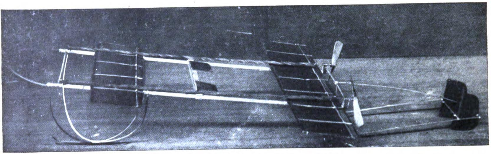

   A well-proportioned model built by Reginald Overton

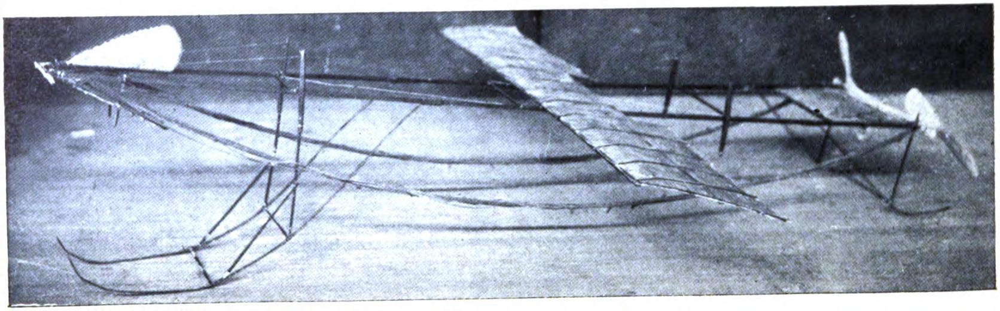

   A good model intended for long distance work built by A. C. Odom

In order to lighten the plane, the outer frames at the ends and rear may be cut entirely away. An appreciable saving of weight is thus obtained without weakening its structure. This plan is especially to be advised in comparatively small planes. Design your plane and lay out its exact form on a board. A thin strip of wood should be cut the width of the front or entering edge, and similar straight lengths for the longer ribs.

It will be found a good plan to use a heavier piece back of the front edge or at the top of the curve. In building your plane, follow the former directions of laying a stick on the board to give you the height of the curve. The shorter cross ribs may then be fastened by glueing to the longer ribs. By using a light lath or strip for the cross ribs, it will be possible to make them sufficiently rigid merely by glueing without the trouble of nailing. A skeleton frame of this kind has the advantage of being very elastic.

In covering the frame, draw the cloth tightly across the upper side of the frame and touch with glue at regular intervals along the ribs. When dry, trim away the cloth between the points of the ribs and the open ends. The rear edge may be held in position merely by the shorter cross ribs. Trim the cloth along the edge.

In such a plane it is well to stiffen the cloth covering by painting with shellac or varnish. This also lends a semi-transparent effect which improves the general appearance of the plane. By cutting away the side and end pieces of the frame such a plane three feet in width may be made to weigh less than one ounce.

Since it is very important that the covering of the planes may be perfectly smooth, it will be well to experiment with several different methods of attaching the cloth or silk or paper. By covering with paper, a taut surface like a drumhead may be had. Use a rice or fiber paper and moisten the sheets by laying them between damp cloths, as was explained in detail in a previous volume. In drying, the paper contracts and tightens.

In covering a frame with cloth, the angle of the two sides may be altered by stretching the covering over the raised ribs on one side and drawing it tightly from edge to edge on the reverse side. If you have difficulty in making your surface smooth, try lacing it to the sides. You will need a strong hem at the edge. By using a thread, you will be able to pull the cloth taut much the same as tent flaps are tightened.

The proper curve for a flexed plane is still a matter of dispute. The highest part of the curve should come well forward, while the rear surface is drawn straight. A good camber may be plotted very simply. Draw a rectangle with a length sixteen times its height. Now mark off a point on the upper side one-fourth of the way from the left-hand corner and draw diagonal lines from this point to the two lower corners. Next round off the broad angle formed by the two lines and you will have a good curve to imitate in flexing your planes.

CHAPTER VI SCIENTIFIC PROPELLER BUILDING
````````````````````````````````````````

Ever since windmills were first set up, men have been studying the merits of different propellers. By the time steamships came to be driven through the water by rotary blades or screws, their modeling had become a science. The builders of rotary fans in turn contributed still further to our knowledge on the subject. Drawing largely upon all this experience, the aviator has learned to build fairly efficient propellers, although there is probably no department of aeronautics to-day so little understood.

In a windmill a current or cylinder of air flows, of course, against the propeller. The blades must be shaped and spaced with this in view. Reverse the action of the windmill, and the propeller proves inefficient. The broad blades will stir up a current of air, to be sure, but a very weak one. A revolving fan solves a very different problem in detaching a cylinder of air from the atmosphere and propelling it with the greatest possible momentum. Here, again, the propellers must be differently modeled and spaced. Neither the reversed windmill propeller nor the electric fan, however, would serve to drive an aeroplane.

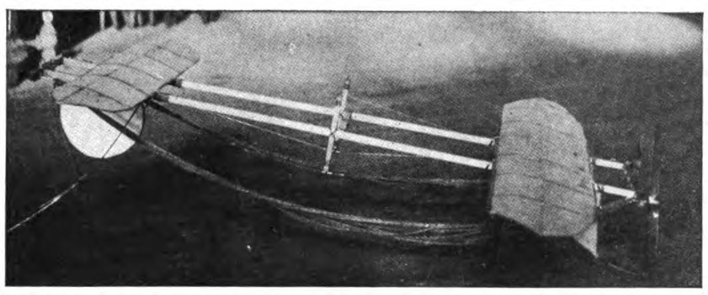

   A beautiful monoplane built by R. Mungokee

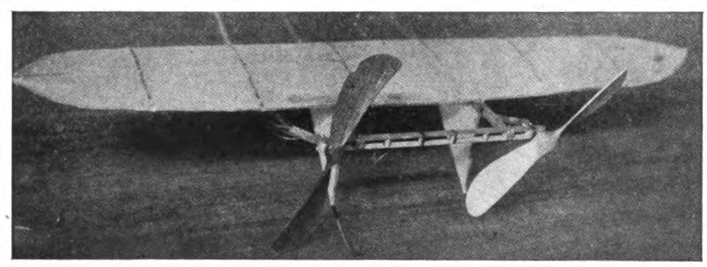

   Detail of a model built by R. Mungokee

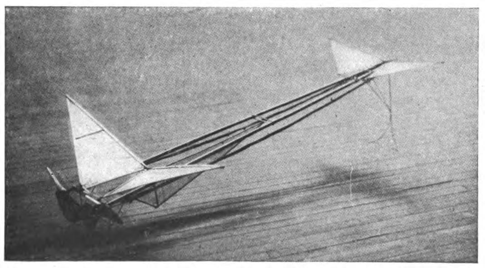

   An ingenious application of the dihedral angle

The propeller of an aeroplane must cut its way smoothly, pressing the air backward without splashing. It is only when an aeroplane is held fast that its propellers kick up such a fuss and blow your hat off. The aeroplane propeller's work is much the same as that of a steamship, although the air through which it travels has many tricks not yet understood. The density of the air compares to that of water as one to eight hundred, but the friction encountered by the air propellers is much greater than 1-800th that of water. It may be laid down as a general rule, however, that the driving force of an aeroplane propeller varies as the square of the number of revolutions per minute.

There is at present no standard form of propeller for the man-carrying or model aeroplane. One school of designers favors a small blade revolved at high speed, while others claim that a larger propeller driven more slowly is more efficient. As a general rule it may be laid down that a model with a span of thirty inches should be driven by twin propellers eight inches in length or diameter. They should have a speed of about 1,200 revolutions per minute, or at the rate of some 200 turns every ten seconds. To test the strength of your motor, give the propeller 200 or 400 turns, and watch in hand, find how long it takes to run down.

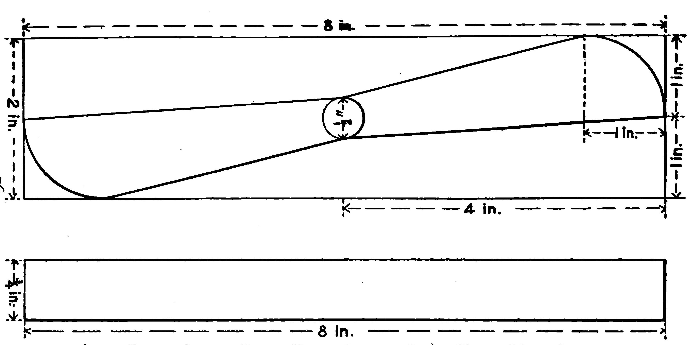

   Diagram Showing How To Make A Propeller From A Wooden Blank

There is much difference of opinion as to the proper modeling of the propeller. It has been worked out by elaborate equations that the blade should be concave and yet in actual tests it has been found that some machines are driven faster by a flat blade propeller. By a flat screw we mean a straight pitch propeller, or one in which the angle does not vary from the hub to the tip. When Mr. Glenn H. Curtiss made his famous record flight at Rheims, he used a straight pitch propeller, and when, later, his machine was equipped with propellers scientifically curved, his aeroplane lost speed. Evidently the exact relation of propeller forms to the machine still remains much of a mystery.

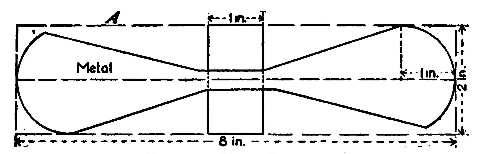

   Design of Metal Propeller

A very simple test of the efficiency of propellers of various modeling may be made by running them in heavy smoke. By burning a piece of oily cotton waste, you may watch the action of the propellers on the smoke, while, at the same time, this greasy smoke will leave its mark on the section of the propeller blade which does the most work. The speed of the blades near the hub of the propeller is, of course, much less than at the tips, and consequently the work they perform in sending the aeroplane forward is small. At the extreme end of the propellers, the air, of course, tends to slip off.

The most efficient part of the blade, according to these tests, is about one-third of the radius distant from the center. Less than two-thirds of the propeller seems to do effective driving work. On the propellers driven against greasy smoke, the blades near the hub remain comparatively clean while the portion most soiled extends outward from this point. The test would seem to indicate that a broad blade narrowing to the hub would develop the maximum thrust. It would also seem that it is unnecessary to carry the lines of the blade close to the axle, thereby possibly weakening the propeller.

To understand the theory of the propeller, bear in mind the principle of the action of the wings, for the analogy between the two is very close. The forward, or entering, edge of the propeller is curved so that it will cut its way smoothly and offer less resistance than a straight entering edge. The blade of the propeller is made slightly concave for exactly the same reason that the plane is curved. Like the plane, such a surface takes advantage of the resistance of the air.

The curve of the propeller blade near the hub is made much higher than further on because this part travels more slowly, and it is important that the cylinder of air set in motion by the blade should have the same velocity throughout its diameter. The blade is made widest at its outer end, since this is the most effective surface and is expected to do the greatest amount of work. The other end of the propeller blade is rounded off in order that the air may slip away, thus avoiding skin friction, which at this point is naturally high.

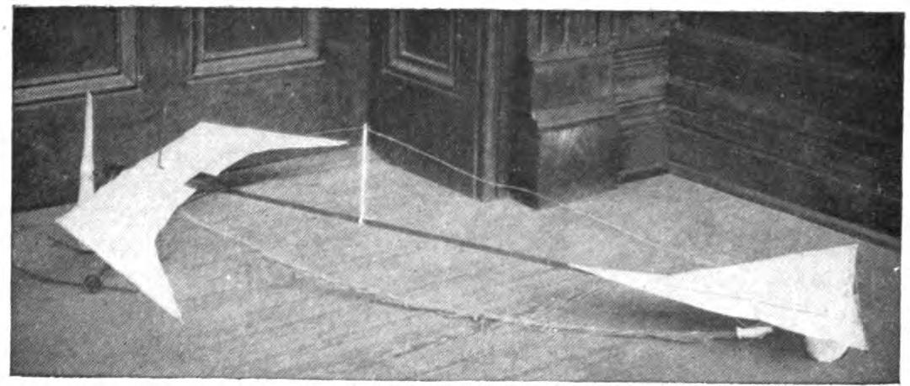

   A test of high aspect ratio planes

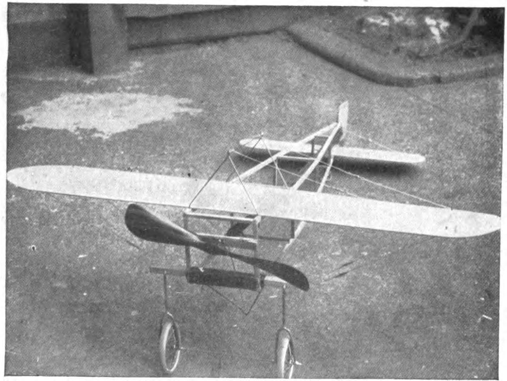

   A modified Bleriot built by Cecil Peoli

The width of the propeller blade has been the subject of an immense amount of investigation and discussion. The friends of both the wide and narrow blade back up their arguments with complicated equations, which it would only be confusing to repeat. It is argued by some authorities that since the narrow blade does not stir up the air as long a time as the wide blade, therefore one blade does not stir up the air enough to interfere with the action of the second blade.

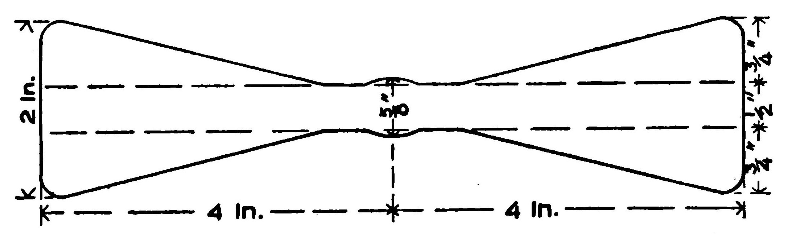

   Langley Propeller Blade

A small blade may be driven by a much lighter motor, and is, of course, capable of much higher speed. On the other hand, the wide blade drives the model much further ahead per turn than the narrow blade, while making a much greater demand upon the motor.

Briefly a narrow propeller is best for speed and the wide blade propeller for power. There is an immense amount of difference of opinion concerning the form and position of the propeller so that it is impossible to lay down any hard and fast rules. It is argued by several well-known aviators that a propeller is more effective when driven with its straight edge forward and there is scarcely a point not in dispute.

One of the most novel propeller designs, the Cowley, is a blade bent in the form of an arc of a circle, the radius of the curve being equal to the diameter of the propeller. The propeller is mounted with the convex surface forward. The theory of this propeller is that it focuses the air, as it were, which it throws back forming a cylinder of air which travels at a higher speed than one set in motion by the horizontal blades.

The tendency for the air to slip off the ends of the propeller blades is probably reduced. This form of propeller may be made by steaming the blades and bending them into position. A mould may be prepared and the steamed blades forced to take their shape and held in position until they have dried.

A series of experiments have been made in England with boomerangs to discover the effect of curved surfaces on flight. The Langeley propeller, which embodies the information gained in this way, has a flat back while the face is concave, following the general stream line form. The ends of the propeller blades are practically square. Some of the new propellers are covered with a thin canvass glued smoothly over the greater part of the blade. The covering guards somewhat against splitting and splintering.

In the latest Percy Pierce models, for instance, the blade is carried out in a semicircle at the end of the propeller, thus practically doubling its surface. The driving power of this blade is very high. It is argued for this design that the blade being very thin is forced slightly backward at the beginning of the flight, while the model is gathering motion, but later, when the tension is removed, springs back thus increasing its effective surface and the thrust. The propeller thus automatically adjusts itself for the work it has to perform.

Since it is so difficult to fix upon the right pitch of a propeller, the builder of model aeroplanes had best work out this problem for himself. The propeller blank described later on, with a depth of three-fourths of one inch to an eight inch diameter, will give you a comparatively low-pitch propeller. An eight-inch propeller cut from a block one inch in depth will give you as high a pitch as you are likely to need. As you increase the pitch, you, of course, increase the power of your aeroplane, while at the same time you make a greater demand upon your motor. Try the propellers of different pitch until you find the one which gives you the greatest stability and the highest speed. It is well to remember that in increasing the width of your propeller blade you add to the skin friction.

Some designers carry the curve of the propeller blade to the center of the axle, while others leave the center blank. It is argued by the former that the longer the blade the greater is the thrust. Others believe that the blade exerts little or no thrust near the center and is weakened by being cut away too much. The builder of model aeroplanes has one great advantage over the designer of passenger-carrying craft. The model does not have to carry fuel. After all, the difference in the power required for the various models is so slight that an extra strand or two on the motor will probably solve the problem.

Many successful builders of model aeroplanes now carve their propellers from solid blocks of wood. This method, to be sure, allows the designer to shape the propeller blades with more freedom than with the ordinary or built-up propeller, and of course does away with much of the preliminary work. So great is the demand for the one piece propellers that the manufacturers of accessories now prepare "propeller blanks" or pieces of wood in a variety of sizes ready to be carved. The one-piece propeller is likely to split, but they are easy to make, and this work is a very fascinating kind of whittling.

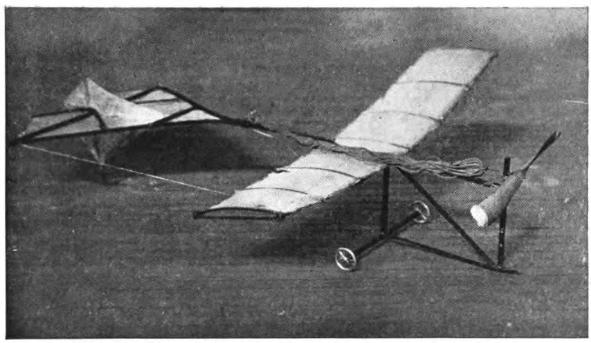

   A combination of several interesting features

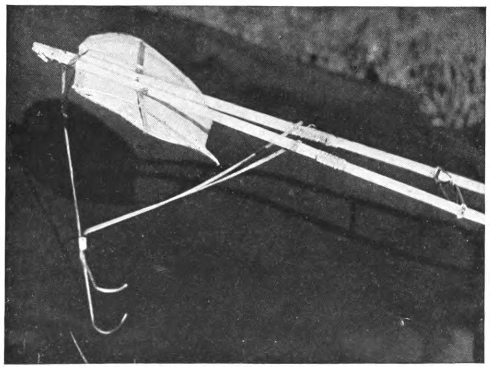

   A skilful adjustment of the front plane and skid built by Percy Pierce

Propeller blanks are easily prepared in case you find it inconvenient to buy them. The following directions refer to a propeller eight inches in length, but the same proportions hold good for any size. Select a piece of some straight-grained wood, white pine is best, which will not split readily, and is easy to work. The original block for an eight-inch propeller should be eight inches in length, two inches in width, and three-fourths of one inch thick. Now draw a line lengthwise, exactly bisecting the block, and mark off the middle of the line, and two points one inch from either end. With one of these outer points as a center, describe a quadrant of a circle above the line, and from the corresponding point, draw a similar circle below the line. From the center of the blocks draw a complete circle one-half of one inch in diameter. Draw straight lines from the ends of the arcs to the vertical diameters of the circle, and saw away the wood to these lines. In carving your propeller, first cut away the wood from the longer straight lines of the block on opposite sides. The blades should be slightly concave. It will be found a good plan to finish one side of the blade before cutting away the opposite side. Cut away the wood until the blade is less than one-eighth of an inch thick, and sandpaper away all marks of the knife or chisel. The wood should then be oiled or covered with a light coat of varnish. It is very important that the two ends of the propellers should be uniform both as to their modeling and weight. To mount the axle, drill a hole at the center just large enough to admit the wire. The outer end may be bent over and inserted into the hole to keep it rigid. If the axle does not fit tightly, drive in small wedges of wood, such as a toothpick, at both sides.

The propeller used by the Wright Brothers on their machines is very simple to construct. Prepare a propeller blank eight inches in length, two in width and three-fourths of an inch in depth. Draw two lines parallel with the longer sides, the first seven-eighths of an inch and the second one and one-eighth inches back. Now at the upper right-hand corner mark off a point one and one-half inches from the end, and from the opposite corner on the lower base the same dimension. Connect these two points.

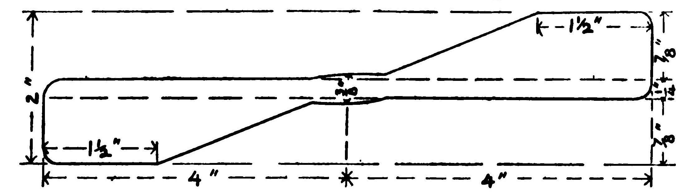

   Wright Propeller Blade

The blank is completed by cutting away to these lines, leaving the blades each one and one-eighth inches in width. The axle should be left a little full, say three-eighths of an inch across. Round off the outer corners. In modeling your propeller cut away or bevel the sides formed by the two intersecting lines, which will form the entering edge of the propeller. The blade should be cut to a very slight concave, although some prefer a flat blade. The propeller is mounted by drilling a hole at the center and mounting in the usual way.

The propellers of a model aeroplane are subject to more wear and tear than those of a regular passenger-carrying machine. At the end of every flight, they face a possible catastrophe. In the search for some durable form of screw, a number of interesting discoveries have been made. One builder has succeeded in coating a wooden propeller with bronze by subjecting it to an electroplating process, but this is much too complicated for the amateur. The lighter metals, aluminum and magnalium, naturally suggest themselves for the purpose. Such propellers weigh no more than wood and may be readily bent to the required shape.

Procure a thin sheet of aluminum, or, if this cannot be had, a smooth piece of tin will do. It must, however, be heavy enough to hold its shape. The design of the propeller may be laid out on the tin, and the metal trimmed away. To make an eight-inch propeller, draw a rectangle eight inches in length and two inches broad, and draw a line joining the middle of short sides. At the center, draw two vertical lines half an inch on either side of the center lines, half an inch above and below the center, forming a small inner rectangle. Now from a point on the bisecting line, one inch from either end, draw two semicircles. Next, connect the top of one of these circles with the nearest point of the inner rectangle and draw another line from the point below to the corresponding corner of the large rectangle. Repeat the diagram on the other end of the rectangle, reversing the curve as indicated in Fig. A.

In cutting out the design, allow the straight sections running to the sides of the larger rectangle to remain. They will be needed to hold the central piece in position. This consists of a block of wood measuring one inch by one-half an inch and one-quarter of an inch in thickness. The strips at the center should be bent tightly over the corners, overlapped, and nailed firmly down with brads. Next, at the center, punch a small hole and drill through the block a shaft large enough to hold the axle of the propeller which is then firmly imbedded in it. One great advantage of the metal propeller is the fact that you may readily alter its pitch.

An efficient propeller may be made by mounting metal blades on a wooden shaft. Procure a stick one quarter of an inch square and three inches in length, and saw through both ends for a distance of three quarters of an inch. Prepare your propeller blades by plotting them out on a sheet of aluminum, as described above, and cut away the middle section. The blades may then be inserted in the open ends of the stock and nailed securely in position. The edges of the wood may then be rounded off and the axle inserted firmly at the center. The metal sheet should be bent into the proper pitch as in the case of other metal propellers.

FABRIC PROPELLERS
#################

The most nearly indestructible propellers are the fabric screws. They are also doubtless the lightest form. The blades will, of course, be perfectly flat, making straight pitch propellers. You will need a small cylindrical piece of wood one half an inch in diameter, and one half an inch in height, of some tough, hard wood. The blades may be made of reed or cane, or, still better, of wire. Aluminum wire being very light is probably the best for the purpose. Bend the wire into the form of a triangle two inches in width and four inches in length. Determine at what angle you wish them to be set, and bore holes in the hub and fix wires of each frame firmly in them. Cover the frames neatly with cloth and mount it in the usual way.

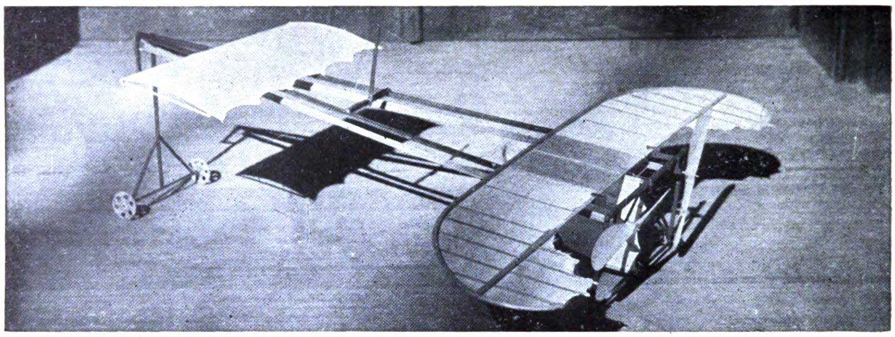

   An efficient model, showing excellent construction, designed by John Caresi

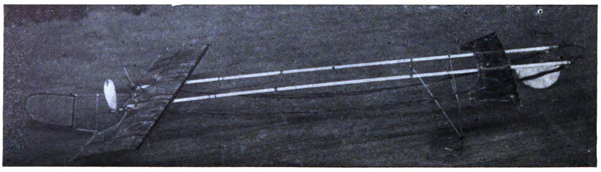

   One of the best minimum plane models of 1911

THE LANGELEY BLANK.
###################

Many model builders still retain the Langeley propeller. It is a very simple one to build. To prepare a blank secure a block, as before, eight by two inches and three-fourths of an inch in depth. Connect the four corners with diagonal lines. Parallel to the longer side draw two lines, one three-fourths of an inch inside and the second one-half inch below it. Cut away the block forming a double fan-shaped piece. Some prefer a wider center and the hub may be made a trifle broader if desired.

In shaping the propeller cut away from opposite sides of the blank. The original Langeley is a flat blade propeller so that the modeling is very simple. You may use your own judgement as to the thickness of the blade, although about one-eighth of an inch is suggested. The Langeley is mounted in the usual way. To heighten the pitch of your propeller secure a thicker blank.

CHAPTER VII ASSEMBLING THE MOTORS
`````````````````````````````````

In the present stage of model aeroplane building, rubber strand motors satisfy every demand. Models have been flown for more than 2,500 feet by the force of these twisted strands, and doubtless their efficiency will be still further increased. Such motive power is besides very easily obtained and applied. Careful tests have shown that more energy may be stored up in twisted rubber strands than in the same weight of springs of steel or any other metal.

In gauging the strength of your motor, much depends upon whether your model is to rise from the ground or be launched from the hand. In the model tournaments in England, the flying machines are almost invariably thrown across the starting line, while in America they are required to rise unaided. It is obviously unfair, therefore, to compare the distance records of the two countries.

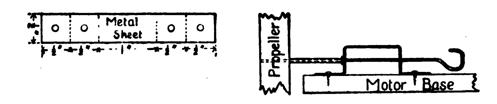

   A Metal Motor Anchorage

It requires a comparatively powerful motor to raise a model from the ground, whereas a lighter motor would be sufficient to propel it through the air. Many models, capable of flights of several hundred feet when thrown will refuse to rise, while, on the other hand, some models which rise well enough have poor distance qualities.

It should be borne in mind that the length of the motor, speaking broadly, controls the distance qualities, and its diameter the speed of the model aeroplane. A long slender motor, capable of from five hundred to one thousand turns which will revolve the propellers for thirty seconds or more, should insure a flight of several hundred feet. As you increase the number of strands of rubber, building up the diameter of the motor, you cut down the number of turns and therefore its duration, although you increase its speed.

A motor capable of one thousand turns must be about forty inches in length and consist of but six, or at most eight, of these strands. A model which may be driven by this motor, it will be found, must be very light. A model aeroplane weighing upwards of one pound, on the other hand, will require motors composed of fourteen strands or more to raise it from the ground. It is a very simple matter, of course, to add strands of rubber until your motor develops sufficient energy for the work it is expected to do.

The length and diameter of your motor, again, has a direct influence on the height of the flight. Too much power tends to raise the aeroplane higher than necessary above the ground. Since it requires more energy to drive a model aeroplane upward than along a horizontal direction, this is obviously a waste of energy.

If it is desired to fly the model as far as possible, it must be kept close to the ground. In the case of weight-lifting contests, the problem of altitude is, of course, entirely different. Overwinding is even worse than underwinding, since it shortens the life of the motor.

Try out your aeroplane with ten strands on each motor and increase them later. The motor, as previously explained, is formed by looping the rubber strands loosely between the hooks, just as zephyr is wound on a skein. Keep the strands very loose and fasten them to the hooks by tying with a strand of rubber. In winding, do not turn the propeller after the rubber has a double row of knots for its entire length. Such a motor should take up from three hundred to five hundred turns, perhaps more. Do not keep the elastic wound up too long before starting your flight. The strain is great and it quickly wears out.

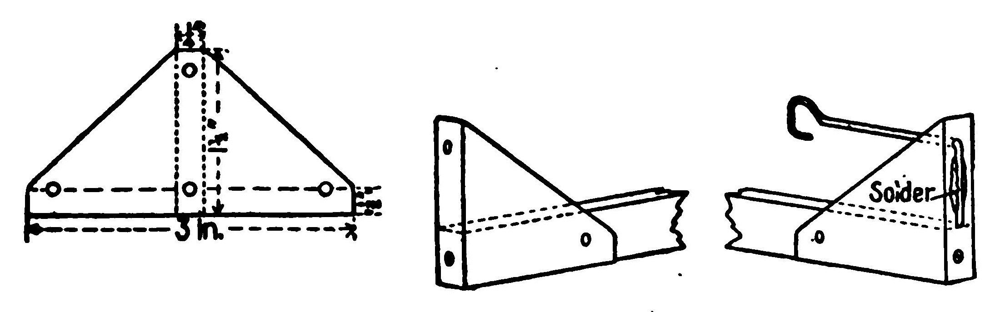

   A Metal Motor Anchorage

The rubber strands should not be allowed to come in contact with any metal parts of the model. The copper that is often used for wiring is especially injurious and tends to decompose the rubber. The hooks of both the propeller and motor anchorage should be covered with a piece of rubber tubing. This serves a double purpose. With this protection, the rubber when tightly twisted is in no danger of being cut by the wire or of taking up the oxides which quickly eat through it.

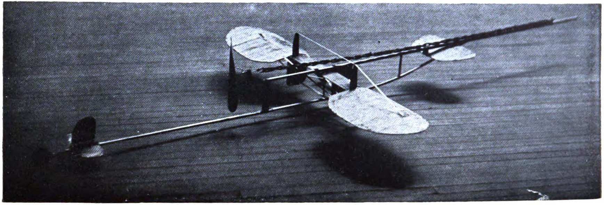

   A notable model possessing unusual stability. Built by W.S. Howell, Jr.

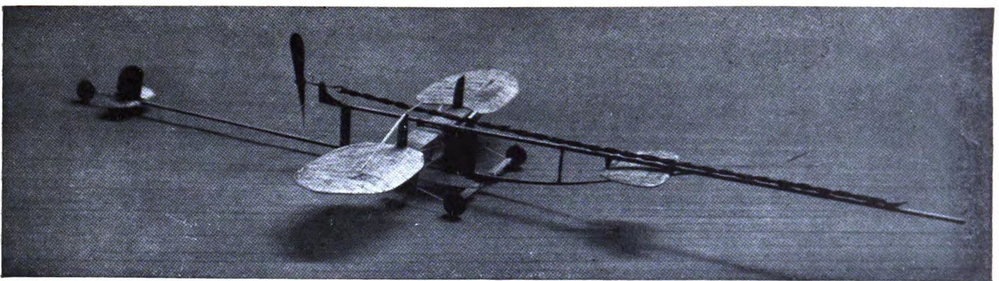

   Front view of model built by W.S. Howell, Jr.

It requires an expert to pick out the best quality of rubber. If the strands be examined under a magnifying glass, it will be found that the edges of fresh rubber of the best quality are clean-cut, whereas the cheaper rubber, and that which is worn, has commenced to granulate, giving the edges a ragged appearance.

A simple test is to stretch the rubber over a ruler. A good rubber, in first-class condition, will stretch about seven times its length, and on being released instantly spring back to its original size. The same rubber should stretch to ten times its length without breaking.

There is a great difference of opinion among the most successful model builders as to the best shape of rubber strands. Some prefer the flat, band rubber, while others are obtaining satisfactory results with rubber cut in square strands. The strand used by the English model builders is seldom more than one-sixteenth of an inch square, while in America one-eighth of an inch strand is commonly used.

Experiments have been made with a single strand of rubber one-fourth of an inch square, but the results have not been satisfactory. One theory is that the corners of the square rubber tend to cut into one another and quickly wear out, and that a perfectly round strand would be the more efficient. At present there are no such strands on the market. It is argued by some that the square strand in twisting must be turned on itself further than the flat strand, and is therefore placed under an unnecessary strain. After all, the advantage of one form over another is fractional, and an extra strand added to the motor will balance any possible defects.

Figures have been prepared giving the exact relation of the size of rubber to the number of turns, although such statistics are elastic. The problem may be worked out with your own motor. Differences of temperature will be quickly noted. The rules prepared by V. E. Johnson, M.A., an English authority on aviation, are as follows: The motive power is doubled by increasing the number of rubber strands one-half; by doubling the number of strands, the motive power is increased more than two times; and the tripling of the strands increases the motive power seven times. As regards the number of turns the same authority states that the doubling of the number of strands diminishes the number of turns by one-third to one-half.

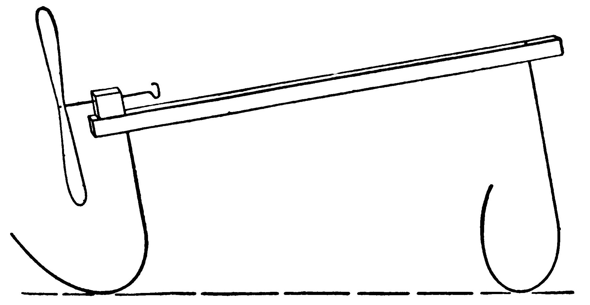

   A Metal Skid

It is also found that each strand will have doubled knots of 310 turns; four strands, 440; sixteen strands at 200; and eight at 210. This is working with strands one-sixteenth of an inch square. As a rule, rubber should not be turned after the second row of knots is formed. And by the way, you will find that the rubber, after being tightly twisted, tends to stick together, and should be carefully separated after a flight so that the air can reach all surfaces.

According to the experiments made by Mr. Johnson, one pound of rubber may be made to store up 320 foot pounds of energy, while one pound of steel, in the form of springs, will only store up 65 pounds.

In the early model aeroplanes much valuable energy was lost through friction. There has been a marked improvement in the construction of the propellers, axles, and bearings. Friction has been reduced to practically nothing. It is possible, of course, to drive a propeller with the shaft turning in a hole drilled at random through a stick, with a glass bead for a washer. It is very important, however, that the axle should turn exactly at right angles, and to hold it in position requires careful adjustment. To meet the demands of model aeroplane builders, several shaft mechanisms have been prepared, even to a very complete arrangement of miniature ball bearings.

The model builder who cannot avail himself of these parts can, nevertheless, imitate their action with reasonable fidelity. The axle attached to the propeller should be heavy enough to resist bending in ordinary wear and tear. A bicycle spoke is just the thing. When you have decided upon this axle, procure a piece of metal tubing in which the axle will turn freely, without binding or rattling about. The tubing should then be passed through the frame supporting the propeller exactly at right angles, and extend out at either side about half an inch. To fasten it securely in position, glue and if necessary drive small wedges,—a match or toothpick,—about it.

Several metal washers should be strung on the axle between the upper edge of the shaft and the propeller. These may be punched from a sheet of metal. A section of this tube may also be inserted part way in the propeller, and washers introduced where they meet. The second tube will insure smooth action.

The projecting tube will serve also to remove the propeller far enough from the frame to prevent its striking. By freely oiling these parts, the propeller may be made to turn very freely.

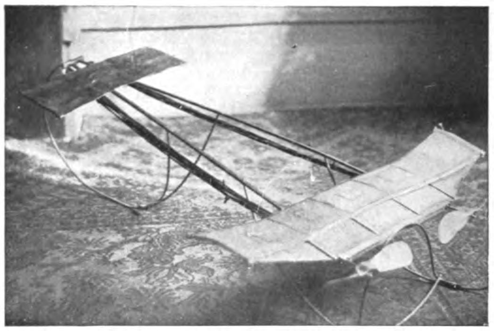

   An ingenious adjustment of ailerons

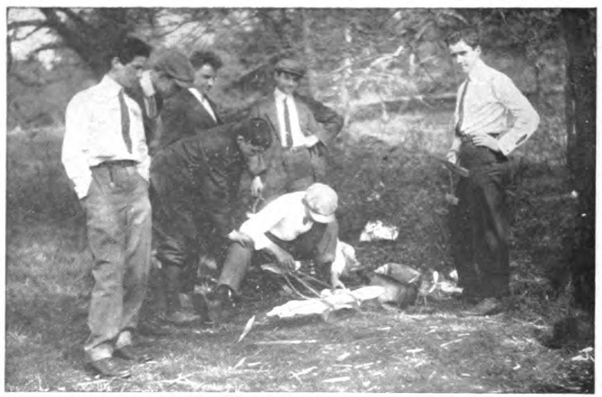

   Tuning up the model for a flight.

In bending the axle into a hook for holding the rubber strands of the motor, care must be taken to keep the ends of the strands on a line with the axle. After turning the wire into a hook, bend back the shank to the proper angle. It will be seen that if the motor carries the axle about from side to side, the friction will be considerably increased. Over this hook, slip a piece of rubber tubing before attaching the strands of rubber, since the metal is likely to cut and wear the motor. It will be found a good plan to tie the strands together just below the hook to keep them from slipping off. And, by the way, do not keep your motor wound up any longer than you can help before a flight, since the strain on the rubber in this position is very great.

As motors have increased in power and distance qualities, the process of winding up has become a serious problem. The simple method of turning the propeller by hand takes too long, and a slip with a powerful motor may give one an ugly cut. An ordinary machine drill will do the work much more quickly. Some drills are geared so that a single turn of the wheel will give you ten revolutions of the propeller.

To arrange your motor for winding with a drill, run the axle through the propellers and turn in the form of a closed hook. A small hook should then be fixed to the end of the drill, which may be inserted in this loop. Some boys use a double hook on the propeller, detach the strands of rubber, wind them up, and then attach them to the propeller.

A very simple and ingenious method of winding up has been adopted in the remarkable model constructed by Mr. Mungokee. The motor is anchored by running the wire holding the strands through the supporting stick of the base, and bending the end into a hook which, as the rubber pulls, is held securely in a second hole at the side.

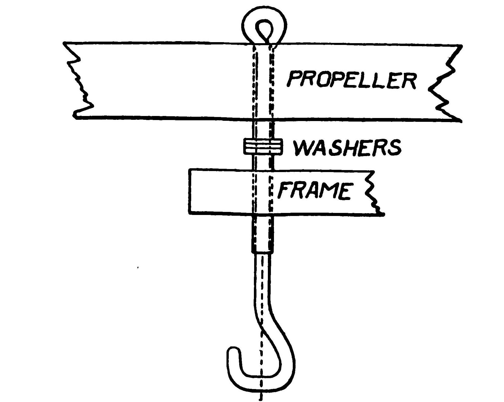

   Showing Construction And Mounting Of Propeller And Axle.

To wind up, it is only necessary to draw out this hook, attach it to the winding drill and turn. When wound up, the pull of the motor will obviously hold the end of the hook firmly in the hole, making it impossible for it to turn. This does away with extra hooks and the trouble of hooking up the motor when once it has been wound.

The life of your rubber motor may be lengthened by careful winding. As long as you wind up by turning the propeller by hand, it is safe to turn it as fast as you can, since the process is slow at best. In case the turning is done with a machine drill or some similar geared wheel, there is danger at some points of winding too fast.

It is safe to wind as quickly as you can until the first row of knots has formed in the rubber strands, but at the moment the double strands begin to appear the winding should proceed very slowly. You will find that if you wind very quickly the double knots will appear in tight groups or bunches, and that only after considerable winding do these begin to spread out evenly. This puts the rubber under a severe and unnecessary strain and shortens its life.

The simplest way of locking the propellers when once wound up is to thrust a piece of cane or reed through the hooks. The twist of the motor will hold it tightly in position, so that you can carry your model about, even shake it vigorously without danger of dislodging it. If you have twin propellers, use a strip long enough to pass through both hooks. Remove the strip just before starting. Be careful, of course, that your axles have not been thrown out of plumb.

It will be found very convenient to equip your model with a single clasp for holding the propellers after they have been wound up, which may be easily released. It is awkward to keep them from slipping. An effective break may be made by attaching two strips of reed or cane, such as you use for skids, to either side of the motor base, so that the free ends will pass between the propeller blades and the frame, thus locking them fast.

These bands should spring outward and be held in position by rubber bands running from one to the other. To release the propellers, simply pinch the two free ends together, and the propellers will be freed at the same instant. Do not keep your motor wound up a moment longer than you can help. It is very trying to the rubber to be held in this tightly-twisted position.

In mounting your propeller, it is well to make the support for the bearing of the propeller axle as long as possible. An axle turning in a shaft one inch in length will meet with much less resistance than in a half-inch shaft, and with a good motor an inch-and-a-half shaft is still better. The rear stick of your motor base, which often holds the propeller axle, is usually made as thin as possible and rarely gives you more than a half-inch support.

It is a good plan to lengthen the shaft by attaching a block of wood to the frame and passing the axle through it. Cut from a strip one-half an inch square a piece one inch in length, or whatever seems necessary. This may be mortised slightly into the stick and glued at right angles.

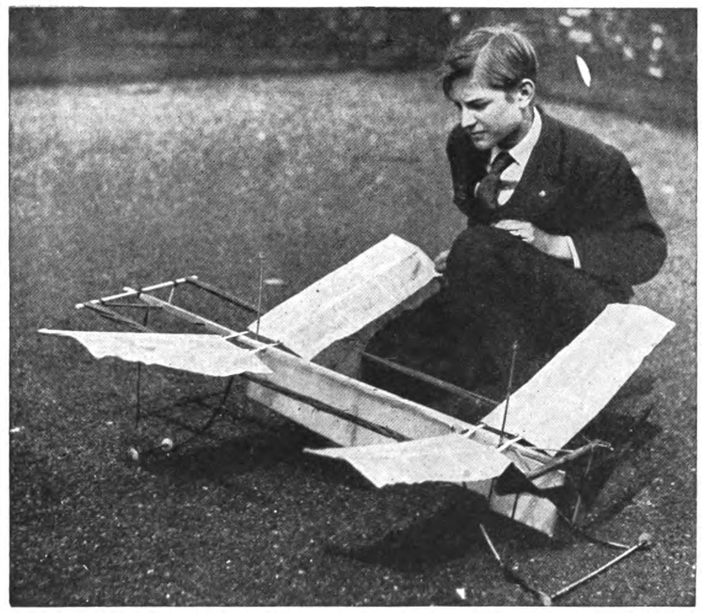

   An excellent monoplane capable of long flights.

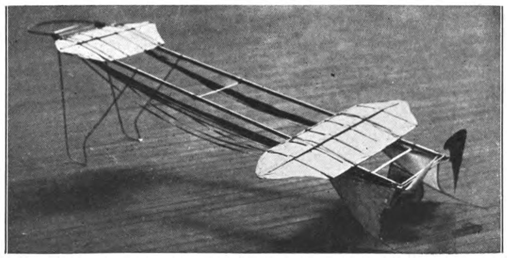

   Long-distance model built by Percy Pierce.

Now drill a hole through the stick, with the grain, and the stick of your motor base and pass the tube holding the propeller shaft through both. To make this look shipshape, round off the edges. A great advantage of this stick is that it enables you to mount the propeller as far as you like from the frame, thus preventing it from striking.

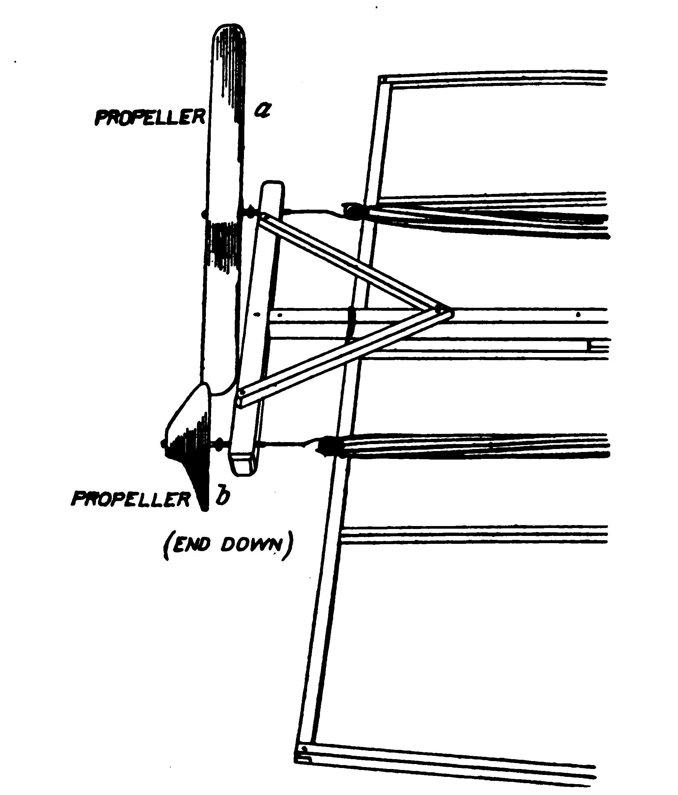

   Showing An Excellent Way Of Fastening The Propellers To The Framework.

In mounting the propellers above or below the frame, you will need similar supports. The blocks should measure half an inch in width by one and a half inches square and should be cut with the grain of the wood running lengthwise. The hole for the propeller shaft is drilled near the top, and the block is securely fastened to the frame.

It will be found a good plan to mortise the frame slightly in order to make the joint perfectly rigid, even in the face of a bad smash-up. Many boys merely glue the stick in position and bind it securely to the motor base with fine strong thread, and paint it with glue or shellac to hold it in position. These blocks may be fastened either above or below the frame or at the sides.

In mounting the propellers, bear in mind that a position above the planes tends to drive the aeroplane downward, while the thrust exerted below tends to throw the aeroplane upward. The builders of model aeroplanes differ as much as to the best position of the propellers as the designers of man-carrying machines. Excellent models have been built with the propellers in either position. It is obviously impossible to lay down a rule for all models, since the properties of the planes vary so widely.

A very simple and efficient support for the propeller shaft may be made of metal to correspond to the motor anchorage. Procure a sheet of heavy tin—a piece of sheet aluminum is still better—one-half inch in width and three inches in length. Now mark off a one-half inch, one inch, two inches, and two and one-half inches, and bend over the ends at right angles, as shown in the accompanying drawing.

This support may be nailed or screwed rigidly to the end of the motor base, and a hole for the shaft of the propeller drilled through the two uprights. The propeller must be mounted so that the blades will, of course, be free of the base. The size of the support may be altered to suit the frame. In case you are using a heavy propeller, say an inch blade, the metal must be heavy enough to resist the pull of the propeller.

The forward ends of the motors may be held by a cross piece cut from a sheet of aluminum six inches in width and two inches in depth, which is bound rigidly to the end of the motor base with shoemaker's thread. Aluminum suitable for this purpose costs about fifteen cents a square foot, and is soft enough to be cut with heavy shears.

An ingenious motor anchorage of metal construction has been hit upon by the builders of model aeroplanes in France. We are all familiar with the difficulty of raising the hook, holding the rubber bands, high enough above the main frame, or fusilage, to be perfectly free. Instead of attaching a wooden block, the French boys bend a piece of tin, or some such metal, very simply into a support for the hook.

You will need a sheet of metal heavy enough to withstand the full force of the motor when wound up. The tin used in cans, as a rule, is not heavy enough. For each support you will need a rectangle of tin or metal measuring three by one and one-half inches. Parallel to the longer base, draw a line one-quarter of an inch above. From the center, erect a long rectangle one-quarter of an inch wide, extending to the opposite side. Now connect the ends of the line above the base with the points at which the upright rectangle intersects the top line, round off the edges neatly and cut away this triangle. Four holes should be cut or punched in the tin, as indicated in the drawing.

Now bend the tin on the two upright lines until the two sides are parallel. This support is fitted to the end of a motor base and secured by driving nails through the three holes at the base covering the wood. The end of the hook which holds the rubber strands of the motor should be passed through the opening at the end, bent over and fastened into position with a drop or two of solder. Such a support adds practically nothing to the weight of the frame, and obviously anchors the motor rigidly.

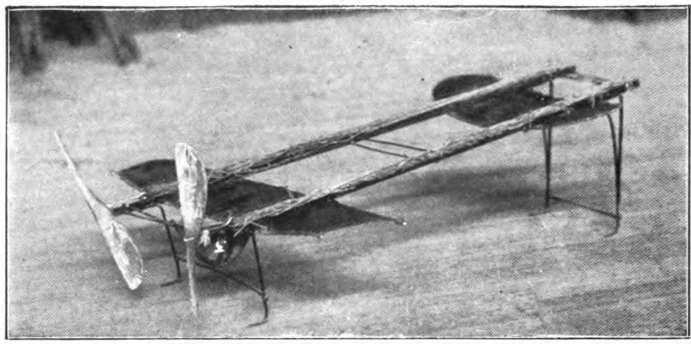

   Model built by Rutledge Barry, winner of spectacular flight contest.

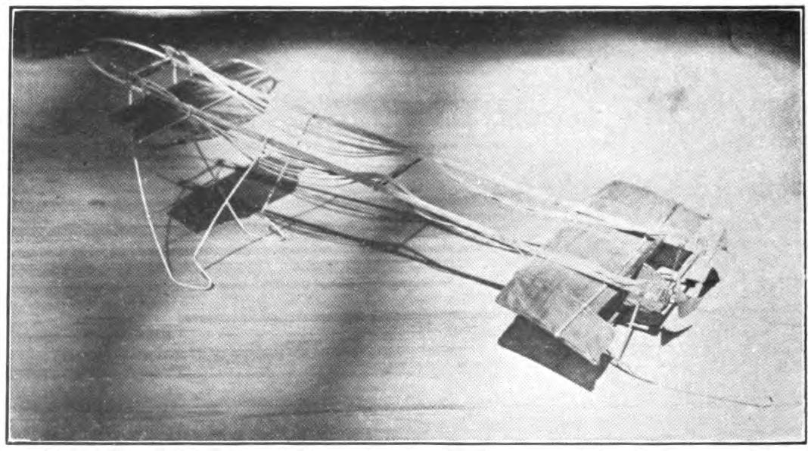

   A model by Percy Pierce, winner of the indoor long-distance record.

The efficiency of a rubber-strand motor may be considerably increased by careful adjustment. If the strands first be wound rather loosely, as a rope is formed, and strung between the propeller hook and the motor anchorage, you will find that about thirty per cent. more rubber may be added without increasing the length and that a five to ten per cent. increase in the number of effective turns may be gained as well. By increasing the amount of rubber, you will, of course, add accordingly to the power of the motor. It is safe to say that the efficiency of your motor is increased upwards of twenty-five per cent. by this adjustment. The credit of this ingenious arrangement is due to Mr. W. Howell, Jr.

It will be well to experiment with a short-strand motor, using a single strand of rubber for the test. Let us assume that your motor is twelve inches in length, thus making a double strand twenty-four inches long. First knot this, string it between the two hooks and turn it, counting the revolutions until the first row of double knots begins to appear. Note the number of turns.

Now untie the strand and, holding one end, twist it until the lines of the edges make a continuous loose spiral throughout its entire length. The easiest way of twisting them is to lay them on a flat surface and rub with the palm of the hand.

Now bring the two ends together and let the strands twist and wriggle until they come to rest. Fasten the ends and measure the double twisted strand. You will find that it measures less than ten inches.

To prepare a strand for a twelve-inch motor, you must therefore begin with a piece of rubber fully thirty inches in length. It is clear, therefore, that the new plan enables you to gain considerably more rubber length for length. Now string your twisted rubber on the hooks of your motor so that to wind up you must turn against the twisted strand. You will find that a number of turns are required before the rubber strands are untwisted and lie parallel, which is pure gain. Count the number of turns up to the time the first line of the double knots appears, and you will find that it is about five per cent. greater than in the case of the single strands.

The power exerted by your motor is meanwhile increased in direct proportion to the amount of rubber added. Still another advantage of this adjustment lies in the fact that such a motor will unwind to the first turn. In preparing a multiple-strand rubber, each strand must, of course, be twisted in the same direction and exactly the same number of times before being installed.

The builders of model aeroplanes may profit from the experience of the automobile tire manufacturers in studying the properties of the rubber used for motors. Rubber is at best comparatively short-lived. It suffers a surface deterioration on being exposed to the air, which in time affects the entire mass.

This process of decay goes on fastest in very warm weather and in very bright sunlight. It is believed that sea air and the rarified air of the mountains are bad for rubber. On the other hand, a very low temperature, as you may perhaps have discovered, robs the rubber of much of its elasticity.

It will pay you to take some trouble to protect the rubber strands as far as possible. Lay them away in a can or jar in some cool, dry and dark place when they are not in use. Some boys cover the rubber with powdered chalk. When the surface of the rubber begins to granulate, its best days are over. Rubber is originally white in color, while the refining process gives it the familiar gray tone.

The Para rubber is generally considered the best of the many kinds now on the market. As a rule, any oil or grease tends to decay the rubber, as any motorist can tell you. This is particularly unfortunate for the aviator, since the efficiency of the rubber motor is increased by slightly lubricating the strands. Many boys prefer to chance injuring their motors in order to gain the advantage of the oiled strands.

The strands thus prepared slide smoothly on one another and do not grip each other even when tightly wound. The simplest preparation for greasing the strands is a solution of ordinary soap and water. A few drops poured over the strands will suffice. When your motor unwinds, be careful to keep your face out of range, since a few drops might be flung into your eyes. Several preparations for lubricating the motors have been placed upon the market.

The direction flights may be controlled very easily by winding the motor. If you care to fly your model in circles or spirals, the simplest plan for influencing its direction is to give different power to your propellers. It often happens that a model must be in a restricted place, perhaps a straight-away flight is out of the question.

The model may be deflected to the right or left by the use of vertical propellers, but they require delicate adjustment, and a gust of wind may destroy their effect. B y winding up one double the number of turns of the other, a circular flight is assured. To gauge the diameter of the circle merely alter the relation of the number of turns. You will soon find that you can control the diameter of the circle with remarkable accuracy.

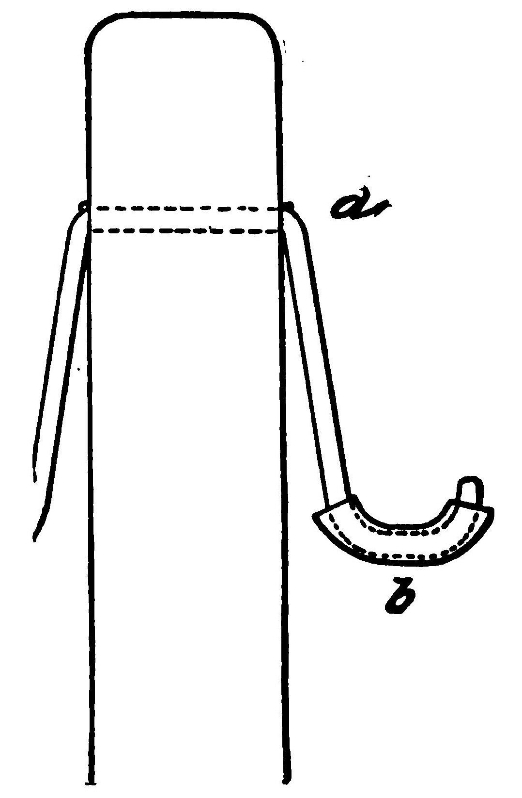

   A Motor Anchorage

CHAPTER VIII DIRECTIONAL CONTROL
````````````````````````````````

THE unerring flight of birds is, of course, the model for the builders of heavier-than-air machines. Much of the birds' skill in directing their motive power remains a mystery to us, but we are learning to analyze and, in a measure, imitate them. The builder of model aeroplanes again must not alone imitate the methods of the birds; he must make their system of maintaining stability automatic. A study of a variety of successful models shows that there is great difference of opinion as to the best plan for stabilizing the aeroplane.

Directional stability is gained by the use of horizontal elevators or tails for controlling vertical movement, by vertical rudders or fins for steering to right or left, and by flexible wing tips to guard against tipping.

In designing any system of rudders, or ailerons, for gaining stability, one should always have in mind the general principles upon which such surfaces act. The movement of the horizontal planes or ailerons has an important effect upon the direction of the flight, because they change the angle of incidence.

In other words, they alter the angle of the plane with the line along which the aeroplane is flying. If you bend the rear edge of the plane, or aileron, downward, the angle of incidence is increased. What happens is this. As the plane is lowered, the air is compressed beneath it, which tends to lift the plane, throwing up the front edge and changing the course of the flight.

This method of securing stability, which was invented and patented by the Wright Brothers, has been widely imitated. In their later machines, the Wrights have even abandoned the front elevating surfaces and depend upon the movement of the main plane and a small elevating plane placed just back of the rear rudder for their directional control.

They have thus done away with the friction encountered by the front planes, which has resulted in giving the machine greatly increased speed. Now in the model aeroplane, it is, of course, impossible to flex the planes up or down during flight. Some adjustment must be hit upon which will give the machine automatic stability. The principle of the action of the stabilizer remains, of course, exactly the same.

In designing rudders for controlling horizontal flight, it should be borne in mind that their stabilizing power varies largely in proportion to their distance from the center of gravity. In most models the further they are removed, either front or back, the greater is their leverage, and the smaller need be their surface. By placing the rudder on an outrigger carried far out, a very small plane will suffice.

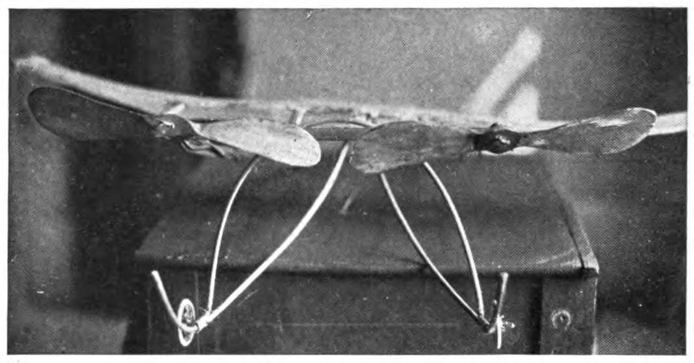

   A serviceable model showing excellent workmanship built by Cecil Peoli

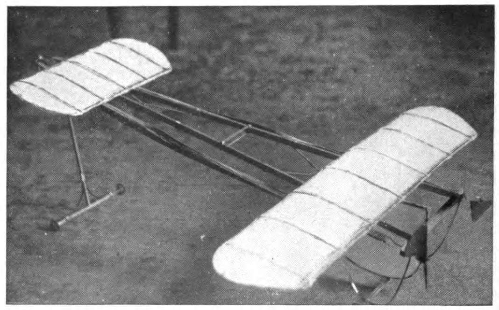

   A serviceable model showing excellent workmanship built by Cecil Peoli

The vertical rudders or fins, as they are sometimes called, are, of course, intended to control the movement to right or left and keep the model from sliding sideways. They have no counterpart in the wings of birds, and are believed by some aviators to have little effect. At any rate, they can do little harm since their head resistance is practically nothing. Unlike the horizontal forward planes, these fins should not be carried too far forward.

In practice it is found that they often get in the way, and a slight side gust of wind striking them, with their great leverage, will knock the aeroplane completely off its course, perhaps upset it. The best position for such rudders is either above or below the main plane, or behind it, where they are out of the way of cross currents. In last year's models, these vertical surfaces were often very large, presenting as much surface as the planes themselves. It has been found that they may be cut down in size, thus saving weight without losing their efficiency.

A long vertical fin, or keel, has the disadvantage of presenting a dangerously broad surface to any cross current of wind. The question of the position of the rudder was taken up in a previous volume. A glance at the successful model aeroplanes of the year shows that the vertical rudders have been adopted very generally. Considerable ingenuity is displayed in adjusting them.

The use of wing tips of any form is intended to control both the horizontal and vertical movement. The general theory or equilibrium, of course, applies in both cases. The most perfectly adjusted model is subject to many forces which tend to tip it to one side or the other. A gust of wind,—and the air is never perfectly quiet,—will tip one end of the plane up or down.


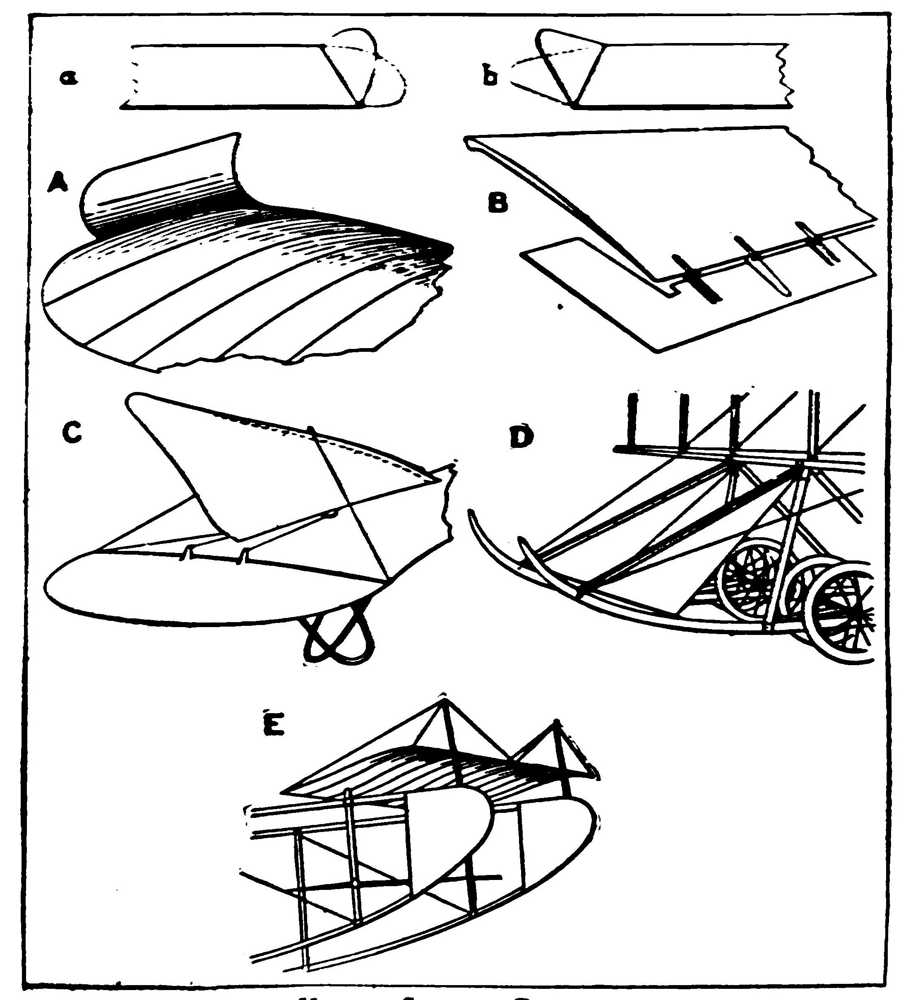

   Various Steering Devices. "a" and "b," simple aileron forms. "A" novel fin on Vinet plane. "B" L-shaped aileron. "C" vertical rudder (Bleriot type). "D" "Blinkers," an effective rudder. "E" stability planes not unlike the runners of a sleigh.

In the early models, this tendency was met by fixing the plane at a dihedral angle. An examination of last year's models will show how common was this design. The dihedral angle lowers the center of gravity. Now, after one side of the model is raised and the plane rights itself, the center of gravity swings through a considerable arc, like a pendulum, before it can come to rest, so that the center must swing back and forth several times.

This tendency to tipping is fatal to a steady flight. It was first observed by the Wright Brothers while studying the early Langeley type of machine. The Wrights abandoned the dihedral angle entirely, as all the world knows, and replaced it by the horizontal plane with a straight entering edge. The keel will in a measure overcome this side motion.

Much of the advantage of the dihedral angle may be borrowed, however, by turning up the extreme ends of the plane, without materially lowering the center of gravity. In several of the successful models of the year, these tips have been made equal to about one-fifth the width of the plane, and are raised as high as forty-five degrees.

The theory is that, when the oscillation commences, these surfaces damp out the swinging tendency, and bring the model to an even keel. Sometimes the tips are rounded off, although in some cases they are made triangular and brought to a point. As a rule, they are added to the rear plane, although one notable exception is the case of the Lester Robinson model, which carries these tips on both planes.

The tips, or ailerons, at the ends of the planes maybe made of the same material as the planes themselves. In case you are using wire frames, it is, of course, a very simple matter to bend up the tips to any desired angle. When the frames of the planes are made of reed, as is generally the case, the tips should be made separately. Bend your reeds to the desired shape and cover them with the same material used for the planes.

It is quite as important that they be covered smoothly as in the case of the planes. They may then be attached to the ends of the planes by wiring rigidly in position. It will be found convenient to adjust them so that they may be bent up or down to suit conditions. The same plan should be followed in building and attaching the ailerons to the rear of the main stability planes.

Some interesting experiments have been made by placing several vertical surfaces above the main stability plane. A series of four or six vertical rudders are sometimes spaced apart at equal distances, extending from the front to the rear edge, with a height of about half their length. In some cases the corners are rounded off, while others prefer to cut away the front edge sharply.

In the Vinet monoplane, the vertical fin appears in an entirely new form. The fin is attached near the outer edge of the main plane and the upper edges curled inward, forming an arc of a circle. The theory of the curve is that it tends to keep the air from slipping off the ends, after the manner of the curtains of the Vaison biplane.

As a rule, these curled fins are about three-fourths the depth of the plane and are attached with the front ends on a line with the entering edge of the plane. These curled planes may be stretched on frames of light wire or thin reed. As the model tilts to one side, the air striking the curved surface of the outer side of the fin meets with little resistance, while the fin at the opposite side, acting with its concave surface against the wind, offers considerably more resistance, thus tending to check the side motion and bring the aeroplane to an even keel.

An effective form of aileron consists of an "L" shaped plane set closely against the rear corner of the main wing. These ailerons are made in pairs and hinged to a rear edge. The side should extend about half the width of the plane. The action of the hinged plane at the rear is, of course, familiar.

The extension at the side, which should be kept rather narrow, not more than one-fourth the depth of the main plane, is likely to prove very efficient. If the aileron be turned too far either up or down it will offer considerable resistance. In one of the new English models, these ailerons are so connected that as one rises the opposite aileron is lowered. Here is a fascinating field for experiment in automatic control.

The vertical rudder used on the new Bleriot, the result of an immense amount of experiment, suggests interesting possibilities for the model builder. The rudder is built in the form of a long triangle and is mounted by hinging one of its shorter sides to the upper surface of the rear plane, so that its corner will extend upward and outward. In this position it suggests a fish's fin. The receding angle of the front edge offers very trifling resistance.

The new Baby Wright racer depends for its lateral control largely upon a novel form of rudders known as "blinkers." These rudders are triangular in shape and extend out in front of and below the forward planes with their longer edges forward. They act much the same as the jib of a sailing vessel, and, because of their position well in front of the center of gravity, act with considerable leverage.

The design appeals especially to the builder of model aeroplanes, since they can be added with very trifling weight by curving the front skids forward and stretching the cloth across their forward corners. The Valkyrie monoplane is equipped with similar rudders, in the form of half circles carried in the same position.

In addition to the vertical and horizontal stability planes, many aeroplanes are now equipped with stability planes extending diagonally from the vertical axis. These are placed below the main planes, extending outward not unlike the runners of a sleigh. This box-like form tends to confine the air and affords increased support.

There is even an upward tendency from this pressure of air. These planes are usually rectangular in shape, the forward or entering edge being cut away sharply. By mounting these planes on the skids, their additional weight is practically nothing. Several interesting applications of this principle are shown in the accompanying illustrations of models.

CHAPTER IX MODEL AEROPLANE DESIGNS
``````````````````````````````````

Whether one be designing the simplest paper glider, a model or a passenger-carrying aeroplane, the problem of stability is the same. To keep afloat, your air craft must be supported, as a rule, by at least two surfaces to provide longitudinal stability. To understand the principle of longitudinal stability, picture to yourself a very delicately-balanced board or "seesaw." The center of gravity naturally falls between these two planes at either end, and the wings therefore tilt up or down, or seesaw, on this invisible fulcrum. With this principle in mind, the movement of your aeroplane, which may seem so capricious, will be seen to follow definite laws.

When a gust of wind forces the front plane upward, the rear plane swings down. This movement increases the angle of both planes to the horizontal; they offer much greater resistance to the air, and the speed of the machine is checked. As the aeroplane slows down, as a rule, it tries to right itself, that is, to seesaw back to balance at a horizontal position. This in turn reduces the resistance the planes offer to the wind, and the flight is continued at its original speed.

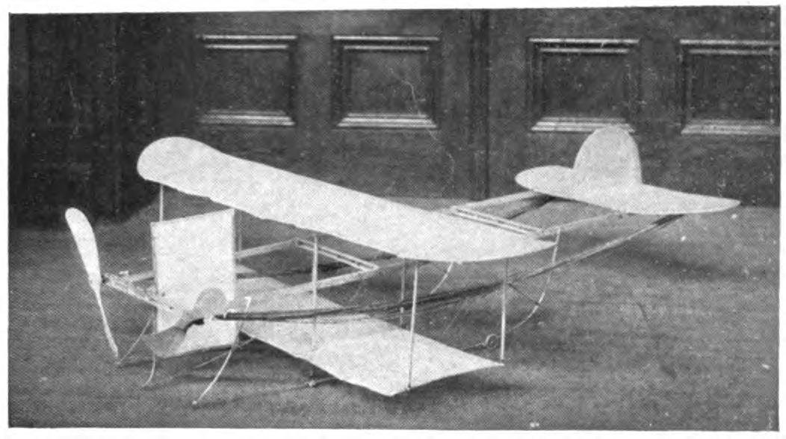

   An excellent piece of workmanship. Model by R. Mungokee

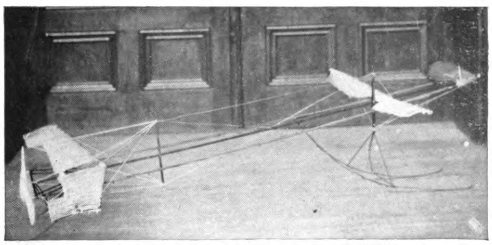

   Model with minimum plane surface. Built by A. C. Odom

The trick, therefore, is to adjust your planes with regard to the center of gravity so that they will always seesaw back to a horizontal position; in other words, to secure automatic longitudinal stability.

In designing a motor base bear in mind that it must be made as long as possible for installing the motor, and broad enough to afford stable support for the wings, the whole being kept as light and as rigid as possible. Since the length of the flight depends directly upon the length of the motor, the frame of your model should be at least two feet in length. The width of the frame may vary widely, as a glance at the successful model aeroplanes of the year will prove. For racing model aeroplanes, the base may be increased to four or even five feet in length.

THE FAMOUS "ONE OUNCER."
########################

The one-ounce models, which have been brought to such perfection in England, are among the simplest aeroplanes to build. Fig. A models have a record of 1,500 feet. The adjustment is delicate, however; it is a very "tricky" affair to manage, and whether you can get the remarkable flights made abroad is another matter. For the stick, select a piece of straight-grained ash or some light wood three feet in length and one-quarter of an inch square. The planes should be cut from a thin board one-sixteenth of an inch thick. The main plane should measure fifteen inches by three inches, and the smaller plane eight by one and a half inches, thus giving them a high aspect ratio. They should taper slightly towards the ends. Round off the corners of both planes and sandpaper the edges down. If the wood will stand it, work it down, using a sharp plane or sandpaper. The planes should be bent by steaming slightly across the middle and set at a slight dihedral angle.

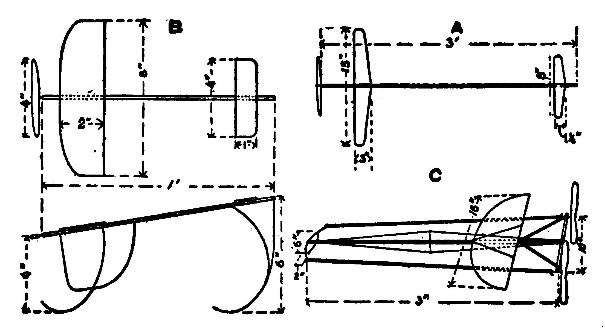

   A — The Famous "one Ouncer." B — A Small Experimental Model. C — A Modified Burgess Webb Model. 

The model is driven most efficiently by a six-inch propeller. If it be a one-piece blade, prepare a propeller blank six inches by one inch, cut from a half-inch board. Cut away to the thinnest possible blade. Use a very simple support for your propeller shaft as well as for the motor anchorage at the extreme forward end. The planes should be tied with rubber strands to the stick and glued in position when properly adjusted. Try out your model with a motor consisting of two strands of one-eighth-inch rubber, and increase if necessary. You will need all your ingenuity and skill and workmanship to construct a stable model even of so simple a design which will come within one ounce. Throw it with the wind.

A MODIFIED BLERIOT.
###################

In improving the lines of the various self-raising models, many of the designs have been greatly simplified. With the number of members reduced, the construction of a successful model becomes much easier and the chances of failure more remote. A simple rectangular frame with two planes driven by twin propellers requires very little skill or experience to put together. It is very easy to locate and correct the trouble in such a model, and quickly adjust it to rise and fly for considerable distances.

There are many forms of such planes this year which are marvels of lightness and strength, but the beginner should try the simplest. Begin by building a simple rectangular frame, three feet in length and ten inches in width of half-inch or quarter-inch strips. Mortise the corners half way through each stick and glue them in position. Increase the steadiness of the frame by a cross piece at the center, without mortising. Mount your motor above the frame, selecting some simple, strong support for the axle and the anchorage.

A model which rises unassisted requires considerable power and your propellers should have eight-inch blades and be carved from blanks one inch thick. You may find it advisable later on to install propellers with very broad blades. First install motors of considerable power, each consisting of twelve or fourteen one-eighth-inch rubber strips. You will not get more than two or three hundred turns out of them, but with a high-pitch propeller this will give you an excellent flight, say 200 feet.

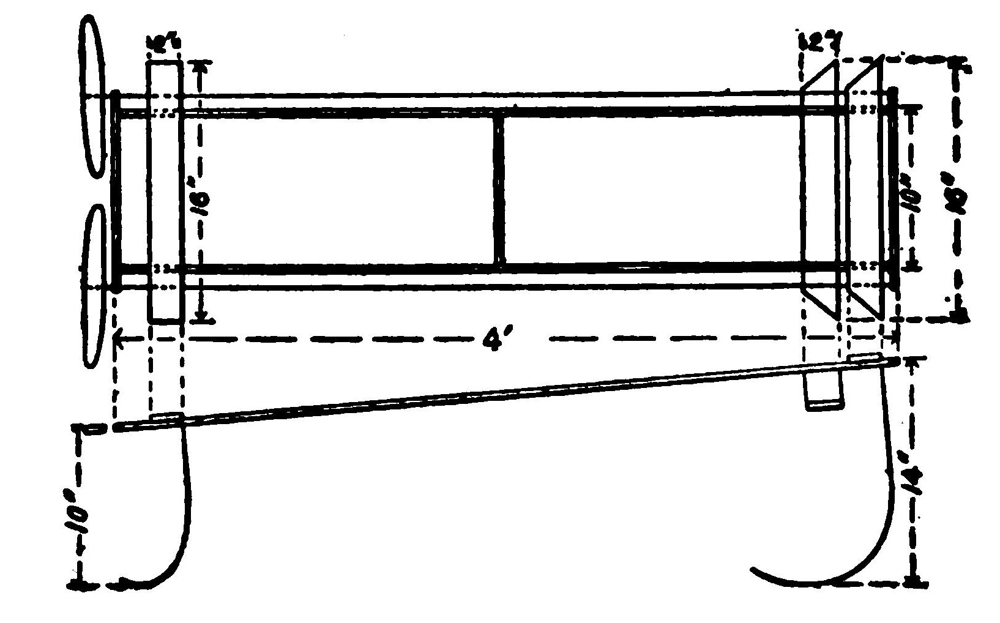

   Model With Minimum Plane Surface. 

For the early trials use planes with a rather high aspect ratio. Make one of the planes four by sixteen inches with square corners, and the second, which will be carried forward, about the same size with rounded corners. Both planes should have a slight camber.

Attach the planes to the under side of the motor base. The theory of this adjustment is that the planes thus rest upon undisturbed air and are more stable. The planes above the frame come in contact with air which has been churned up more or less by the passage of the frame. A small vertical rudder may be added below the rear frame and well back of the center of gravity. The model should be supported at a slight elevation by a simple skid. By adjusting the angle of the forward plane, this model may be made to perform a number of spectacular flights. A model very similar to this was the winner of a cup offered for the best spectacular flights at an important New York tournament.

A SIMPLE EXPERIMENTAL MODEL.
############################

A great deal of pleasure and profit may be had from a small experimental model aeroplane. The beginner who is constructing his first model will find a small machine by far the most satisfactory. The more experienced model builder, on the other hand, will find that so simple a model will enable him to try out new theories quickly and cheaply. A simple Bleriot form, one foot in length, driven tail foremost is recommended. Many successful model builders keep such a model constantly in their workshops.

A model aeroplane of this type and size can be made to fly from the very first. Many of the problems which appear so difficult in constructing a three-foot model, such as balance, head resistance, and the proper adjustment of power, practically are avoided in this miniature aeroplane. There is a great advantage again in the fact that the small model may be flown indoors in the average room, where the air problems are almost negligible. Fig. B.

Let the motor base consist of a single stick one-fourth or three-eighths of an inch square and one foot in length. At one end of the base, attach a block of wood one inch square and of a thickness equal to that of the stick. Glue this in position and bind it securely by wrapping with thread touched with glue. At a point three-quarters of an inch above the stick, drill a hole parallel to the frame for the axle of your propeller. A hooked wire should be attached to the opposite end of the base. One end may be run through the stick and fastened, or it may be imbedded in a block fastened to the stick corresponding to the axle block. A simple and effective motor anchorage may be made of metal (described elsewhere).

Your propeller should measure four inches in diameter. A propeller cut from a blank one by four inches and one-half of an inch thick will give a good pitch. Either a propeller of wood or metal such as has already been described will answer. The propeller should be mounted upon an axle and adjusted to the bearings, and the hook after passing through the bearings in the support turned into a hook for the rubber strands. Select from the detailed instructions the method which appeals to you. Be sure that the propeller spins smoothly. It should be so delicately adjusted that it will turn literally at a breath.

Before stringing the rubber strands between the two hooks of your motor, be sure that the hooks are bent back, so that the strands will be in a line with the bands. The bearings should be carefully oiled. In flying out of doors, there is danger of getting fine sand or dirt in the bearings which, of course, greatly increases the friction. Try out your motor with four strands of rubber one-eighth of an inch square. The rubber sold for one-eighth inch is often a trifle under this measurement. The propeller should, of course, be mounted with the shorter or curved edge forward. In winding your motor, never turn it after the second row of double knots begin to appear, and do not keep your propeller wound a second more than is necessary before a flight.

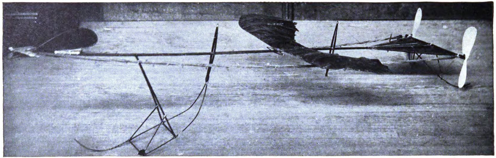

   An American Fleming Williams built by C. McQueen

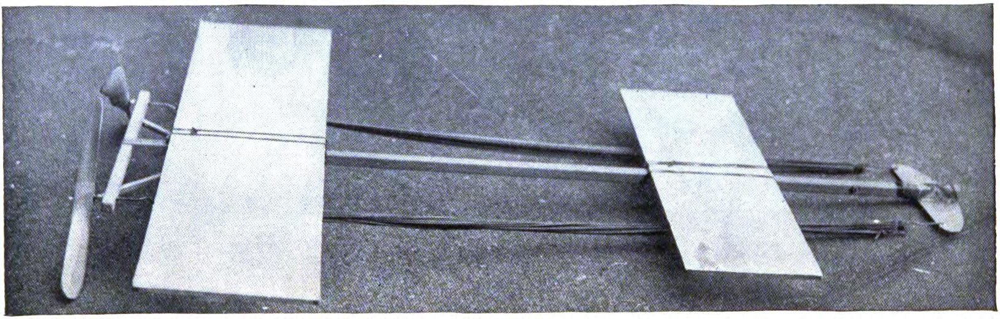

   One of the earlier models built by Cecil Peoli 

For a model of this size, wooden planes are entirely practical and very simple to construct. Much depends upon the modeling of the planes and the smoothness of both of their surfaces. For the planes you will need two thin boards, one eight by two inches and another four by two inches, each one-eighth of an inch thick. Select a wood such as poplar or spruce, which will not split easily. The ends of the planes should be rounded in front and cut sharply away at the rear edge, as described elsewhere. If the wood will stand reduction without breaking, plane or sandpaper away the surfaces until they are about one-sixteenth of an inch thick.

The planes may be flexed by steaming, but there is a still simpler method. Paint your planes with a thin glue or varnish, and while they are still wet and pliable, bend them to the desired shape. To shape them, procure a strip of wood one-quarter of an inch square, tack it to a board and bend the planes over it, and fasten them in position with brads driven about the edges and bent over to hold it down. The stick should be placed parallel to the entering edge and one-half an inch back of the line. This will give you planes flexed with a dipping edge. Later you will probably want to experiment by changing this curve, which is very easily done by bending over a stick of different size and altering its position.

The model is driven by the propeller with the small plane forward. Attach the planes to the stick with the curved or entering edge forward by tying them with a rubber band. This will hold them in position and allow them to give when they fall. Slip the planes back and forth until the proper position has been found. A small block of wood may be inserted between the planes and the stick to raise the wing to the desired elevation. Practise throwing the model as a glider until it sails across the room on an even keel, when the motor may be installed.

Directional stability may be gained by adding a vertical rudder. It may be made from a thin board similar to that used in the planes. Cut a piece two inches square and round off the corners, and shave to a knife edge. Attach this, curved edge downward, to the edge of the stick directly beneath the rear plane, taking care that the motor does not touch it. To complete the model, attach skids to the under surface at the front and rear. These should be of light reed, cane or bamboo, glued to the main frame and curved downward and backward like runners.

MODEL WITH MINIMUM PLANE SURFACE.
#################################

In the experiments in building models with very narrow planes, some amazing results have been produced during the past year. The limit in this reduction would seem to have been reached in the model with planes with a ratio of eight separated by a distance equal to ten times their width. The forward part of this amazing model is a modified biplane, and in this respect it resembles a successful model of last season. The two models are reproduced side by side, for the sake of comparison. The economy of weight and resistance is instantly obvious to the most inexperienced eye. The model rises quickly and flies for nearly three hundred feet in a perfectly straight line.

The motor base, which has a length equal to six times its width, or eight by forty inches, is constructed of one-quarter inch strips. A light cross piece at the center braces the two sides. The supports for the propeller axles extend out horizontally from the sides. This arrangement makes it possible to mount two ten-inch propellers on an eight-inch base. The front ends of the frame are joined by a semicircular piece of reed which acts as a shock absorber and does away with the weight of the cross piece. The workmanship in every detail of this frame must be exceedingly delicate.

The planes have an aspect ratio of eight and measure two inches in depth by sixteen in width. The outer ends of the rear plane are three inches in their fore and aft dimensions, thus making the outer rear edge a slight concave. The front is cut sharply away at an angle of forty-five degrees. The upper plane lies flat upon the motor base. The lower plane is not set directly below it as in the ordinary biplane form, but to the rear, its front edge being on a line with the rear edge of the upper plane, after the manner of the Valkyrie machine. The two planes are separated by a space slightly greater than their width. Two small rudders, elliptical in shape, are carried just behind and below the rear plane. The model is mounted on very delicate skids built of reed, and is inclined at a very slight angle. Six strands of one-eighth-inch rubber are used for each motor. The unusual length of the motor makes it possible to give six hundred turns.

THE BURGESS WEBB MODEL.
#######################

An ingenious method of lightening the front end of the motor base and at the same time reducing the head resistance is employed in the Burgess Webb model. A single stick frame is used with a base equal to one-fourth its length. The cross piece is mortised to the central stick and braced by the diagonal sticks, joining at the main frame. This cross piece is carried out beyond the braces and pierced for the propeller shafts, where two twin propellers are mounted. Fig. C.

The front plane is elliptical in form, with a width equal to two-thirds the width of the base. It has an aspect ratio of two. The propeller motors are strung on hooks attached to the outer sides of this frame. The plane must be unusually strong to stand the pull of the motors, which is naturally great. It is fixed to the extreme outer end of the central stick. The main plane, which is mounted well forward in this model, is an almost perfect semicircle. One can, of course, carry out his own ideas in selecting the design of the planes.

A very light central stick is used which is strengthened by wires running to a vertical strut at the center. It is claimed that the ingenious arrangement of the forward plane cuts away from one to two ounces in the weight of the model, and the decreased head resistance adds both to its stability in flight and distance qualities. The simplified form of front plane may be adopted on a variety of models.

A MODEL WITH ADJUSTABLE STABILIZERS.
####################################

A serviceable model may be built up with flat planes equipped with ailerons both at the rear and outer ends of the planes. These tips make it possible to control both the horizontal and vertical movement, and permit a great many adjustments impossible with other models. The motor base may be borrowed from some earlier model. It should be fairly heavy. A rectangle measuring ten by forty inches built of one-half inch strips will be found sufficiently rigid. The sides should be braced by a cross piece at the middle. The ends and central strut may be made of some form of truss, if desired. One of the simplest means of providing supports for the axles of the propellers is to carry the stick at the rear, one and a half inches beyond the side pieces, and pass the axle through a hole drilled one-half an inch from the end.

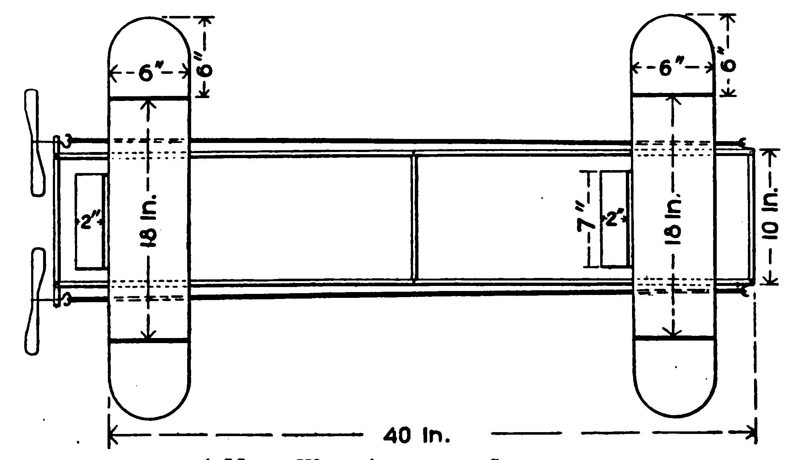

   A Model With Adjustable Stabilizer. 

The pull of the motors when wound is thus well distributed and, as has been pointed out, permits of a larger propeller being used without danger of their striking in turning. Still another advantage is that it keeps the strands of the motor from interfering with the planes. When the motors are strung above the planes, they have a tendency to force the machine downward.

Construct two serviceable planes the same size, six by eighteen inches. These should be flat and covered as smoothly as possible. Now attach to the rear edges of each plane a series of three ailerons each two by five inches, fastening one at either end and the third at the middle. Make the frames of the ailerons of a very light lath strip and wire them to the rear edge in such a way that they may be swung up or down through a small arc. At the outer ends of each of the planes, attach semicircular tips, each with a base of six inches and a radius of six inches. These may be rounded off or cut away to sharp points as desired. They should also be attached so that they may be bent up or down and will hold their position. Mount the model on some simple arrangement of reed skids, so that it will be elevated at a very slight angle above the horizontal. The model complete should weigh about eight ounces. Equipped with twin motors of fourteen strands of one-sixteenth-inch rubber each, the propellers should be turned about four hundred times. A medium-pitch propeller will best serve your purpose.

In flying this model, bear in mind that the flight will be directed in an opposite direction from the angle of the ailerons, or rudders, just as a boat answers its helm. The wing tips should be bent up or down until the flight is stable. The complete equipment of ailerons enable one to correct any defects in proportion which are likely to be needed in models built by beginners.

AN EFFICIENT THREE-OUNCE MODEL.
###############################

(Record 900 Feet)

A surprising variety of designs may be carried out in models of the three-ounce class. One of the easiest to control is a broad adaptation of the Bleriot model, flown with its small surface forward. For a three-foot model, first build two planes of very light material. Wire frames are especially suited for this model. The main plane should measure two feet in length by four in width, or with an aspect ratio of six. The smaller plane, carried forward, should be one foot in length with the same aspect ratio. It will be found a good plan to carry the outer edges of this plane back, forming two inch squares at the rear edges. A plane with a slight camber will prove the more stable.

For the frame secure two light sticks three-sixteenths of an inch square of some fairly strong wood; a straight spruce is good. Attach the motors to these sticks before completing the frame. Select some rigid support for the propeller axle. Prepare two ten-inch propellers, carving the blades from propeller blanks three-fourths of an inch thick. The motor will probably work best when made up of six strands of rubber, one-eighth of an inch square, although this should be finally determined by actual test flights. Keep all parts of the motors extremely light.

To assemble the model, connect the forward ends of the sticks carrying the motors by a piece of reed bent to a half circle, by merely binding the ends firmly together. The sticks should diverge so that the propellers will be about ten inches apart, giving plenty of room for the propellers to turn without striking one another. Next fasten the larger plane in position across the top of the sticks, and about two inches away from the propellers, making the plane serve as a cross piece to hold them firmly in position. The strands of the motor should preferably be carried above the plane. This plan does away with the rear stick of the motor base, thus saving this weight. Adjust the parts very carefully, that the frame will be rigid enough to stand the strain of the motor.

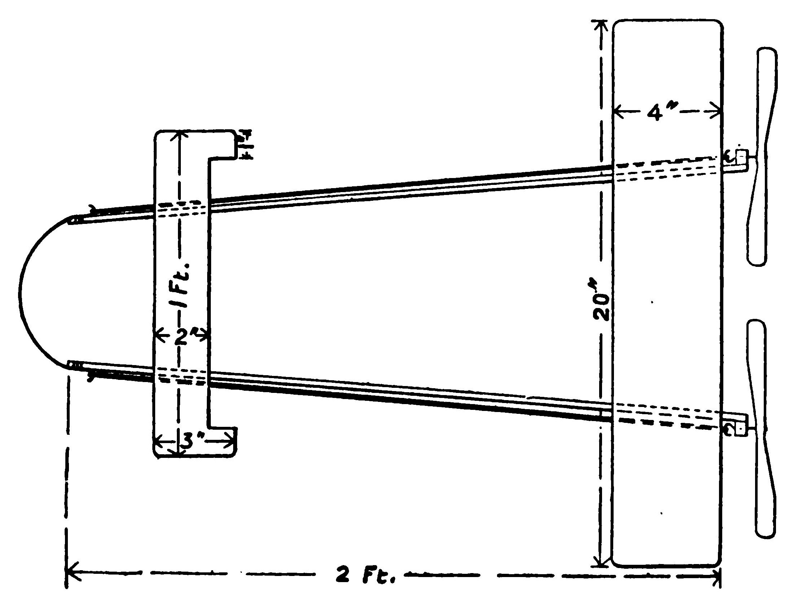

   An Efficient Three-ounce Model.

The model will require careful adjusting to be brought to an even keel. The forward plane should be attached in such a way that it may be tilted up or down as desired. With care, the weight of the model may be brought within three ounces, although a fraction over will not matter. Models built on these lines have flown in a perfectly straight line for 900 feet.

AN ALL-METAL MODEL FRAME.
#########################

In a previous paper, it was suggested that the motor base be made of tubes of aluminum. The idea has been carried further, and attractive frames are now constructed in which not only the main frame is constructed of metal tubing, but the cross piece supporting the propellers and the braces as well are of the same material. The new metal, "magnalium," has been used successfully for this purpose. It is a trifle heavier than aluminum, but much stronger, and almost as easy to work. In England, the motor base is sometimes made of metal tubing one inch in diameter, and the rubber motor is passed through the tube itself.

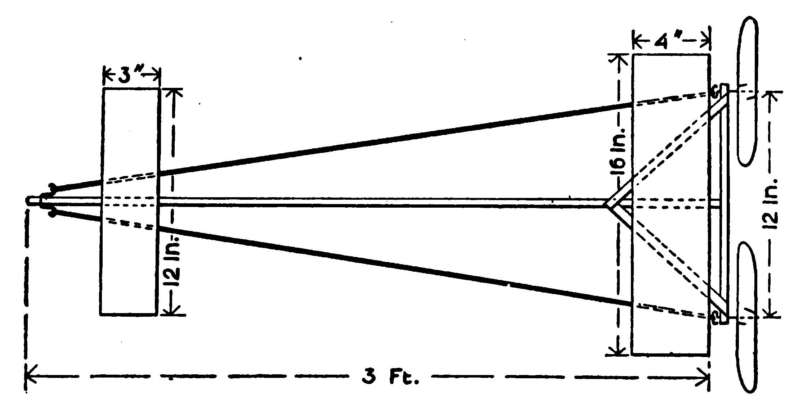

   An All-metal Model Frame.

Such a frame may be made readily by one who has had no experience in tinsmithing or metal work. The metal frames are sometimes constructed by driving wooden blocks into the ends of the tubes and letting them project one-half an inch or more. The plug may be cut off flush, and the cross piece fastened by wire and stout nails through the cross tube into the plug of the main tube. A convenient brace may be constructed by cutting the tubes to the proper size, fasten the ends and pass the rivet through both tubes at the point of intersection, and screw the nut down firmly on the opposite side. Such a frame is practically indestructible. There is one possible drawback, however, in the tendency of the metal to bend if the rubber motor pulls too strongly. Once bent, it is difficult to get back into shape. This tendency may be overcome when twin propellers are used, by winding alternately, giving one propeller one hundred turns and the other propeller one hundred turns, then the first another hundred, and so on until the motor is wound up. The planes, propellers and skids may be of any reliable design.

AN EFFICIENT SINGLE STICKER.
############################

A very light single-stick model may be built of bamboo rods, which will stand an immense amount of wear and tear. It consists of a single longitudinal member with crossed pieces at either end, braced against the central stick to withstand the pull of the motor. Select a bamboo stick about half an inch in diameter and three feet long. An old fish pole will answer. The cross pieces at the ends should be of some light, strong wood, such as poplar, whitewood or ash, since they must be mortised and drilled, and the bamboo is likely to split under the operation. Use a three-eighth-inch strip, cutting a piece ten inches long for the rear and another six inches in length for the front of the base. Fasten these rigidly in position at right angles by mortising, glueing and tying in position. Run diagonal pieces cut from quarter-inch strips from the ends of both cross sticks to the central frame. Be careful not to cut away the wood in mortising it, for a bad break is likely to occur at the weakened point.

Build two serviceable planes. The larger one, which should be carried in the rear, should measure about twenty-four inches by eight, and the front plane twelve by four inches. Since your frame is very light and strong, there is no need to economize weight. By carrying the braces running from the cross sticks well out on the stick, you can provide a broad support for the planes. Tie the wings on the motor base with strands of rubber. In landing they will then give enough to save a bad smash.

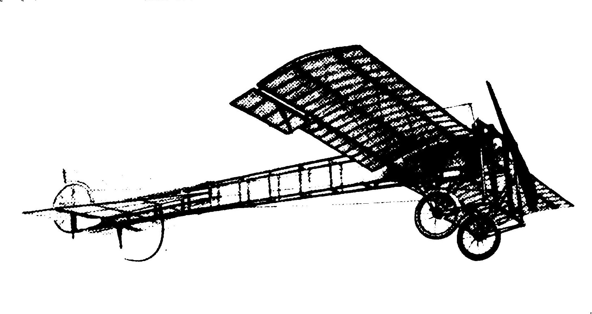

   One of the best models of the year, built by John Caresi

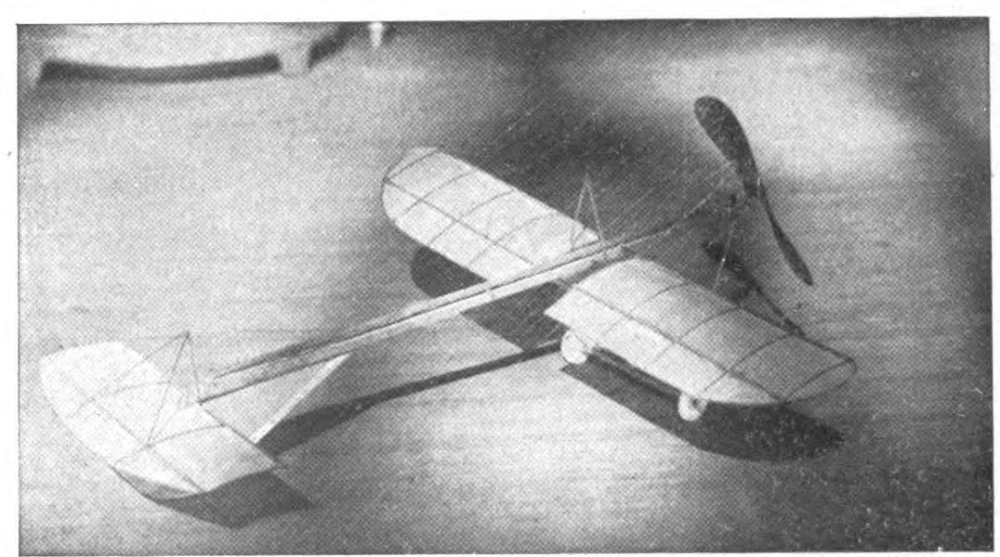

   An excellent model, showing careful attention to details. Built by L. V. Brooks

The propellers are mounted by passing the axles through holes drilled through the center of the rear stick about one inch from the ends. The rubber strands may be simply passed around the front stick and tied in position, or may be looped about a hook inserted in the stick. Use a fairly high pitch propeller, since the base will carry a powerful motor. Select some simple form of skid, for the model will be comparatively light, say within ten ounces.

A ONE-PLANE MODEL.
##################

Interesting experiments have been made this season by altering the angle at which the main planes are set to the motor base. The theory of these designs is, of course, that the resistance offered by an entering angle is less than that of a straight edge. In some models, the main planes are carried backward until the rear tips are on a line with the propellers. The model is driven tail first by twin propellers. The planes are besides set at a slight dihedral angle so that the angle of incidence is greater at the ends.

A rectangular base is suggested, with a central stick. The planes, which may be either flat or cambered, are attached to the central stick and slightly raised by inserting strips of wood above the outer edges of the motor base. In this way, it is possible to fix them rigidly. Wire braces running from the outer ends to the rear of the motor base will add to its strength. The angle of the wings to the motor base may be altered to suit conditions. A plane of high aspect ratio works best in this position.

THE CANNING MODEL.
##################

There is much to be said for the model with propellers placed near the centers of gravity and pressure. Many authorities believe that the successful aeroplane of the future will carry propellers somewhere near the center of the motor base. Since the thrust is exerted near the point where the aeroplane balances, it is argued that its stability is greatly increased, while with the propellers far removed, either to the front or rear, the torque gains a leverage from its position which it is difficult to control. The main difficulty with this arrangement all along for rubber-strand motors has been that the length of the motor must be cut down to about half, and their efficiency reduced.

In the Canning model, this difficulty has been overcome, and a motor extending the entire length of the motor base is hitched up to twin propellers placed near the center of gravity. A powerful motor extends along the center of the motor base, attached to a gear wheel at the forward end. This wheel turns two smaller gears at either side. In this way, a motor running the entire length of the frame may be used with an increased number of turns. A third gear wheel should be introduced to make the propellers turn in opposite directions.

THE FLEMMING WILLIAMS MODEL.
############################

An immense amount of curiosity has been aroused regarding the famous Flemming Williams model. This machine has completely outdistanced all rivals, and set a new and amazing distance record. Its builder frequently gets flights of eighteen hundred feet with his model, and has made the astonishing record, under favorable conditions, of one-half a mile. In order to study this model at first hand, the writer has imported one of the machines, built by Ding, Sayles & Company, one of the leading model builders of England.

The distance qualities of this model will be recognized at a glance. It is a single sticker, extremely light in all its members, combining an extraordinarily long motor base with well-adjusted plane surfaces. The arrangement of the wings is original. The main stability plane is set forward in front of the center of pressure. The rear plane is formed by filling in the space between the rear stick and the braces, thus saving the weight of the frame usually carried in this position. The model is driven by two seven and a half inch propellers of very high pitch. The model is without skids and is launched from the hand.

The central member measures four feet two inches in length. The stick is one-half by one-fourth of an inch, with the forward part tapering gradually to one-fourth of an inch square. The base stick is eight inches in length, cut from a strip five-eighths by one-eighth of an inch. The diagonal pieces forming the triangle are cut from the same material, and meet at a point eight inches from the rear, thus affording a surface of twenty-four square inches. The wooden parts are glued and tied together, no nails or brads being used.

The main plane is an exceedingly refined piece of workmanship. A glance shows that it is very speedy. The frame consists of steel wire one thirty-second of an inch in diameter. The plane measures sixteen and one-half inches in width and four and one-half inches in depth at the narrowest point at the center, and five and one-half inches in the widest part at the ends. It has four cross ribs of the same wire. The frame is covered, on the upper side, with oiled silk. The camber is slightly higher at the sides than the middle.

The plan of fixing a rigid shaft for the propeller axle is very simple and effective. A piece of aluminum tubing is forced over the ends of the rear stick and glued firmly in position. A hole for the axle is then drilled through this tube, and the wooden stick which forms its core. The axle thus turns in what is really a metal shaft, and the friction is reduced to a minimum. A piece of tin tubing, a putty blower, for instance, will serve as well. In this particular machine, the propellers are cut from a board one-sixteenth of an inch thick and bent by steaming to the desired curve.

The shafts of the propellers are formed of a very light steel wire, less than one thirty-second of an inch in diameter. This is passed through the hole in the rear stick and bent into a hook in the usual way. The motor anchorage consists of a wire passed through the central stick and bent back, and turned into two hooks. The rubber-strand motor consists of twenty strands of strip rubber one-eighth of an inch broad. A special preparation resembling cosmoline is used to lubricate the rubber, thus increasing the number of turns. The motor will take on one thousand turns without undue strain.

CHAPTER X DESIGNING THE SKIDS
`````````````````````````````

Much more attention is paid to designing the skids for model aeroplanes in America than abroad. Since the American model usually rises from the ground under its own power, this detail of construction naturally has come to be of vital importance. By attacking the problems faced by the designers of large aeroplanes, our work is helpful in developing the science of aviation as a whole.

Nothing has been found better for building skids than cane or bamboo. A chassis may be made of these materials which will weigh but a fraction of an ounce, so that even the most elaborate skids will add but little weight. They are, besides, exceedingly elastic, which makes them easy to work, while this quality enables them to take up the shock of a violent landing. The thinnest sizes are best for our purposes. The reed one-eighth of an inch in diameter will answer for all ordinary models. To prepare reed for working, soak it for an hour. Another plan is to heat it slightly over a flame, when it may be bent with little danger of breaking. In case of a bad smash during a meet such skids may be readily pieced out and repairs made so quickly that the model need not be kept long out of the contest.

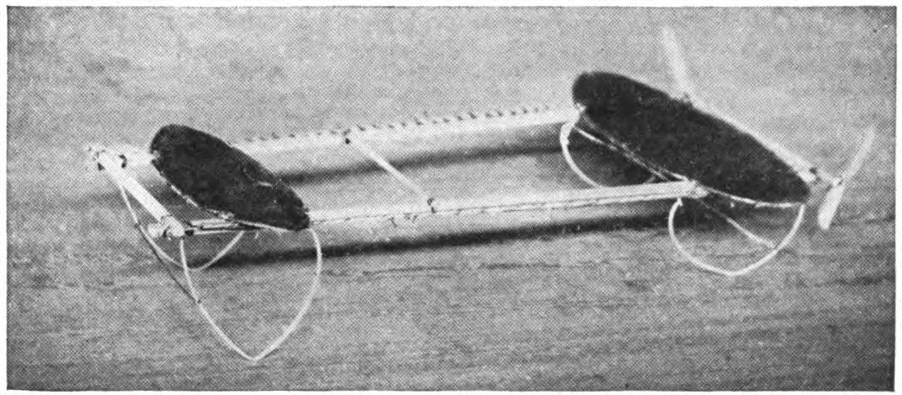

   A model with limited plane area built by R. Barry

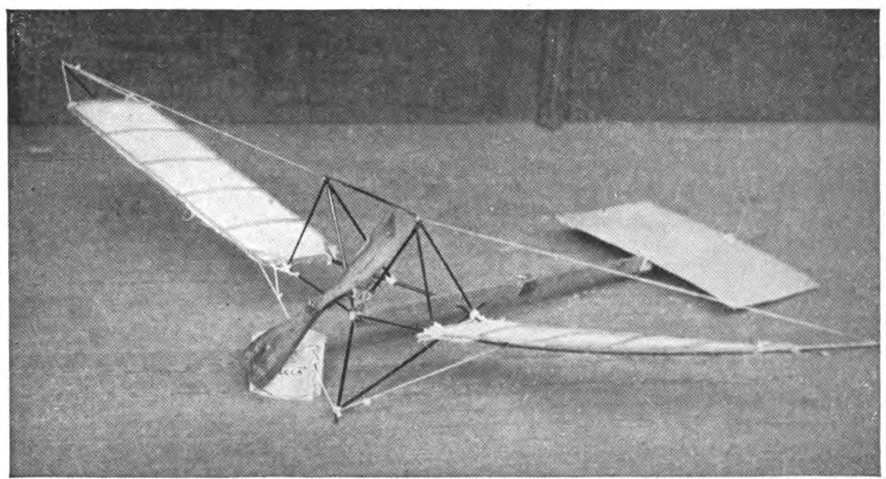

   An interesting experiment in metal frame building by R. Fisher

The simplest skid is made by splitting a section of reed, or splicing it, to form a Y, and attaching the upper ends to the bottom of your motor base. The lower end is then bent into a half circle. Wrap the reed tightly at the crotch to keep it from splitting, and touch the wrapping with glue. To make such a skid stable, join the two pieces by a cross brace. The skid should slant backward at a slight angle to reduce the friction on starting. Several methods of bracing such a skid are suggested in the accompanying photographs of models.

A stronger skid is formed by turning the reed to form ellipses and attaching them to the motor base. The curved parts will require bracing. Two diagonal braces will keep them in position. Some model builders prefer to shape the skids at the bottom, so that only a single point of the reed comes in contact with the floor. This plan makes it possible to shape the skids into several graceful forms which help to make the model attractive.

Still another plan, followed by some of the most successful model builders, is to shape the skids like the runners of a sleigh. In some of the Percy Pierce models this year, about six inches of the rear skids come in contact with the ground. It might be supposed that the friction in this case would be considerable, but this particular model is one of the quickest to rise. This design has the great advantage of being extremely elastic and letting the rear of the model down gently after a considerable fall.

Some model builders still retain the wheel skid in a much simpler and lighter form. The miniature bicycle wheels do very well for scale models, but since they are likely to add an ounce or two to the weight of the aeroplane, they are prohibitive. To avoid this weight, the wheels may be made of simple disks of wood cut very small. A wheel one-half an inch in diameter, cut from a board one-eighth of an inch thick, weighs practically nothing and affords sufficient support. These may be mounted very simply on axles made of bent wire attached to the feet of the skids. Sandpaper the rims to an edge in order to reduce the surface presented to the air. Since their surface is edgewise to the line of flight, they will offer very little resistance.

The wheels on some of this year's models are formed of wire disks covered with silk. The weight of these wheels is practically nothing, and they add much to the appearance of a well-finished model. Wire disks which may be covered in this way may be bought from the supply houses. It requires rather a skilful hand to shape the wire into perfect circles which will run easily. The covering again is a very nice operation. The silk wheel is not recommended for the beginner; but for one who is anxious to finish his model to the last detail as attractively as possible, they form an interesting feature.

Ping-pong balls make serviceable skids. Since they are carefully rounded, they will turn easily. To mount them, drill a hole for the wire shaft or axle, taking great care to have it pass through opposite points of the sphere. The wire may then be bent above it and attached to the skid. The celluloid turning on the wire axle produces practically no friction, and the ball offers very little resistance to the air. The balls are, of course, extremely light and add little to the weight of the model.

By combining the skid and wheel form of support, your model will gain the advantage of both these devices. The general form of the Farman skid may be followed. The skid in this case should be fairly heavy, strong enough to hold its shape, although elastic enough to take up a considerable shock. The simplest plan is to connect the two skids by a cross piece, and use this as the axle for two small wheels, mounted on the outside of the skid. This plan enables the aeroplane to rise with the minimum amount of resistance and land at the end of a flight with protection.

In the collapsible skid we find one of the most interesting novelties of the year. This ingenious mechanism, which is very easy to adjust, and which is placed under the front of the model on rising from the ground, is drawn into a horizontal position extending out before the machine and acts as a buffer, an aerial cow-catcher. Any simple form of skid may be adjusted in this way. The upper end or ends are merely fastened to the motor base so that they will swing easily back and forth. From a point half way down the skid, a rubber band is run to the front end of the motor base. When the model is set on the ground, after winding up, the skid is pulled back to form the forward support. It will be found necessary to adjust it to stand at a trifle less than the vertical. The rubber bands must be just strong enough to permit the skid to stand in this position when held down by the weight of the machine. As the machine rises, the skid is, of course, released and instantly snaps up to a horizontal position.

A new interest is lent to model aeroplane building by mounting them on pontoons contrived to float them on the water. Several large men carrying machines have risen from the water, notably the Curtiss model. It is believed by some aviators that since the water offers less friction than the earth or than a wooden runway, it is easier to rise in this way.

The builders of modern aeroplanes have been quick to adopt this idea. The models are mounted on miniature pontoons, and after winding up the motors are released in the usual way. An actual photograph of a model thus mounted in the very act of rising clear on the surface of the water is reproduced as a frontispiece of this volume. The pontoons, it will be noticed, consist of two small pieces of board, placed almost directly beneath the planes. The model is mounted on these pontoons by ordinary skids of reed. The angle of the planes with the surface of the water is the same as in the ordinary mounting. The pontoons are kept as small and light as possible.

To start the machine, the propellers are wound up in the usual way. It has been found that a model would rise rather more quickly from the water than from the land or within a few feet. As our photograph shows, the pontoons leave a slight wake behind them in the water. Once started to rise, however, the machine rapidly gains its elevation. One advantage of the pontoon skid flying over the water is the safety it insures on landing. At the end of such a flight the model drops into the water, but with little danger of breaking any of its parts. It will be found interesting to experiment in mounting the model loosely on pontoons, so that when it rises it will leave them behind, thus doing away with the increased load.

CHAPTER XI GEARED MOTORS
````````````````````````

A MORE accurate control may be gained over a strand motor by using gear wheels. Both their speed and duration may be increased indefinitely. The gear will restrain a powerful motor from "racing," acting much the same as the governor of an ordinary engine. Still another advantage is the steadiness they insure to a machine in flight by cutting down the vibration.

The geared wheels and the frames for mounting them will be found to add very little weight, and they make possible a saving of rubber in the motor which renders such equipment no heavier than the ordinary direct-drive motor. Gears may be installed upon any ordinary motor base. Here is a fascinating field for experiment.

The great advantage of the geared motor lies, of course, in the fact that it enables you to divide up your rubber motor into smaller groups of strands. As you increase the power by adding more rubber, you of course cut down the number of the turns it will take. A motor forty inches in length, comprising six strands of rubber, one-eighth of an inch square, may be twisted to about one thousand turns. Double the number of strands and you will find that you cannot get more than five hundred turns with safety. Double the diameter of your motor one more and it cannot be twisted more than to two hundred times.

Now it is clear that if the motor consists of two groups of six strands each, and the axles be geared together, it may be wound up with one thousand turns while the power exerted will be that of the twelve strands. A motor with three groups of strands in turn will give you one thousand turns with the propelling force of the combined number, or eighteen strands, and so on.

As a general rule, it may be laid down, that by dividing your motor you double the number of revolutions. The heavier the motor the greater is the vibration in unwinding, and as you have doubtless discovered, a model which vibrates in flight offers a greatly increased resistance to the air. The geared motor cuts the vibration in half, or a third, as the case may be. Incidentally, this renders your motor practically noiseless.

The resistance offered by a set of smoothly-running geared wheels is slight, and may be compensated by adding more strands to the motor. In mounting them use the same care as used in the shafts of ordinary motors. By mounting them on a simple metal frame the friction may be cut down still further. This mechanism, moreover, is so slight that you can afford to select substantial material for the purpose. The clock wheels used in most of our American clocks are too thin for the purpose and easily slip apart.

A wheel one-sixteenth of an inch thick will add little weight to your model and will run much more smoothly. They may be bought very cheaply from clockmakers. The ingenious miniature ball bearings constructed for model aeroplanes are excellent for mounting gears, but they are not essential by any means, and the ordinary arrangement of washers used for motor axles will be delicate enough for gear adjustments. Complete sets of gear wheels mounted on metal frames, ready to be attached to the motor bases, may be purchased from the supply houses, but they are so simple that almost any bright boy can construct them for himself.

In experimenting with gears it will be well to begin with but two sets of strands with gears of the same number of teeth. Several models equipped in this way have been flown with success in America. The best flights are those made by a model built by Mr. Frank Schoeber of New York, a winner in several competitions. Mr. Schoeber's model is driven by two motors of three strands each. He uses wheels of the same size and number of teeth. The support on which the gear wheels are mounted must be perfectly rigid, since any play will result in a serious loss of power through increased friction.

Compressed-air motors have not yet been developed to a form practical for use in small model aeroplanes.

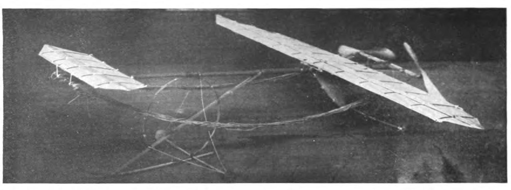

   An aeroplane of simple construction that flies remarkably well, built by R. S. Barnaby

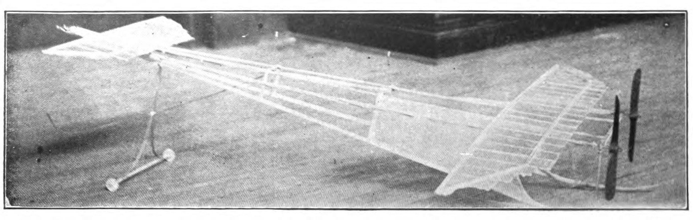

A number of inventors are at work on this problem and high hopes are entertained that a practical form of compressed-air engine will soon be invented. An unlimited supply of compressed air may of course be carried without adding to the weight of the model. It costs nothing again to get a supply. Anyone with a bicycle pump can get up enough energy for his model as easily as he can inflate a bicycle tire. The best compressed-air engines at present weigh from one-third to one-half as much as the model they drive, and will run only from ten to thirty seconds.

Spring motors hold out a promise for the model aeroplane builder. A number of fascinating experiments have been made to utilize the power of a coil spring. One young aviator mounted the spring of an ordinary shade roller upon a model aeroplane. The spring was connected up for a direct drive, a single propeller being used. It was found that such a spring could turn fifty times, storing up a relatively large amount of energy. Once released, however, it unwound with startling rapidity. The unwinding process was so rapid that the propeller spun through the air without taking hold or exerting any appreciable driving power.

A propeller of very high pitch was employed, but with the same results. Evidently a spring of this nature is not practical. Experiments have been made in Germany, however, with coil springs better suited for model aeroplanes, with satisfactory results. Since trolley cars have been driven for considerable distances by energy wound up in coil springs, the model aeroplane should be able to take advantage of this elasticity. Doubtless another year will find model aeroplanes flying by energy stored in this way.

The Petrol motors are now offered for sale in sizes suitable for model aeroplanes by several firms. A motor developing one-half of one horsepower weighs but little. The principal difficulty of these little power plants is that they set up a more or less violent vibration which racks the entire machine and renders a stable flight difficult. To set up one of these engines and adjust it to so delicate a task requires the highest engineering skill. Unless one has had such experience it will be well to avoid such experiments for the present at least. As a rule the engines are used to equip scale models which are not intended to fly. The beautiful model illustrated on the cover of this volume built by Mr. Karl H. De Leon is equipped with a rotary Knome engine especially imported.

CHAPTER XII LESSONS OF THE MAN-CARRYING AEROPLANES
``````````````````````````````````````````````````

THE builder of model aeroplanes will do well to keep in touch with the development of the passenger-carrying air craft. The development of both types of machines will always be more or less parallel. It is especially important that you watch the design and position of wings, and the modeling of propellers, since here the problem confronting both classes of builders is practically the same. The use of ailerons and vertical surfaces and all improvement in steering the large machines again may have a direct application on model aeroplane buildings.

The photographs of the new models of the large machines published in the newspapers will often give valuable hints, while the technical aeronautical papers will, of course, give more detailed information. In a few years, at the present rate of model aeroplane development, the designers and pilots of large machines may be looking to the new designs of model aeroplanes with much the same interest.

There is at present but one passenger-carrying monoplane, the Valkyrie, flown "tail first." It is built in two sizes, the smaller, fitted with high-powered engines, being intended for racing. The general lines of the Valkyrie resemble those of many of the model aeroplanes, but there are some features which deserve careful study. The main plane of the Valkyrie is set at a pronounced elevation, and has a high aspect ratio.

The front and rear planes are separated by a distance equal to about five times their width. Both planes have a slight camber. One of the most novel features of this model is that the forward plane is tilted upward at a positive angle, while the rear plane is elevated considerably less, thus giving the machine a longitudinal dihedral angle. This arrangement makes for fore and aft stability much the same as the dihedral angle of the wings makes for lateral stability, and suggests an interesting field of experiment.

The new type of Bleriot XI follows the general lines of the famous machine which first crossed the Channel. The fuselage of the new machine, however, is completely covered, tapering to a broad flat surface at the rear. This plan of gaining more surface by covering the frame is becoming general. In model building, it is unsafe to follow this plan, unless the motor base be comparatively small. The new Bleriot carries a larger horizontal rudder than formerly, placed aft, while the vertical rudder above it has been increased in size. The general design of the main plane, which is placed forward, remains unchanged. A single tractor screw is carried in front as usual.

In the new Blackburn aeroplane, the fuselage is covered with wood as far back as the pilot's seat, and with cloth to its extreme end. The use of thin board for this purpose suggests interesting possibilities. One of the most novel features of this model is the light skid attached to the outer ends of the main plane. The skid is very light, adding little to the weight or head resistance, and prevents the end of the plane from digging into the ground on landing. Such an attachment may readily be added to model aeroplanes when they will save many a broken wing.

A novelty in plane-designing is shown in the Handley Page monoplane. The main plane, carried forward, as in the Bleriot, is cambered just back of the entering edge, flows back to a flat surface at the middle and then tilts upward toward the rear edge. The two sides, in turn, are set at a slight dihedral angle to the horizontal. This modeling is believed to secure automatic stability in two dimensions, both longitudinal and transverse. The planes are unusually broad in their fore and aft dimension, extending back nearly one-half the length of the motor base. The horizontal and vertical rudders are very small. The design should work well in models.

Builders of biplane models will find some interesting suggestions in the new Bristol biplane. The forward planes are of the biplane form, the lower surface being much narrower than the superimposed plane, the comparative width being one-third wider. Another original feature of this machine is that the planes are connected by only four struts instead of by rows of struts along both the front and rear edges. The planes are held rigid by a series of braces. It is believed that this arrangement decreases the head resistance, at the same time insuring considerable lateral automatic stability. The rear plane is of the monoplane type.

The friends of the Dunn monoplane believe that the question of automatic stability has been practically solved in this ingenious machine. The Dunn machine has flown on an even keel for five miles without the pilot once touching the controlling levers. The trick is in the design of the main wings.

The greater part of the wing, extending out from the central stick, has a slight camber and is slightly elevated, besides being set at a dihedral angle. Near the outer edge the wings are bent sharply down, much as the wings of a swallow are bent, and are given a considerable negative angle both forward and outward. The tips, therefore, form pockets at either end under the arched tips.

Wings modeled in this way are remarkably stable even when traveling across the wind. When a gust of wind strikes the outer edge of the plane, it tends to thrust it down rather than up, as is the case when a gust gets under a wing of the ordinary design. The wing quickly rights itself, however, since the angle of the plane tends to lift it. The pockets in turn by compressing the air tend to counteract this tipping tendency. These pockets are besides closed to an extent by ailerons or flaps, which may be pulled down, thus confining the air still further.

An effective device for securing lateral control appears in the new Grahame-White machine. Narrow ailerons are placed on the forward edge of the front plane near the outer tips. The tips at the opposite ends are hinged and so connected that as one is raised the corresponding tip is lowered, or the other way about. Now as one of these tips is lowered, tending to lift the machine, the opposite aileron working in the other direction tends to depress it.

The increased resistance offered by the lowered flap again tends to keep the machine from swinging around in the direction of the side on which the other aileron is lowered. The lateral control is thus much more quickly applied than in the case of the rear ailerons. In applying this principle to model construction, it must be borne in mind that the resistance of these forward tips is tending to retard the machine and must be used with care when the motive power is limited.

As far as general appearance is concerned, the Piggot monoplane is probably the greatest novelty of the year. It is the first aeroplane to carry a cabin, as it were, in which the pilot sits completely enclosed. In general appearance it suggests a great whale with exaggerated fins. The pilot looks out through elliptical windows at the sides and bottom, covered with mica, to protect him from the wind.

The wings of the Piggot aeroplane resemble the Bleriot machine, the propeller, or rather tractor, being carried forward. It is extremely interesting, however, since it suggests for the first time what the appearance of a cabined, passenger-carrying aeroplane of the future may be.

On the Farman aeroplane, the arrangement for providing stability is very interesting. The ailerons in this case are attached to the rear of one of the main planes, the lower one, by hinges. This general plan will be followed in the case of the model aeroplanes. In a number of successful model aeroplanes, the Farman ailerons have been closely imitated. The Curtiss biplane depends for its stability upon ailerons mounted midway between the two main planes and partly within them. This plan is scarcely practicable in the case of model aeroplanes, since they increase air resistance and are difficult to control.

The Baldwin biplane has introduced a new feature for obtaining stability which may be closely imitated. A large plane is set vertically, directly above the upper main plane which may be swung from side to side by the pilot. The theory of this stabilizing surface is that it will restore equilibrium from side to side, since it works in undisturbed air while meeting with very little head resistance.

Many builders of model aeroplanes have introduced a similar vertical plane directly above the main plane, or have placed it well forward at the extreme front of the motor base. By removing this rudder as far as possible from the main supporting surface, it exerts a greater leverage, and a very small plane carried well forward will be more effective than a larger plane directly above the main supporting surface. It has the disadvantage of catching any chance side current and thereby knocking the aeroplane off its course.

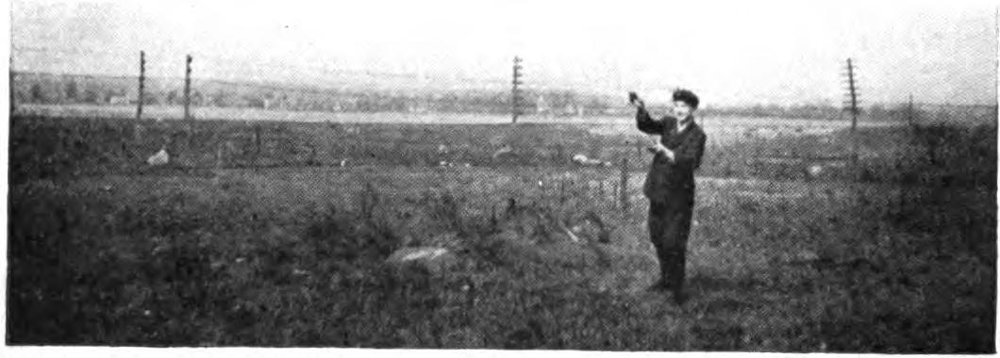

   Percy Pierce, winner of the distance record

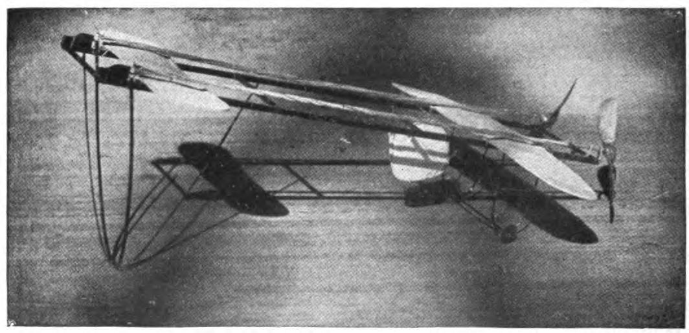

   A well-proportioned model, capable of long flights

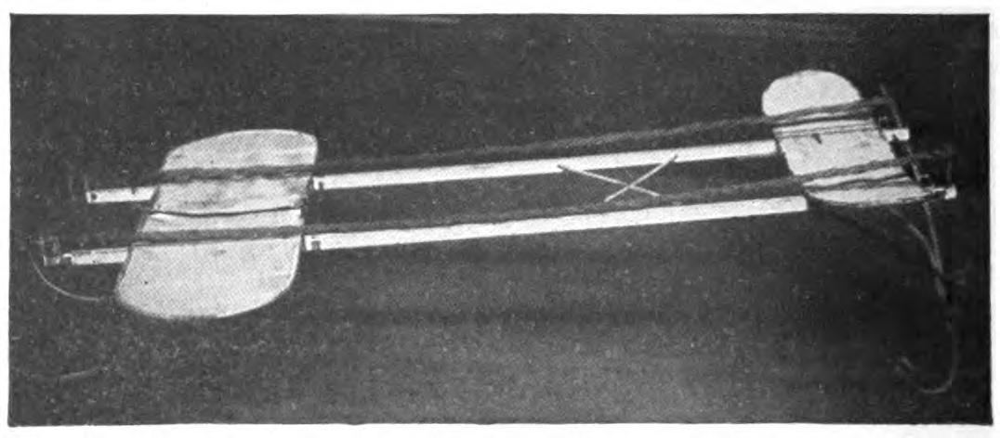

   A well designed aeroplane built by James MacPherson

The same principle has been carried somewhat further in the case of the new Herring biplane, which carries six triangular stabilizing fins set vertically above the upper plane. It is believed that these fins offer considerable resistance to any tipping motion of the planes, and if the machine slants to one side or the other, for any cause, there is a tendency, of course, to dart downward at an abrupt angle. The fins retard this motion as far as the upper plane is concerned, and the lower plane without such an equipment tends to swing back like a pendulum, thus bringing the aeroplane to an even keel.

In the case of the Antoinette aeroplane, of a monoplane type, a somewhat different device is depended upon for stability. The ailerons in this case are attached to the outer edges of the rear wing and are hinged so that they may be raised or lowered at will. One of these may be turned up while the other is turned down. Although these resemble the Farman ailerons, they are believed to be twice as effective since they may work in opposite directions, while those of the Farman aeroplane may only be inclined downward.

It will be noticed in the photographs of many successful model aeroplanes that the tips of the wings are flexed upward at an angle often as much as 45 degrees. These planes, it is believed, tend to lower the center of gravity, and in the case of a turn tend to bring the aeroplane to an even keel. Their head resistance in a straight flight is, of course, rather great. It is claimed that the Antoinette aeroplane is the easiest of all aeroplanes for a beginner, largely because of this adjustment of ailerons.

One of the most novel devices for gaining stability which has appeared during the year, is that of the Pfitzner monoplane, which gains lateral stability by means of an ingenious sliding wing tip which may be pushed out or drawn back at will. When the aeroplane begins to fall from its level, one of these wing tips is shot out, while the other is pulled in. This increased surface tends to throw one plane upward while the shorter plane, which for the time exerts less lifting power, falls correspondingly. The Pfitzner monoplane makes many sharp turns with very little tipping.

A New York aviator has succeeded, it is reported, in building a practicable aeroplane, which combines the best features of both the lighter and heavier than air machines. In the earlier stages of the development of aeronautics many believed that the solution of the problem was to be found in some such combination. The attempts usually consisted in adding large planes to dirigible balloons. Gradually, however, the combination was given up as impossible. The great dirigibles of to-day carry considerable plane surface, but this is intended to lend stability for guiding and not support.

The New York aviator, however, reverses matters and retaining the aeroplane form attempts to gain additional support from gas pockets. He does this by building his plane after the general Bleriot model but with a considerable space between the upper and lower surfaces, which he fills with gas. The machine has not yet been exhibited, but it is understood that this space is upwards of one foot in thickness and as wide and long as the planes. The front entering edge is kept sharp so that the wings, for all their size, meet as little resistance as possible. Whether the support gained from so small a body of gas is worth while, and counteracts the increased resistance of the enlarged wing, is of course an open question. The dirigible aeroplane has been flown successfully several times, however, with a passenger and is reported to have behaved well.

The new Paulhan biplane introduces an entirely new form of plane which is being watched with great interest. The wings have the appearance of being fluted or corrugated. The frames of the planes consist of a great number of ribs, running from front to rear, placed but a few inches apart. These ribs are made very flexible. The canvass covering of the planes is sewn with a series of pockets, exactly corresponding to the ribs. The wings are covered by merely pulling the canvass on the ribs and fastening it rigidly in place. This gives the canvass a tendency to arch between the ribs so that the planes consist of a series of corrugations. It is believed by some aviators that the supporting power of the aeroplane is increased in this way. It has the advantage at least of being very easy to adjust. A model aeroplane built on these lines should fly well and have a distinctive appearance.

Another feature of the new Paulhan which should appeal to the builder of model aeroplanes is its ingenious trussed girder. It is known as the Fabre girder. It is interesting to note here that the built-up girder was used in the model aeroplanes even before it was adopted in the man-carrying machines. The Fabre girder consists of two long strips of light wood connected by crosspieces of steel running diagonally. This form of construction gives unusual strength and is very light. It has its parallel in the beautifully built-up trusses to be found for instance in the models built by Mr. Mungokee. In this case the girders are made entirely of wood.

The question is often asked whether the rear edge of the front plane should be straight or brought back and tipped at either end. A study of the various models of the standard manufacturers shows that there is considerable difference of opinion among the experts. The builders of model aeroplanes in America still retain the straight line, while in England the tips are brought well back in a great many of the designs. The theory of this form is, obviously, that this tip tends to damp out any lateral motion, and makes for stability. In the most successful American models the rear line of the plane is kept straight without apparent loss of stability.

Turning now to the large machines, we find a similar contrast. In none of the Bleriot models is the rear line broken. The Wright, Curtis and Antoinette machines, even in their latest form, still retain the straight line. The Etrich monoplane has had good results with rear wing tips. The model has been accepted by the Austrian Minister of War who has ordered a fleet of twenty of these craft for the army.

The rear tip was first suggested by Lilienthal. The friends of this form claim that it more nearly approaches the form of a bird's wing than any of the other planes now in use. The depth of the main plane is nine and three-quarter feet and at the tips twelve feet. The entire tip is so adjusted that it may be flexed at will from the pilot's seat. It will be seen that this arrangement makes it possible to imitate the flight of a bird very closely. In adopting this idea in model aeroplanes it will be well to attach the extension by a hinge so that it may be turned up or down at will. Since it is placed well out from the main axis of the machine its leverage is naturally great.

In the large machines as well as in the models there seems to be a general tendency to increase the aspect ratio of the main planes. The Bleriot XI still retains its broad deep plane, but in several of the models the depth of the model has been greatly reduced. In the new Voisin monoplane the main wing has a width of thirty-seven feet and a depth of but five feet, thus giving it an aspect ratio of nearly one to eight. The machine flies with great ease, its resistance is very low and it answers well to its stabilizing devices. The Cody biplane again has supporting planes measuring fifty-two feet by only seven feet six inches.

The same tendency to reduce the size of the planes is noticeable in the recent Wright models. The Wright machines (model R), are the smallest yet used on an aeroplane. They have a spread of but twenty-six feet six inches and a chord of only three feet seven inches, giving them an exceedingly high aspect ratio. In the racing machines the spread has been cut down to twenty-one feet six inches. Attention has been called in an earlier chapter to this same tendency to reduce the wing area in model aeroplanes. It is interesting to find our amateur aviators increasing the aspect ratio of their planes although working independently.

In many of the large machines the front and rear planes are brought much closer together in the more recent models. It would seem that as the front and rear planes are brought closer together there would be a loss in fore and aft stability, but on the other hand the reduction in weight made possible by shortening the frame is very important.

A careful report has been prepared in France recently of all the serious accidents to aeroplanes with the idea of classifying them. The record of fatal accidents shows a total of thirty-one up to the beginning of the present year, resulting in thirty-four deaths. Although these figures taken alone are appalling, they are found on analysis to indicate that aviation is nevertheless growing safer and not more dangerous. In 1910 there were twice as many fatal accidents as in the previous year, but on the other hand there were more than five times as many flights made, so that the percentage of accidents, as a matter of fact, was but forty per cent. as great as for the preceding year.

The commonest cause of accidents according to these tables has been faulty construction. Next in turn came the accidents due to the errors of the pilots. Atmospheric conditions rank third in the list and fourth the carelessness of the spectators. There were in all some forty-seven accidents in 1909, and 101 in 1910. An increase is to be noticed last year in the accidents due to atmospheric conditions. This was caused in most cases by the unusual daring, even foolhardiness of the pilots. In their attempts to amaze their audience by performing hazardous dives and volplanes from great heights many machines were wrecked and several aviators met their death.

Since the main cause of fatal accidents has not been structural weakness or the carelessness of the pilots, it is clear that the science of aviation itself cannot be blamed. It is of course a comparatively easy matter to build machines sufficiently strong to fly without breaking down. The number of accidents, especially fatal accidents, due to the inherent danger of flying, to dangers which cannot be overcome, has been very trifling, and is steadily diminishing.

CHAPTER XIII SELECTED QUESTIONS FOR BEGINNERS
`````````````````````````````````````````````

How can I find the center of pressure of my model aeroplane? The simplest plan is to adjust the planes so that the model flies on a perfectly even keel, and then balance the machine. Since the center of pressure and the center of gravity must coincide to produce horizontal flight, this point of balance will be the center of pressure. As a rule, the center of pressure will be found to be near the front edge of the main plane, perhaps slightly back of this forward edge.

What is the best position for the propeller?

In the case of a model driven by a single motor, the propeller shaft should pass through the center of gravity and center of pressure of the machine. It is very important that the alignment should be perfect or you will have great difficulty in securing a horizontal flight. In case of a double propeller machine, the line midway between the two propeller shafts must pass between the center of gravity.

My aeroplane starts off all right but often begins to rock from side to side like a cradle and then flutters to the ground. How can I prevent this?

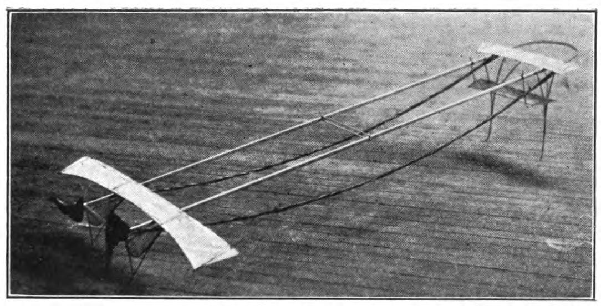

   A beautiful model built by Stewart Easter

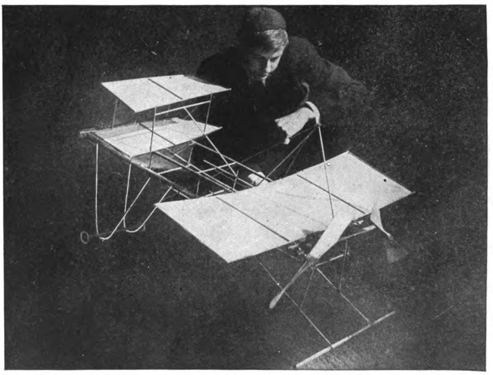

   A successful model of 1910 built by E. G. Halpine. Note contrast in plane area

This "rocking" motion is probably caused by a too low center of gravity in your machine. If your planes are set at a dihedral angle, they should be brought nearer to the horizontal. Another plan is to place them lower down. A side gust of wind will start this rocking or vibration, and in order to right itself the machine loses momentum and falls. This difficulty is seldom experienced with horizontal wings, especially if their aspect ratio is high.

I have no trouble in getting my model off the ground, but it seems to rise too fast and fall backward or uses up the power before it really gets under way. Is the trouble with the propeller or the planes, for my motor seems all right?

If your model rises quickly, the planes are probably well designed and built, the motor is effective, and the propeller sufficient for all needs. The trouble is likely to be with the angle of the planes. Perhaps your front plane is elevated too high. The rear plane should be kept horizontal or very nearly so. An aileron at the rear of the main plane will help you to properly adjust same. As a rule, the angle of ascent should be a little more than that of the front plane. If it still acts badly, strengthen your motor and bring your large plane back a trifle.

What is the best place to put the keel? 

The greatest stability is usually gained by fixing the keel at the center of gravity. There is great difference of opinion as to whether it should be above or below. Try both ways. What is stability for one aeroplane may mean disaster for another.

Why should an aeroplane pitch and roll when rising or even traveling horizontally, but sail in a bee line when it begins to descend?

The stability of a model is greater when its course is downward than when in a horizontal flight. In this position, the center of pressure is much less likely to shift, and the pole of gravity has rather a steadying effect. For this reason a glider thrown from an elevation travels much more evenly than a power-driven machine. Try reversing your planes.

Why is it that my aeroplane sails all right, but when I increase the power of my motor it falls off and darts about until it reaches the ground?

It has been found in experiments of man-carrying machines that an increase in the speed of a flight would often render an ordinarily steady machine unstable. It is argued by some authorities that the air is churned up, as it were, by the forward planes, and that the rear wing, therefore, rocks just as will a boat in rough water. If your model flies well at a certain speed, you had better stick to the motor, and try a larger plane.

How far apart shall I place the two wings of my monoplane?

There is no general rule possible. Some designers believe that the two planes should be separated by a distance equal to four times the width of the main plane. An excellent model which makes long flights is illustrated herewith, in which the distance is equal to nearly twenty times the width of the main plane, while another successful model has an open space of only twice the width of the main plane. Much depends, of course, upon the speed at which the aeroplane flies. The wings may be much further apart on a high-speed than on a slow-flying model.

Are there any simple equations for working out the relation of the proportion of the size and weight of model aeroplanes?

There are many such equations, but none of them are simple. The formula which obliges one to solve a complicated problem in algebra or calculus to know where to cut off a stick is obviously absurd in the case of small models. These formulas which may be found in technical books on aviation seem to savor too much of certain school books to be brought in for the builder of model aeroplanes. A good rule to remember is that the thrust should equal the weight of the machine.

Some of the large aeroplanes are driven by propellers made up of four blades. Would you try this arrangement on a model aeroplane?

By no means. As explained in the chapter on propellers, the work performed by your propeller blades is entirely different from that of an electric fan. It is true that fairly efficient propellers made up of four blades have been used on some passenger-carrying aeroplanes. This form might prove effective on a model aeroplane, but increased weight is prohibitive. By carefully designing your two blades, you can get equally as much work out of them and at the same time reduce the weight by one-half. It is argued by some authorities that the single blades act upon undisturbed air and are therefore more efficient than a four-blade propeller, as the air is always churned up.

How can I calculate the speed of my machine from the size and pitch of my propeller?

It is practically impossible to do so. If you multiply the pitch of a propeller by the number of turns at a given time, you will arrive theoretically at the speed.

In practice, however, the slip of an aerial propeller is from twenty-five to forty per cent. It is very difficult to determine just what the slip is. Your calculation is likely to be a matter of thirty per cent off and is of little value.

I am troubled with my machine trembling a great deal during flight. What can I do to make it steady?

The framework of your model is probably too light for your motor. Strengthen your machine if it will stand it, or take off some strands of your motor, if it will stand it. The frame may be strengthened by using wire braces. This method so commonly used last year is being abandoned by the successful builders, as it makes it necessary to attach struts at right angles to the frame, which add to the weight and resistance. The wire in vibrating also offers an appreciable amount of resistance to the air. In a large passenger-carrying machine, these wire braces are absolutely necessary, but the model being so much smaller it is better to make the frame heavy enough to remain rigid. A great deal of extra work and annoyance is saved by doing away with wires. This trembling again may be caused by your propeller not being properly balanced.

What is the lightest metal I can use?

Aluminum has less specific gravity than any metal now available. Its cheapness also makes it practicable. Magnalium is a trifle heavier than aluminum but considerably stronger, and is preferred by many model builders. There are still others who prefer steel to either of these. Steel is three times as heavy as aluminum and about five times as strong. If you can get the metal in the proper size for model aeroplane building, steel is probably the lightest after all. Some model builders have great success with umbrella ribs, which is probably the most available form of steel for our purpose. As most of us have discovered, a steel bicycle spoke is by far the best axle for propellers.

Should the propeller be in front or behind the machine?

It will require some years of experimenting to answer this question definitely. On one hand it is argued that the forward propeller, or tractor as it is called, works in undisturbed air and is therefore more efficient. Most of the large passenger-carrying aeroplanes are driven by tractors. Others argue that the propeller churns up the air and that the planes would therefore balance themselves against the gusts thus set in motion, which makes their flight unstable besides requiring additional power. Practically all of the successful model aeroplanes this year are driven by propellers.

What is the lightest practical model aeroplane?

The English aviators who excel in constructing very light models have had great success with what are termed "one ouncers." Some of the models of this type weigh even less than one ounce. The distance qualities of these machines are marvelous. Mr. Burge Webb claims a record of 1,500 feet in a straight-away flight by one of his one-ounce models.

Can I make a model fly by turning the propellers in the same direction?

It is doubtful. In using twin propellers the blades should, of course, revolve in opposite directions although they are wound up by turning them away from the center. Be careful, of course, to mount the right and left propeller in the proper position. Some aviators believe that the propellers should be turned at the same time,—there are machines to do this,—in order that the thrust may be exactly balanced.

What is the longest flight ever made by a model aeroplane?

Mr. Flemming Williams, the English expert, claims to have made a flight of almost exactly one-half a mile. His machine, which is illustrated in this volume, weighs ten ounces. It was launched by throwing it in the air, and in making this record flight travelled with the wind.

What is the best weight for a model?

Here is a very difficult question. It depends entirely upon what you are trying to accomplish. In England, where everything is sacrificed to the distance qualities of the model aeroplane, the best models vary from five to ten ounces in weight. In America, where much more is required of a model aeroplane, since it must rise from the ground under its own power and possess considerable automatic stability, the average weight is much more.

What is the average speed of a model aeroplane in flight?

About twelve miles an hour. When sailing with the wind this speed may be increased indefinitely. In sailing against the wind, a model aeroplane may creep along while remaining almost stationary.

Will tandem propellers make my model swifter or steadier?

Little has been accomplished either in America or in England with the tandem propeller. Several small French models have been flown in this way, but without striking results. Theoretically, the torque of the propellers balance one another in this position; the forward propeller creates a considerable backwash, and the second propeller works at a disadvantage. Further experiments may discover an advantage in this arrangement

How hard should I throw my machine when starting it?

It is not a good plan to launch the machine at a higher speed than that at which it travels under its own power. By increasing its speed, you are likely to set up violent oscillation, and, as explained elsewhere, a model becomes unstable with increased speed. It is better to start it too slowly than too rapidly. In the case of a glider, of course, it is well to throw it with all your might. This is a problem, incidentally, which does not occur when the models rise by their own power.

My machine flies very well indeed, but I cannot make it start from the ground. When I add more power it swerves to one side and will not fly off. What would you advise?

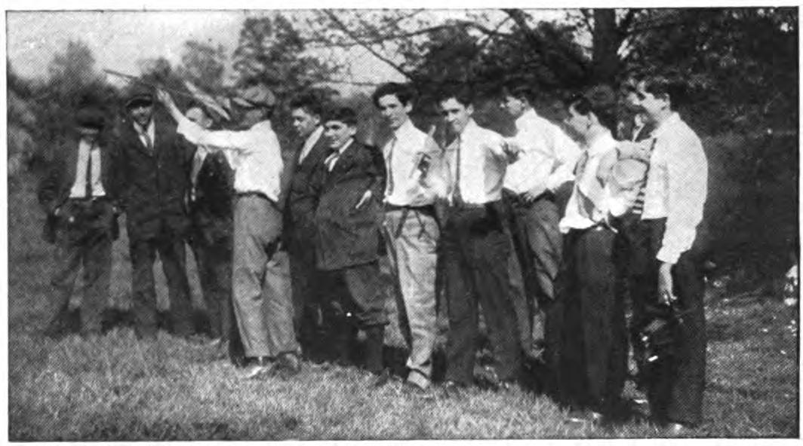

   Percy Pierce launching a prize-winning model

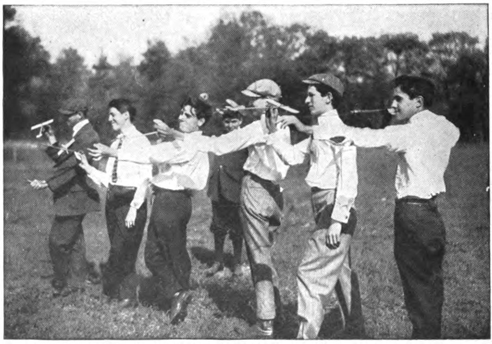

   Launching the sling-shot gliders

This is a common experience. Our advice is to return to the original motor and make the most of the successful flights. Your model may not be adapted to rising at all, that is, it is too light to carry the motor required to raise it from the ground. If your frame is made strong enough, it may be able to stand the increase in power, if it vibrates violently, as is probably the case with a heavier motor.

What is the best time to release the propellers, just as it starts or before?

Try both ways. Some model builders allow their propellers to get under way a second or so before the flight commences, and release them and push the machine forward at the same instant. One amateur secures his propellers by means of a thread which he breaks by touching it with a match, but it is rather fanciful.

What is the best height for a model aeroplane to fly?

In the principal model tournaments held in New York the models were seldom more than twenty feet from the ground at any time. Most model builders have this altitude in mind in designing their machines. It seems to be generally agreed that when a model rises higher than this too much power is used up in gaining altitude and there is a corresponding loss in the distance qualities. On the other hand in the remarkable 1,600 foot flight made by Cecil Peoli in July, the model rose to a height, it is believed, of more than 100 feet and gained considerable distance in gliding down. After all it is a problem which must be decided by the individual. Incidentally it is estimated that a large man-carrying aeroplane on rising to an altitude of one mile can safely soar with all power shut off for twelve miles. This means of course that an aviator has the choice of landing anywhere within a circle twenty-five miles in diameter, which gives him a rather wide choice.

What is meant by "critical soaring speed?" 

It is claimed by some aviators that every aeroplane has a certain speed at which it flies best and beyond which it is unsafe to push it. If more power is put on, they argue, it will only tend to send the machine up in the air and will not increase its speed. This is probably true in a measure of model aeroplanes as well. When you have found the speed at which your aeroplane flies best do not change the number of rubber bands of your motor or the number of turns in winding.

Do the tails of birds serve as rudders to guide them in flying?

It is an open question. Some aviators who have made very careful observations of birds in flight deny that the tails have anything to do with their direction. The theory is advanced by some scientists that the birds used their heads to change their course, operating them as a forward rudder, much as do some types of aeroplanes. They argue that since a rudder is much more effective when placed forward the smaller surface presented by the flat heads and necks of birds has more effect than a comparatively large tail.

What is the relation of the wing surface to the weight and horse-power of the biplane as compared with the monoplane?

The Wright biplane carries a trifle more than two pounds of weight for each square foot of lifting surface. The Bleriot monoplane carries about five pounds weight to every square foot of lifting surface. On the other hand the Wright machine carries about forty pounds per horse-power, whereas the Bleriot will only carry about twenty-seven pounds. These figures do not work out for all biplanes or monoplanes but they indicate broadly the relation between the two general types of aeroplanes.

What would be the effect of bending down the outer ends of the wings of an aeroplane as the wings of some birds droop?

The experiment is well worth trying. It would seem that this angle would give increased stability, although if the model were knocked off its course it might increase the resistance considerably. An elaborate test of this form has been made by an aeronaut named Weiss in England, who believes he has gained automatic stability in this way. Mr. Weiss has built and flown a number of aeroplanes, varying in size from one weighing five pounds to one which carried a weight of 140 pounds, and the tests are reported to have been very satisfactory.

What is meant by the phugoid path of a model aeroplane?

The line described by the machine in flight. Every aeroplane left to itself flies in a series of waves swaying more or less up and down from the horizontal. In a aeroplane under the control of an aviator this is largely overcome by manipulating the rudders controlling the vertical motion. Every model aeroplane or soaring machine has a phugoid path peculiar to itself which is affected by the power of its motor, the form of the wings, its ability to right itself, etc. It is obvious of course that if the path of your model aeroplane is irregular the machine must travel more slowly and its distance qualities are therefore reduced.

Is a variable wing surface an advantage and can it be applied to model aeroplanes?

In theory at least there is a great advantage in the variable surface plane. As yet but one aeroplane has been flown in which the pilot may increase or cut down the spread of his wings at will. When such control is possible the aviator may employ the maximum spread of the wings for rising, for instance where it is needed, and then reduce their area when aloft, thus gaining in speed qualities. At the present stage of the development of the model aeroplane a variable wing does not seem practicable, although it is reasonable to suppose that the improvement will come in time. The control would of course have to be automatic, which renders the problem rather complicated.

What is a vortex pack?

Literally a small cyclone or eddy of the air. The term is used by aviators to describe a turbulent section of the atmosphere. It is very common in flying, especially at low altitudes, to run into a very turbulent eddy of air, such as is set in motion by high buildings or deep valleys. They are extremely dangerous since they cause the aeroplane to dip and roll about violently, and call for quick and skilful handling of the aeroplane to keep it from being upset. The term might be used to describe an eddy of air which brings a model aeroplane to grief.

What form of propeller will give the highest efficiency?

It is impossible to lay down a hard and fast rule. Much depends upon the form of the machine. The Voison propellers have been found in actual practice to give only about forty per cent efficiency. This is said to be partially due to the fact that their parts are held together by bolts and projecting nuts which offer considerable skin friction. The Wright propellers are believed to be the most efficient propellers for large machines since their efficiency is about seventy per cent. The accompanying photographs of the standard model aeroplane types in America will show that there is great difference of opinion as to the diameter and pitch of the screws.

What is meant by a variable speed machine?

Merely an aeroplane whose speed may be increased or reduced by degrees at the will of the aviator. This will enable the pilot to use a slow speed for rising, for instance — and on reaching a desired altitude increase his speed. On encountering high winds, for instance, the speed might be increased so that the aeroplane would cut through them almost undisturbed. The variable speed aeroplane will doubtless soon make its appearance. Many aviators expect that it will be the next great step in the advancement of the science of aviation.

Has any model aeroplane been fitted with an automatic stability device and what is it like?

No such equipment has attracted public attention up to the present writing. An interesting method of securing automatic control has been suggested by H. L. Twining, the well-known writer on aviation. His plan is to attach a geared wheel to the propeller shaft in such a way that it will not begin to move until the propeller has made about 100 revolutions. A string is then run about this wheel which is pulled back as it turns. The pull of this string in turn is made to raise or lower the horizontal rudder of the model, but only after the machine propellers have made 100 turns and the model is presumably well up in the air. In this way the propeller may be set to send the model upwards at a sharp angle and then made to take the proper angle for a horizontal flight. The attachment suggests very interesting possibilities. It may be possible, if the device works, to alter the angle of the rudders either vertical or horizontal several times during a flight.

What is the record flight for a motor-driven model aeroplane?

A flight of upwards of one mile is reported to have been made by a motor driven model in India, while in the United States the mile mark is claimed to have been passed. Neither of these flights are official. The most advanced work with motor-driven models is at present being done in France. At a recent model tournament at the Velodrome du Pare des Princess, Paris, a number of model aeroplanes equipped with engines of various types were flown. One of these, a biplane measuring nearly seven feet in length, was fitted with a petroleum two-cylinder motor which developed one-third of a horse-power. It rose beautifully, cleared a high building and was flying well when it unfortunately collided with some telegraph wires and came to grief. Before the accident it had flown nearly three hundred feet in a perfectly straight line. Another model at the same meet equipped with a carbonic acid motor flew very well for a time but was injured in a collision.

How long has a model aeroplane remained in the air?

The American record for time aloft is held, we believe, by Cecil Peoli of New York, whose model has remained in the air for sixty-five seconds. Several records of from thirty to forty seconds are reported from France. It is probable that the best record has been made in the long distance flights in England when 26,000 feet was covered.

Has the model aeroplane any practical commercial utility?

Probably not, unless we take seriously the suggestion of a writer on aerial warfare, who believes they will some day be so perfected that they may be used to drop bombs or high explosives over forts or besieged cities. His suggestion is that hundreds of model aeroplanes equipped with miniature engines might be released in a swarm, each carrying a deadly explosive which would be dropped automatically at a certain time. It would be impossible, he argues, for gunners to bring down an entire fleet of these swiftly moving machines, and so while many of them might fall short enough would succeed in dropping their missiles to make them an exceedingly dangerous weapon. The writer points out that the expense of such a mosquito fleet would be trifling compared with the cost of the ordinary engines of warfare and might be operated without risking any lives.

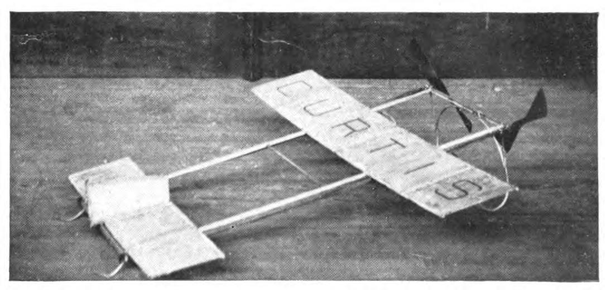

   A tractor with large plane forward built by F. W. Curtis

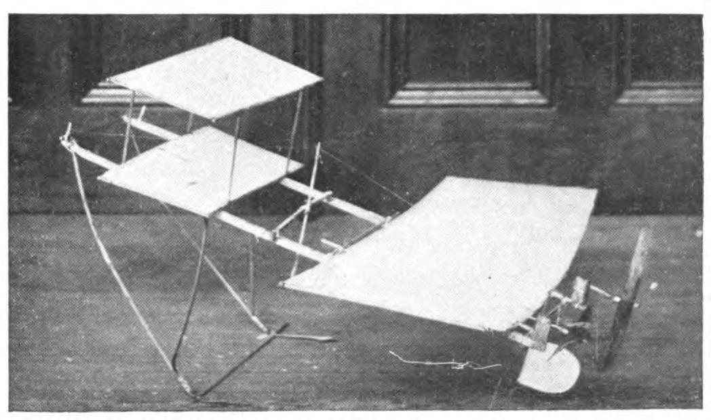

   Model built by William Robinson

How large may a model aeroplane be made with good results?

None of the successful strand motor models at present exceed five feet in length. This would seem to be the practical limit at which a model may be carried with this motive power. Flights of more than 1,500 feet have been made with models but two feet in length. When regular engines are installed there is of course no limit to the size of models.

When was the first model aeroplane constructed?

Crude machines propelled through the air by twisted rubber strands were used as playthings more than a century ago. The model built and flown by Langeley in 1887, was probably the first machine to appear on the lines now generally followed by aeronauts. Successful model aeroplanes have been used as toys for less than five years. Their development in this period has been remarkable.

Are the equations for calculating the thrust of propeller in terms of wing area and skin friction and general proportions useful in designing model aeroplanes?

Only in a general way. When the dimensions are very small these complicated equations are misleading. They are for the most part extremely complicated and for this reason we have avoided them entirely in the present volume. Much better results may be obtained by proceeding merely by the rule of thumb, and testing out the proportions of your aeroplane by actual practice.

What is the American indoor record for model aeroplanes?

A flight of 265 feet was made at a New York tournament by Stewart Easter, the model rising from the ground under its own power. This was made diagonally across the hall as far as it could go. Many flights have been made at the New York meets in which models have flown the entire length of the hall and struck the further wall with their motors far from run down. In other words, model aeroplanes have reached a state of development where they have outgrown the largest indoor enclosures available for flying.


CHAPTER XIV AMONG THE MODEL BUILDERS
````````````````````````````````````

A number of model aeroplane builders in America have developed distinctive designs which have come to be accepted as standard types. Among thousands of boy amateurs these models are looked upon much as, in the larger field of aeronautics, the Wrights, Curtiss, or Bleriot are accepted as authoritative. Like the famous designers and pilots of man-carrying craft this younger generation of designers give their names to their machines. Our young designers, as a rule, confine themselves to developing a particular type of machine. A comparison of the models of the same builder for a year or more will usually show that the same general form and arrangement of the planes remain the same.

The Percy Pierce model, which borrows the name of its designer, is probably the best known of these model aeroplanes. The designer is a New York schoolboy seventeen years of age, who has won distance records both for indoor and outdoor flying. His machines rise from the ground under their own power. The Pierce model of 1911 is equipped with wings much narrower than those used last year, spaced well apart on a four-foot frame. The planes, which are slightly flexed, are covered with silk, or bamboo paper drawn taut and varnished. Twin propellers of high pitch are used and the motors are carried above the planes. They are wound more than five hundred times. The planes are carried beneath the main frame. Directional stability is obtained by carrying back the edges of the rear plane and by a vertical rudder placed beneath. The model is mounted on skids of bent reed and is elevated very slightly above the horizontal. It starts off very fast, often leaving the ground within five feet. The model reaches its maximum altitude, traveling at an angle equivalent to its position at starting, and maintains its height throughout its flights.

The later Pierce machines, while preserving the same general lines, are considerably lighter and have developed surprising distance qualities. The planes are made of light lath or bamboo covered with specially prepared paper, while the pitch of the propellers has been increased as has the power. The latest models have flown for 1,600 feet.

Another prize-winning model which has attracted considerable attention of late is the aeroplane designed and built by Cecil Peoli. It shows an intelligent appreciation of the principles involved and excellent workmanship. It is a monoplane, flying with the smaller plane forward, and has recently flown for nearly 1700 feet. Planes are used with both silk or paper covering. The success of the model is largely due, no doubt, to the careful workmanship and finish of the planes.

The models are usually high powered and are driven by twin propellers of high pitch, carved from especially designed blanks. The aeroplane rises very quickly and will successfully combat a high wind. It is doubtless due to this fact that the model has won in a contest for altitude. It has repeatedly flown over a thousand feet. It does not follow, of course, that the beginner can equal these records since much depends upon the skilful adjustment of the model which comes only with experience.

Another prize-winning aeroplane which has been much admired is the Leslie Robinson model. This model, which is of an original design, makes long and remarkably stable flights. In no other model has metal been used so extensively in construction. The propellers are made of aluminum as is the framework of the planes. Both planes are built in the proportion of about one to five, the smaller wing being carried forward. A novel feature of this model is the turned wing tips of both planes, which are slightly tapered and bent upward and outward at a slight angle. The model is beautifully finished in every detail.

Skids of reed are used and the model is tilted upward sharply at an angle of nearly forty-five degrees. The motors, three feet in length, are composed of ten strands of square rubber, which will take about 400 turns. The model rises quickly at a sharp angle but soon comes to a horizontal position and flies with great steadiness. It weighs complete, ready for flight, nine ounces. Its metal construction makes it very durable and proof against many of the smaller accidents. The later machines have been equipped with geared motors, which work well in practice.

The models built and flown by H. L. Watkins always give a good account of themselves. A comparison of the Watkins models of 1910 and 1911 shows that their inventor has kept closely to his original design and has made remarkable progress in lightening his machine while keeping it sufficiently strong to support two powerful motors. The wings have been cut down in size and made extremely light, the smaller wing being set well forward. Directional stability is gained by a small vertical and horizontal rudder, carried far in the rear of the rear main plane. Every part of the frame is kept extremely light. The model complete weighs but four ounces.

The Watkins model stands on very light skids so arranged that a single point comes in contact with the floor, thus reducing the friction on rising. In many of his models Watkins covers his planes with thin red paper. The machine rests almost horizontally but rises very quickly on being released. Its extreme lightness often gives its flights a slightly waving form. Twin propellers, with unusually broad surfaces are used for driving, although, in some models, a single propeller is carried just back of the rear plane. It is an extremely graceful model in flight.

In the models built by Stewart Easter the wing surface has been reduced still further. The surfaces are no more than knife blades and are mounted surprisingly far apart on a rectangular frame. Every part of the frame has been cut away where possible to economize weight and resistance. Although four feet in length the model weighs less than three ounces. The front planes are flat with straight entering edges and the sides are cut slightly away. The rear edge of the rear plane is slightly concave. In some of his models two thin blades are carried forward, the upper one being placed slightly in front, thus ingeniously varying the biplane form.

Two slight vertical rudders, elliptical in form, are carried back of the rear plane. The frame stands in a practically horizontal position. The skids used are very light, touching the ground at a single point. With a six-strand motor the twin propellers are wound about six hundred times. The propellers are broad and of a high pitch. The Easter model clears the ground instantly, rises rather high and makes a beautiful flight. The model shows extremely fine workmanship in every detail.

The model built by John Caresi contrasts strikingly with these extremely light frames. They are of excellent workmanship and illustrate many new ideas in construction. The Caresi model flies well and has acquitted itself specially in the weight-lifting contests. It is safe to say that no other American model aeroplane shows a more comprehensive knowledge of the scientific principles involved in model building or a higher standard of workmanship in every detail of their construction. The planes are large, thus affording unusual stability. The frames are marvels of delicate and ingenious construction. In contests in which the workmanship and design are considered as well as the distance qualities, the Caresi model stands in a class apart.

No list of the successful model aeroplane models of the year would be complete which did not include the prize-winning machine built by J. Ragot. The aeroplane carries two planes of about equal size and shape mounted on a simple frame. It is driven by twin propellers of rather low pitch and a high-powered motor. By skilful adjustment of the planes and weights the model performs the most amazing spectacular flights. The model is well made. The unexpected course of the machine is controlled by flexing the ends of the planes. The Ragot model "loops the loop" and performs other amazing feats.

In point of workmanship few of the model aeroplanes which have appeared at the meets this year compare with those built by R. Mungokee. The genius of the Japanese for delicate construction finds an admirable opportunity in such work. These models are unusually large, and their wing area considerable, yet so delicate are all the parts that they weigh less than one pound. The sticks used for the motor base are hollow, being built up of a light veneer one-sixteenth of an inch thick. The joints are so cleverly arranged that they would deceive the average eye. The main sticks of the frame are joined by a series of trusses of the same delicate construction which form an exceptionally rigid base of amazing lightness. Every detail of the model shows the same delicacy of construction. The planes are built up of thin strips of bamboo covered with Japanese silk on both surfaces, the curve being drawn perfectly. The models are driven by two very wide propellers of high pitch, placed back of the rear plane. The smaller plane is carried forward. The model rises to considerable height, often fifty feet or more, and flies horizontally with unusual stability. The frame is braced by fine wires running through struts placed midway above and below the main sticks.

The finest scale model aeroplane in America to-day is doubtless the biplane built by Mr. Karl H. De Leon, illustrated on the cover of this volume. Its great size is indicated by comparison with the boys standing about it. The most delicate workmanship is to be found in every detail. The planes are controlled by a complete system of wires and levers centered at the driver's seat, exactly as in the large man-carrying machines.. The wings may be flexed and the guiding rudders turned from side to side or their angle elevated or depressed by the slightest movement of the controlling devices. The model is equipped with a miniature Gnome engine especially imported for the purpose. The materials employed in constructing this model alone cost upwards of $500. The model embodies several original features, the inventions of the builder. 

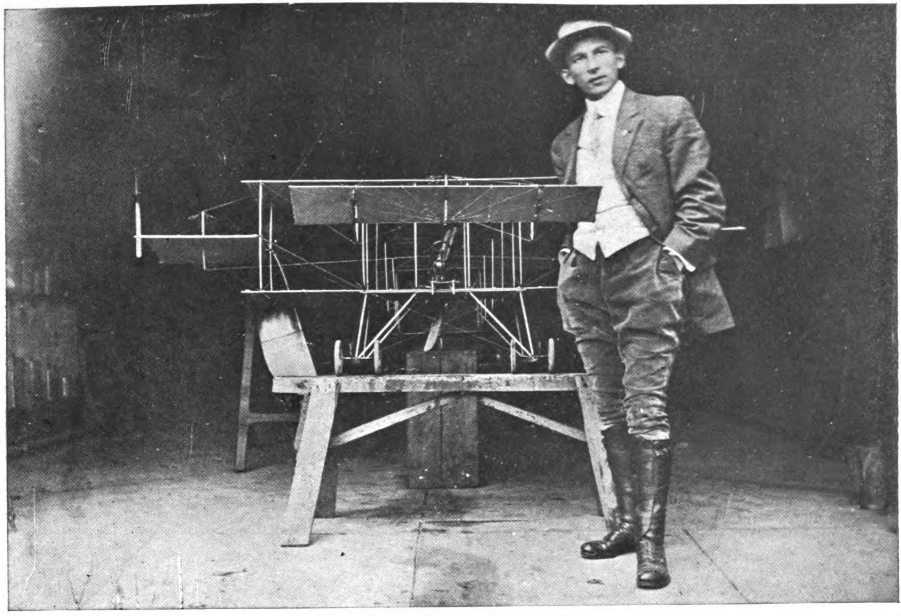

   Front view of the De Lion model

Several of the most interesting models of the year have been designed and built by Mr. W. S. Howell, Jr., a very painstaking and intelligent student of aeronautics. Mr. Howell has done much valuable original work in building scientific gliders. One of his gliders weighing nearly two pounds, has been thrown for more than 600 feet measured in a straight line, while the actual distance traversed was probably two or three times this distance. The model is of exquisite workmanship in every part. Mr. Howell is the inventor of several devices for increasing the efficiency of rubber-strand motors by reverse winding.

CHAPTER XV CURIOSITIES OF THE AIR
`````````````````````````````````

Until the summer of 1911, the longest model aeroplane flights officially recorded in America remained under 300 feet. From England meanwhile came disquieting reports of 1,000 foot flights and better, made by a number of aeroplanes. A comparison of the best American and English models showed that, both as regards form and workmanship, American boys were holding their own against their English cousins, and utterly failed to account for the much greater distance qualities of the foreign models.

In July, 1911, the American distance record was suddenly jumped to 1,691 feet, 6 inches, by Cecil Peoli of New York. The model used had been flown in the regular indoor meets for very much shorter distances. This sensational advance in the distance record was made at an outdoor tournament at Van Courtland Park, New York City. Of the thirty-four models entered for the contest, including the familiar models built by Percy Pierce, H. Watkins and others, several showed a similar increase in distance qualities. The model aeroplanes were the same as had flown but 200 feet indoors, their rubber motors exerted no more power than before, the pitch of the propellers remained unchanged.

What then is the secret of the suddenly acquired distance qualities? Evidently the difference lies in the quality of the air the little ships navigate. It is commonly said that the air indoors is dead as contrasted to the live air found out-of-doors. The variation in the quality and movement of the air forms a very interesting study which no aviator can afford to neglect. To the actual navigator of the air this study is just as important as life and death, while to the designer even of model aeroplanes it is of course of vital importance.

Although the composition of the air and its behavior under various conditions has been the subject of scientific examination for centuries, "it is only within the past few years that it has been studied with the idea of bringing it under control. The long painstaking experiments of Langeley and Lilienthal, referred to in the previous volume, for determining the resistance of the air and its effect on the surface of the aeroplane, opened a new field of scientific research. Within the past few years, even months, the advancement in our knowledge of the air has been greater, it is safe to say, than in the previous century.

It is not generally realized by the laymen how rapid has been the development of "aerology," nor how practical are the results obtained. There have already been established in Germany three scientifically equipped stations for observing air conditions for the benefit of aeronauts, just as the weather bureau observes weather conditions and informs ships at sea of approaching storms. One of these, established by Dr. Polis at Aachen, is now in operation. In addition to this the Public Weather Service Stations of Germany have been equipped recently with the necessary apparatus for making daily observations of the upper air for the special benefit for aerial navigators.

The resistance offered by the air to the passage of an air ship of any type depends upon its density. The air is obviously an exceedingly variable medium, as capricious as quicksilver, as both the sky pilot and the flyer of model aeroplanes have learned. The density and therefore the resistance depends upon the temperature, the pressure and the state of equilibrium. We are in the habit of thinking of density and pressure as affecting enormous volumes or areas miles in extent, such as are reported in the weather forecasts from day to day. To an extent these same conditions are found changing within a few feet. It is this tendency to rapid change of conditions which makes the problem of stability in aeronautics so baffling.

The pressure upon an aeroplane, whether a man-carrying machine or a model, varies considerably between the level of the seashore and the top of a mountain. An aeroplane in rising from the level of the sea for several thousand feet therefore meets new and unexpected conditions. The density is reduced fully one-half at an altitude of 18,000 feet, and since aeroplanes have risen more than 10,000 feet this must be taken into consideration. Even at a height of 300 feet, which is often reached by aeroplanes in flight, the difference in the pressure calls for skilful manipulation on the part of the sky pilot.

The density varies again according to the temperature. Let an aviator suddenly run into a hot or a cold strait of air and the pressure upon his planes will instantly change. The effect of temperature must be taken into consideration by any one flying model aeroplanes. It may happen that a draft of cool or of hot air, by changing the pressure on the planes, will throw a model aeroplane out of balance and mar an otherwise promising flight. A difference of a few degrees of temperature will often affect a very sensitive model. The only way to combat this is of course to build your model with the greatest possible stability.

The presence of high buildings or other violent inequalities will also affect the density of the air and in turn the pressure exerted on the wings of an aeroplane. Among aviators it is generally believed that a great city is one of the most dangerous possible objects to fly above. In the case of New York with its many sky-scrapers, for instance, the danger is vastly increased. Even in the open country the presence of a deep valley or other depression will so affect the density of the atmosphere that an aeroplane is likely to be drawn down from its course. These areas are known among aviators as "pockets," and are often large enough to swallow up a large man-carrying craft, at times with disastrous effects. The chance of your model aeroplane running into such a pocket is of course considerable.

A striking illustration of the effects of these chance currents was afforded during a recent model aero tournament in New York. A model aeroplane which had flown with remarkable steadiness for more than 150 feet chanced to pass over the head of a boy who was walking slowly across the course. This moving object served to set up a small whirlpool of air. The model on striking it was instantly checked, when it turned, skirted the column of air and passed on. In an indoor flying, an open window, merely by changing the temperature slightly in its vicinity, will often cause a model to be seriously deflected, perhaps to be thrown completely off its course. It will often be noticed in outdoor flying that a model, in passing over a stream or body of water or a mass of dense foliage, will encounter a change of temperature which will appreciably affect its course.

In flying model aeroplanes the performance of a machine will often vary unaccountably from day to day. With the same motor and winding, the model will fly much higher and more freely at different seasons of the year. It is well to bear in mind that in the summer months the heat causes a low density. The pressure exerted by the atmosphere is therefore correspondingly small; the model, or for that matter a large machine, travels much faster. A dry day also tends to cause low density. This will account for the excellent flights on warm, dry days and the crankiness of the machine when the weather is damp.

Cold weather on the other hand tends to increase the density of the air. The speed of an aeroplane is materially reduced but on the other hand the air will be found more buoyant. Such weather is better for heavy models, although they fly much more slowly. It will be seen that at high altitudes, where the density is least, models should fly both faster and higher than they will nearer the sea level.

One of the curiosities of the air is the effect of eddies created by the passage of aeroplanes. Let an aeroplane move fast enough through the air and it will create high density above its course, and low density below its line of flight. This condition may also be found in the wake of model aeroplanes. It will often be noticed when two models are flying near together that the disturbance caused by one will seriously interfere with the second machine. The contrast between the air above and below the models in flight in especially noticeable when the planes are flexed.

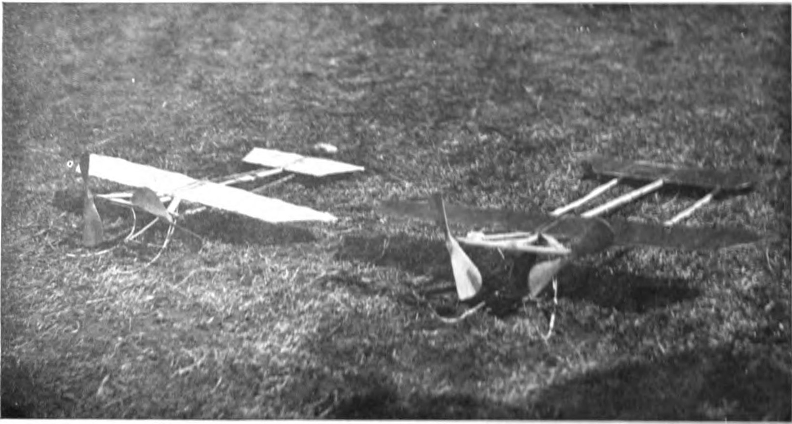

   Two of the earlier Peoli models

A great deal has been learned of the action of the air upon aeroplanes by photographing the air currents. The smallest eddies of the air have been made visible by taking instantaneous photographs of thin smoke as it passes obstacles of various size and form. It has been found that a square object causes a great deal of disturbance when in an air current. The air is compressed in front of it and eddies for some distance in its wake before finally coming to rest. An elliptical object causes less disturbance, but the air continues to splash in its wake for some distance. Even a perfectly spherical object offers a surprising amount of resistance to the air. In the case of a long narrow ellipse the disturbance is considerably reduced. A curved surface however, such as is used for the planes of an aeroplane, cuts the air with practically no resistance, and the air flows smoothly about and joins behind it with very little wake or splashing. A form which suits the air in this way or a "stream line" body as it is called is obviously just the right design for the wings of an aeroplane.

Even the experts in aeronautics differ so widely, however, that it is impossible to lay down any definite rules. One of the greatest authorities on the science of aviation, Mr. Horatio Philips, of England, believes that aeroplanes gain more support from the entering edges of their planes than from the rest of their surface. He argues that it is this edge, meeting the air currents, which serves to hold the aeroplane suspended.

This theory is founded on the experiments made with a machine of original design flown by Mr. Philips as far back as 1890. It consisted of a series of planes mounted one above the other at regular intervals, much the same as the strips of a Venetian blind. The lifting power of this model in proportion to its surface and the power exerted was enormous. This theory is borne out in part by the success of the model aeroplanes with very narrow wings which have been flown with great success during the year. The beautiful model built by Stewart Easter, for instance, which is illustrated on another page, depends for its support on planes which are no wider than ordinary window blinds.

There is an immense difference of opinion again as regards skin friction. Some writers believe the air has a tendency to stick to certain materials more than to others, and that this difference is so great as to materially retard some machines in their passage through the air. A complicate series of tables has been worked out in great detail to show the exact amount of this friction on various bodies. Some aviators go to great pains to make every part of their aeroplanes as slippery as possible. This is done by polishing the surfaces exposed to the air and in some cases enclosing the foreward part of the aeroplane, like a ship's prow, to diminish friction.

On the other hand we find some of the greatest authorities on aviation disregarding this question almost entirely. In the Wright machines, for instance, the surface of the wings is usually left comparatively rough, and the sticks and wires are placed without any attention to diminishing friction. This is true as well of the Delegrange, Voison and Farman machines. Still other aviators design every detail of their machines to cut down this so-called skin friction. The uprights, for instance, are made elliptical in shape, with the sharp edges turned forward so that they will cut their way the more smoothly through the air.

Several interesting attempts have been made to design a prow for an aeroplane which will cut the air with the least possible amount of friction. It is noticeable in these designs that the prows are very blunt, like the prow of a canal boat, and not as might be expected, sharp and narrow like that of a racing craft. The blunt-nosed prow is considered best for the air ship, because the air being one eight hundredth as dense as water offers very little resistance to its entrance. It is so much easier, in other words, to push an air ship through the air than a boat through water that there is no object in sharpening its nose.

The air, however, in flowing along the sides of a rapidly moving body sticks to it, and retards its progress relatively more than water retards a boat. It is important, therefore, that the body of the aeroplane be made very short, so that the sides will offer as little friction as possible. This reverses the proportions of a water-borne ship. We are so accustomed to see fast boats with long, narrow hulls, that it comes as a surprise to find that a fast air ship must have a very broad beam and as short a hull as possible.

It is probable that, as air ships develop, this general characteristic will become more marked. As aeroplanes become larger and faster they will therefore depart further and further from the conventional ideas concerning water-borne craft. It is impossible to prophesy at present what form the great passenger-carrying air ships of the future will take, but it is certain that their hulls or the closed-in portion carrying the machinery and passengers will be very short, snubbed-nose affairs. The world will be obliged to change its mind as to what constitutes a speedy-looking craft.

Man has learned to fly. More than 1,000 aeroplanes have been built which have successfully risen above the earth. It is estimated that these aeroplanes have flown in all more than 250,000 miles, or a distance equal to ten times the circumference of the earth. But no machine has yet been made which will fly alone, without the skilful manipulation of planes and rudders. The model aeroplane which soars gracefully aloft, suiting itself to the varying air conditions, perhaps comes nearest to the automatic flying machine.

A great advance will be made in aviation with the appearance of some practical contrivance for securing automatic stability. The aeroplane as it stands to-day shows a wonderful advance in the improvement of its general lines, and the mechanical perfection of its parts, but the question of stability remains practically the same as it was when the Wright Brothers made their first flights. The machine has been brought under a remarkable control, but only as it is directed by the practised hand of the sky pilot. Let him take his hand even for a moment from the levers, which control the planes and rudders, and there is danger of a bad spill, perhaps a fatal accident. Practically nothing has been accomplished in building machines which will fly unaided.

It has been pointed out, elsewhere in this volume, that the experiments with the model aeroplanes are certain to have an important influence upon the development of aeronautics as a whole, because they address themselves particularly to this problem of stability.

It is believed by many aviators that the problem of automatic stability will be solved by some form of the gyroscope. A great many experiments are being made with various forms of the gyroscope, although no machine has as yet been actually fitted and flown with such a device. The general principle of the gyroscope is very simple. It consists of a wheel which is made to revolve at very high speed. When such a wheel turns fast enough it will remain in a fixed position. Every one is familiar for instance with the gyroscope top. You wind it up and place it at any angle, and it will support itself and retain the position until it has run down.

The gyroscope has been applied for instance to railroad trains and has worked, experimentally at least, with remarkable success. By installing a gyroscope on a car running on a single track the car may be kept upright by the stabilizing force exerted by the revolving wheel. The same principle has been applied to steamships to prevent their rolling in heavy seas. The tipping of a car running on a single track, or of a ship at sea, is of course very much like the rolling of an aeroplane in flight; and it would seem that such a stabilizing device might solve the problem. The gyroscope has a serious disadvantage, however. Since it revolves at enormous speed any breakage would tend to throw the detached part to one side with dangerous force. In the case of the gyroscope used to steady ships at sea this force would be sufficient to send a piece of metal through the hull. On so delicate a craft as an aeroplane such an accident might readily prove disastrous.

It has been found again in experiments with gyroscopes on steamers that the frames have been seriously strained, even when the gyroscope worked smoothly. When a ship rolls and pitches to the motion of the waves, it is of course under a great strain but this balances itself. When it is held in a rigid horizontal position the pitching and rolling exert an exaggerated strain on the hull. In one instance a vessel actually broke its back under such a strain and was lost. An air ship, being at best a very frail structure, could scarcely be expected to stand the strain which has wrecked a steel ship. At the recent Paris Aeronautical show several extremely ingenious combinations of the pendulum and gyroscope principles were illustrated. It is of course possible that some modified form of the gyroscope may solve the problem.

A remarkable series of tests has been made this year in France with an automatic stability device based upon an entirely new principle. The rudders are operated automatically, in this case by a vertical fin opposed to the wind. As the pressure of the air varies, the rudder is forced up or down, thus bringing the aeroplane to an even keel without the assistance of the aviator. It is reported that model aeroplanes equipped with this device have been flown in three hundred experiments without a single accident.

The day is approaching when the air conditions will be observed and announced for the benefit of aviators exactly as the weather is foretold to-day. An aviator who is about to start on a cross-country flight will thus be able to study the conditions of the air lanes and lay out his route just as an automobilist looks up good-roads maps. In crossing a particular piece of country he will therefore know whether to take a low or a high air lane, that is, one of few hundred feet above the earth or the one several thousand feet aloft. The pressure of the air on the regular air lines will be announced as well. In this way aviation will be made much safer than it is to-day, when the aviator must venture without any knowledge of conditions aloft except those he may gain from the ground surface weather maps. During the year 1910, fully a score of lives might have been saved had aviators had such information.

The first of these observation stations is actually in operation in Germany to-day. Each of these stations is supplied with a number of rubber balloons equipped with automatic apparatus for recording atmospheric conditions in the upper air lanes. The stations also contain the proper apparatus for measuring the ascensional force of the balloons, with the gas generators used for inflating the balloons. When the balloons are sent up for great heights their altitude will be measured by means of the theodolite.

The soundings of the air are taken twice daily at eight o'clock in the morning and two in the afternoon whenever the weather permits. In the summer the morning observations are made much earlier. The movements of the balloons are then carefully observed at various altitudes until they are lost. These observations are then telegraphed to the central station at Lindenberg and sent out much the same as the regular weather forecast.

CHAPTER XVI RULES FOR CONDUCTING MODEL AEROPLANE CONTESTS
`````````````````````````````````````````````````````````

PREPARED BY THE WEST SIDE YOUNG MEN'S CHRISTIAN ASSOCIATION, NEW YORK.
######################################################################

GENERAL RULES AND CONDITIONS FOR 1911.
######################################

1. These General Rules and Conditions shall apply to the events conducted by the West Side Y. M. C. A.

2. Each and every contestant for a prize shall accept without reservation the conditions laid down by the West Side Y. M. C. A. and shall abide by the decision of the referee. Each contestant must register his name, age and address before the event.

(a) All contestants in Class "A" must be 18 years of age or over.

(b) All contestant in Class "B" must be under 18 years.

3. Every machine competing must be made by the operator (no toys admitted), and it must be built along practical lines, that is, a model from which a practical man-carrying machine can be built.

4. The Committee shall have the right to reject any entry, the rejection of which they deem advisable.

5. The flights shall be accounted level flights and no allowance will be made for variation of height.

6. A trial shall be considered to have ended whenever the machine touches the ground.

7. Competitors shall decide by drawing lots the order in which they shall take their turns.

8. Any entrant not ready to commence his trial when called upon will forfeit his turn to him who is next ready, and will fall back to the end of the list.

9. The commencement of the distance flown shall in the case of machines on wheels be counted not from the starting line, but from the point which is determined by the judges as that at which such machines actually leave the ground. In the case of machines using the catapult, there shall be deducted from the total distance flown the equivalent of the initial impulse of the catapult.

10. There shall be no restrictions as to the design, size, weight, form or amount of power, but the power must be self-contained in the model.

11. All models must start from the ground.

12. Each contestant shall have three trials.

13. The longest flight in the three trials will be counted for the prize.

14. All awards shall be made to the owner of the model and not to the operator, unless by special agreement between owner and operator.

15. The contests shall cover a period of two hours, unless otherwise designated by the judges.

RULES FOR CONDUCTING MODEL AEROPLANE CONTESTS
#############################################

PREPARED BY THE NEW YORK MODEL AERO CLUB.
#########################################

The officials at the distance contest will be: One entry clerk, one starter, one judge.

The officials at the spectacular flight contest will be: One announcer and starter, a jury composed of three persons selected from spectators, not members of the Club.

The officials at the demonstration of a lifting-power contest will be: One entry clerk, one measurer and calculator, and one judge.

There will be a director in the center of the armory room to order the flights.

The director will have a whistle.

Each starter will have a flag.

Starters will ask for the floor by showing flag.

The director will order the flights as follows:

Three whistles for a spectacular flight. 

Two whistles for a distance flight. 

One whistle for a lifting-power flight. 

Contestants must keep off the floor unless following their own machine in flight.

After they have picked up their machine, they must leave the floor in the most expeditious manner.

Contestants will apply to entry clerks for directions.

RULES FOR MODEL AEROPLANE CONTESTS
################################## 

PREPARED BY THE NEW YORK MODEL AERO CLUB.
#########################################

The contests shall be open to all.

The entries are free, and shall be received at the New York Model Aero Club, 141 Lexington Avenue, either by letter until March 18, 1911, or verbally on March 4 & 11, 1911, from 8:15 P. M. to 10 p. M., and at the 13th Reg. Armory on March 18 from 8 to 9 p. M.

Models must be built by the contestants.

There shall be two contests: A distance contest and a spectacular flight contest.

DISTANCE CONTEST Two prizes:
############################

I. The first prize shall be awarded to the contestant making the longest flight, and the second prize to the contestant making the next longest.

II. Each contestant shall have only his longest flight recorded.

III. Models must start from the ground under their own power.

IV. Contestants are not allowed to push their models. Two special officers of the Club shall be appointed to watch this particular point.

V. All models must start from the same starting line, which will be marked on the floor; they must be off the ground at a distance of twenty feet from the starting line. In case a model is not off the ground at said distance, it shall be disqualified for that flight.

VI. Flights shall be measured from the starting line to the point of landing.

VII. A one-quarter-inch rope shall be laid on the ground without being fastened at either end, at a distance of 20 feet from the starting line.

VIII. Models must measure at least two feet in length and two feet in spread.

SPECTACULAR FLIGHT CONTEST One prize:
#####################################

I. The cup shall be awarded to the contestant making the most spectacular flight as previously announced.

II. A jury of five persons, selected from the spectators, shall decide upon the most spectacular flight.

III. Power shall be optional.

IV. Models must measure at least two feet in length and two feet in spread.

V. Models must be fitted with a landing device by which, if proper speed was obtained, the machine would leave the ground.

VI. Each contestant, before launching his model, must announce the object of his flight. The announcement will be made to the public.

VII. Contestants are at liberty to fly their models from the ground or from the hand, and start wherever they wish.

Non observance of any of the above rules shall disqualify any flight.

CONSTITUTION AND BY-LAWS OF A MODEL AEROPLANE CLUB
``````````````````````````````````````````````````

COURTESY OF NEW YORK MODEL AERO CLUB
####################################

CONSTITUTION
############

ART. I
######

This association shall be called the . . . . . . . . . . . . . . . . . . . . . . . . . . . . .

The object of this Club shall be to popularize and study the Science and Art of Aviation through models.

ART. II
#######

*Membership*. There shall be two classes of members: 1st.—Senior Members, who have been elected as such by the Admission and Membership Committee; who are qualified to represent the Club at all competitions, and shall have a vote at all meetings in the conduct of the affairs of the Club; 2nd.—Junior Members, comprising all such that have not qualified as seniors, and who shall have no vote.

Any person may become a member of this Club who is passed upon by a majority of the Admission and Membership Committee, to whom all applications, either made directly or through a member of the Club, must be submitted.

All applicants accepted shall at once become Junior Members, and shall remain so until elected Senior Members by the Admission and Membership Committee.

ART. III
########

*Officers*. The Officers of this Club shall be a President, two Vice-Presidents, a Secretary-Treasurer, and a Board of Governors, to consist of said officers and the Chairman of the Patent Bureau and Contest Committee.

The President and Second Vice-President shall constitute an Executive Committee of the Board of Governors, with full power to act for them in the affairs of the Club.

ART. IV
#######

*Dues and Assessments*. The dues shall be 25c (twenty-five cents) per month for Junior and Senior Members alike, to be collected at the first business meeting of each month.

ART. V
######

*Standing Committees*. There shall be the following Standing Committees, to consist of four members each:

*1st.—Patent Bureau*. The Patent Bureau shall investigate and pass upon claims for any feature of a member's own contrivance, and register and insure to members the exclusive use thereof in the Club.

*2nd.—Contest Committee*. The Contest Committee shall arrange details of, attend and record all competitions held by the Club. They shall also attend and report on any other competition at the request of the Board of Governors.

*3rd.— Admission and Membership Committee*. The Admission and Membership Committee shall examine all applicants for membership, with full power to accept or reject them, and shall further examine the Junior Members who wish to qualify as Senior Members.

The Committees shall convene regularly at every business meeting and besides, as often as their duties may require.

ART. VI
#######

*Special Committees*. Special Committees may be appointed at any time, by motion or resolution, to take into consideration and report upon special matters. Unless otherwise provided for, they shall be appointed by the presiding officer.

Art. VII
########

*Meetings*. Regular meetings shall be held every Saturday. The first Saturday in October and the first Saturday in April shall be semi-annual election and business meetings. Following these, every first and third Saturday of each month shall be a business meeting.

All other meeting nights shall be called Social meetings. At the social meetings no regular order of business shall be observed.

ART. VIII
#########

*Elections*. The officers and members of the standing committees shall be elected by written ballot.

The President and First Vice-President shall be elected at the first business meeting in October, to serve for one year; the Second Vice-President and the Secretary-Treasurer shall be elected at the first business meeting in April, to serve for one year.

Two members of each of the standing committees shall be elected at the first business meeting in October, to serve for one year; the two other members of each of the standing committees shall be elected at the first business meeting in April, to serve for one year.

ART. IX
#######

*Amendment*. This Constitution may be amended by a two-thirds vote at any regular business meeting; but, no amendment shall be entertained unless it shall have been proposed in writing at the previous business meeting.

By-laws may be altered, suspended, annulled or amended by the majority action of the members present at any meeting.

BY-LAWS
#######

ART. I
######

*Duties of President and Vice-Presidents*. The President shall preside at all meetings of the Club and of the Board of Governors, and perform such other duties as usually pertain to that office.

The Vice-President, in the absence of the President, shall in his stead perform such duties.

ART. II
#######

*Duties of Secretary-Treasurer*. The Secretary-Treasurer shall keep a record of all meetings of the Club and of the Board of Governors; issue notices to members of all special meetings, and perform such other duties as may be assigned him by the Constitution, by the Club, or by the Board of Governors.

The Secretary-Treasurer shall keep the accounts of the Club; receive all moneys, fees, dues, etc.; pay all bills approved by the Board of Governors, and preserve all proper vouchers for such disbursements. He shall, at each regular meeting of the Board of Governors, make a statement of the financial condition of the Club; and shall, at the semi-annual meetings, submit a report, approved by the Board of Governors, of the financial transactions of the preceding fiscal half year.

ART. III
########

*Enforcement of Rules by the Board of Governors*. The Board of Governors shall have full power to expel or suspend any member whose conduct shall be pronounced, by a two-third vote of the members present at a meeting, to have endangered the welfare, interests or character of the Club.

ART. IV
#######

*Liabilities*. The Board of Governors shall have no power to make the Club liable for any debts exceeding in total the amount of five dollars, unless authorized to do so by a recorded vote of a meeting of the Club.

ART. V
######

*Meetings of the Board of Governors*. The Board of Governors shall hold regular meetings on the last Saturday of each month.

ART. VI
#######

*Non-Attendance at Governors' Meetings*. A member of the Board of Governors who, without satisfactory explanation, shall fail to attend two consecutive meetings of that body, shall be deemed to have resigned.

ART. VII
########

*Colors*. The Club colors are Sky Blue and Red.

ART. VIII
#########

*Arrears*. A member one month in arrears shall not have a vote at the meetings, nor hold office in the Club.

ART. IX
#######

*Order of Business.*

1. Reading of Business. 

2. Reports of Officers and Committees.

3. Unfinished Business.

4. Election of Officers.

5. New Business.

DICTIONARY OF AERONAUTICAL TERMS
````````````````````````````````

A
#

Aerodrome. A tract of land selected for flying purposes.

Aerodynamics. The science of aviation, literally the study of the influence of air in motion.

Aerofoil. A flat or flexed plane which lends support to an aeroplane.

Aeronaut. One engaged in navigating the air.

Aeronautics. The science of navigating the air.

Aeroplane. A heavier than air machine supported by one or more fixed planes.

Aerostatics. The science of aerostation, or of buoyancy caused by displacement, ballooning.

Aerostation. The science of lighter than air or gas-born machines.

Aileron. The outer edge or tip of a plane, usually adjustable, used to balance or stabilize.

Airship. Commonly used to denote both heavier and lighter than air machines; correctly a dirigible balloon.

Angle Of Incidence. The angle of the plane with the line of travel.

Area. In the case of planes, the extent of surface measured on both the upper and lower sides. An area of one square foot comprises the actual surface of two square feet.

Aspect Ratio. The relation of a surface crossing the direction of flight with that paralleling the line of

flight. Automatic Stability. Stability secured by fins, the angle of the planes and similar devices. 

Aviator. One engaged in aviation. 

Aviation. The science of heavier than air machines.

B
#

Balancer. A plane or other part intended for lateral equilibrium. 

Biplane. An aeroplane with two supporting surfaces one above the other. 

Body. The main framework supporting the plane and the machinery.

C
#

Camber. The curve measured from the cord to the highest point of the plane.

Carriage. The part on which the main body is supported on land or water.

Center Of Gravity. The point at which the aeroplane balances.

Center Of Pressure. The imaginary line beneath the plane at which the pressure balances.

D
#

Deck. The main surface of a biplane or multiplane. 

Directional Control. The ability to determine the direction of the flight of an aeroplane. 

Dirigible. A balloon driven by power. 

Down Wind. With the wind. 

Drift. The resistance of the plane to the forward movement.

E
#

Elevator. The plane or wing intended to control the vertical flight of the machine. 

Engineer. One who controls the power, driving the machinery. 

Entering Edge. Front edge of the forward plane of an aeroplane. 

Equilibrator. A plane or other contrivance which makes for stability.

F
#

Flexed. A plane is said to be flexed when it curves upward forming an arc of a circle.

Fin. A fixed vertical plane.

Flying Machine. Literally a form of lighter than air craft; a gas-born airship.

Following Edge. The rear edge of the plane or wing of an aeroplane.

Fusilage. The body or framework of an aeroplane.

G
#

Glider. An aeroplane without motor power.

Guy. A brace, usually a wire or cord used for tuning up the aeroplane. 

Gross Weight. The weight of the aircraft comprising fuel, lubricating oils, and the pilot. 

Gyroscope. A rotating mechanism for maintaining equilibrium.

H
#

Hanger. A shed for housing an aeroplane.

Harbor. A shelter for aircrafts. 

Heavier Than Air. A machine weighing more than the air it displaces. 

Helicopter. A flying machine driven upward by rotary screws on vertical shafts. 

Helmsman. One in charge of the steering device.

L
#

Lateral Stability. Stability which prevents side motion.

Loading. The gross weight divided by the supporting area measured in square feet.

Longitudinal Stability. Stability which prevents fore and after motion or pitching.

M
#

Mast. A perpendicular stick holding the stays or struts which keep the planes rigid. 

Model Aeroplane. A toy aeroplane, reproducing a man-carrying machine. 

Monoplane. An aeroplane or heavier than air machine supported by a single main plane which may be formed of two wings extending from a central body. 

Motor. A contrivance for generating driving power. 

Multiplane. An aeroplane with more than three main planes one above another.

N
#

Nacelle. The car of a dirigible balloon, literally a cradle. 

Net Weight. Complete weight of the machine without pilot, fuel or oil.

O
#

Ornithopter. A machine supported and propelled by planes moving in imitation of birds; a flapping wing machine.

Orthogonal. A flight maintained by flapping wings.

P
#

Plane. A surface or wing, either plain or flexed, employed to support or control an aeroplane.

Pilot. One directing an aeroplane in flight.

Pitch. Theoretical distance covered by a propeller in making one revolution.

Pylon. Correctly, a structure housing a falling weight used for starting an aeroplane, commonly a turning point in aeroplane flights.

Propeller. The screw used for driving an aeroplane, plane.

R
#

Rudder. A plane or group of planes used to steer an aeroplane. 

Runner. Strip beneath an aeroplane used for a skid.

S
#

Scale Model. A miniature aeroplane exactly reproducing the proportions of an original.

Spar. A mast, strut, or brace.

Stability. The power to maintain an even keel in flight.

Starting Platform. A runway to enable an aeroplane to leave the ground.

Skin Friction. Resistance offered by planes or wings. 

Slip. The difference between the distance actually travelled by a propeller and that measured by the pitch. 

Soaring Flight. A gliding movement without apparent effort. 

Surface. The extent of planes measured on one side only. 

Sustaining Surface. Extent of wings or planes which lend support to an aeroplane.

T
#

Tail. The plane or planes, both horizontal and vertical, carried behind the main planes.

Tandem. An arrangement of two planes one behind the other.

Thrust. The power exerted by the propeller of an aeroplane.

Tension. The power exerted by twisted strands of rubber in unwinding.

Tractor. A propeller placed before the main plane.

Triplane. An aeroplane with three main planes one above another.

U
#

Up Wind. Against the wind.

W
#

Wake. The churned or disturbed air in the track of a moving aeroplane. 

Wash. The movement of the air radiating from the sides of an aeroplane in flight. 

Wings. Planes or supporting surfaces, commonly a pair of planes extending out from the central body.

.. vspace:: 2

.. pgfooter::

